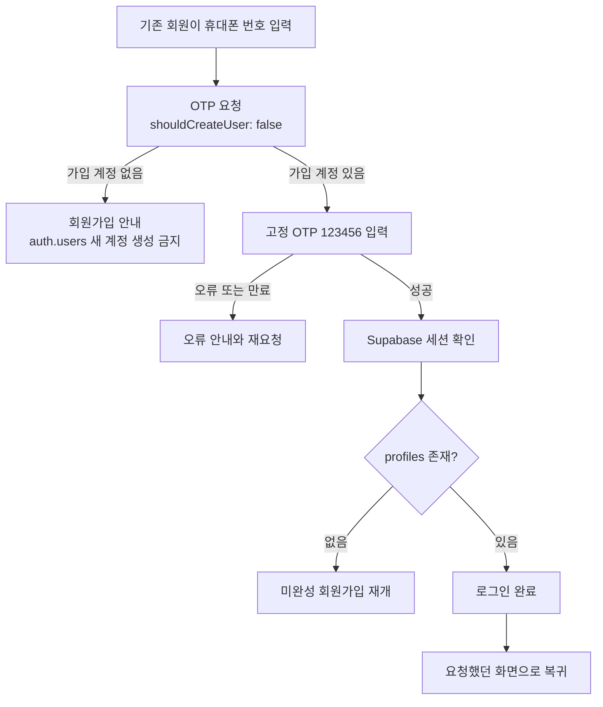

# 유미당 Supabase 재구축 인수인계

기준일: 2026-09-16  
작업 폴더: `/Users/b/Documents/Antigravity/yumidang`  
현재 상태: 사용자 흐름 1번 `회원가입` 구현과 로컬·원격 검증 완료. 사용자 흐름 2번부터는 미구현이다.

## 1. 범위 경계

이번 구현 범위는 아래 흐름 하나다.

`약관 확인 → 휴대폰 번호 입력 → 테스트 OTP 확인 → auth.users 생성 → 기본 프로필 입력 → public.profiles 저장 → 새로고침 후 가입 상태 유지`

- 2번 `기존 회원 로그인`부터 9번 `평가`까지 구현하지 않는다.
- 로그인에 필요한 공통 기반이 생기더라도 2번의 완료로 표시하지 않는다.
- 공고·신청·채팅·매칭·평가 데이터를 Supabase로 옮기지 않는다.
- 기존 브라우저 프로토타입 데이터를 전체 백엔드로 일괄 이관하지 않는다.
- Git 커밋·푸시·배포는 사용자가 별도로 요청하기 전 수행하지 않는다.

## 2. 확인된 Supabase 상태

반드시 아래 새 프로젝트만 사용한다.

- 프로젝트 이름: `yumidang`
- 프로젝트 ref: `bndguguarijmghnkenvt`
- 리전: `ap-northeast-2`
- 프로젝트 URL: `https://bndguguarijmghnkenvt.supabase.co`
- 상태 확인 당시: `ACTIVE_HEALTHY`
- 프로젝트 고정 MCP URL: `https://mcp.supabase.com/mcp?project_ref=bndguguarijmghnkenvt&features=database,development,debugging,docs`

이 ref가 아닌 프로젝트는 모두 대상이 아니다. 프로젝트 이름이나 ref가 다르면 변경하지 말고 중단한다.

2026-09-16 구현은 위 ref가 URL에 고정된 `supabase_yumidang` MCP로만 원격 DB를 확인·변경했다. 다른 Supabase 프로젝트는 조회하거나 변경하지 않았다. 프론트엔드에는 MCP가 반환한 활성 modern publishable key만 사용하며 secret/service-role key는 사용하지 않는다. 실제 값은 Git 제외 파일 `.env.local`에만 있다.

원격 DB 최종 상태:

- 마이그레이션 `20260916080335 create_profiles` 적용
- 마이그레이션 `20260916081429 remove_profiles_neighborhood` 적용
- 마이그레이션 `20260916081750 restrict_profiles_column_writes` 적용
- `public.profiles`: 7개 열, RLS 활성, 정책 3개(`select/insert/update own`), 테스트 행 8개
- 테스트 과정에서 `+821000000001`~`+821000000009`의 `auth.users`가 생성·확인됨. `0001`만 프로필이 없고 `0002`~`0009`는 프로필이 있다.
- 열 권한은 클라이언트가 프로필 입력 열만 쓰게 제한했다. `created_at`, `updated_at`은 클라이언트가 INSERT/UPDATE할 수 없고 DB 기본값·트리거가 관리한다.
- 최종 Supabase Advisor: 성능 경고 0건. 보안 경고는 비밀번호 로그인용 `Leaked Password Protection Disabled` 1건이며 이번 휴대폰 OTP 흐름에는 비밀번호가 없다. 기능 2 이후 비밀번호 로그인을 추가한다면 다시 판단한다.

### 휴대폰 테스트 인증

- 테스트 번호: `+821000000001` ~ `+821000000020`
- 국내 표시: `010-0000-0001` ~ `010-0000-0020`
- 고정 OTP: `123456`
- 휴대폰 가입 허용: 적용 완료
- 휴대폰 확인 요구: 적용 완료
- 실제 SMS: 발송하지 않음
- `+821000000001`: 기존 직접 검증으로 세션 생성됨. 프로필은 없음.
- `+821000000002`~`+821000000009`: 이번 웹 검증으로 세션과 프로필 생성됨.
- `+821000000010`~`+821000000020`: 다음 실제 가입 검증에 사용할 수 있는 미사용 번호다.

고정 OTP는 테스트용 우회 수단이다. 공개 운영 전에는 제거하거나 만료일을 설정하고 실제 SMS 공급자로 교체해야 한다. 현재 만료일은 설정하지 않았다.

## 3. 로컬 저장소 상태

- 브랜치: `main`
- 원격: `https://github.com/jjackbb/yumidang.git`
- 확인 당시 HEAD: `f03e6e5`
- 앱은 React 19 + Vite 6 + TypeScript다.
- `@supabase/supabase-js`는 `2.116.0`으로 고정 설치했다.
- `.env.example`에는 `VITE_SUPABASE_URL`, `VITE_SUPABASE_PUBLISHABLE_KEY`의 빈 자리만 있다.
- `.env.local`은 Git에서 제외되며 지정 프로젝트 URL과 modern publishable key가 있다.
- `supabase/migrations/`에는 원격 이력과 같은 두 마이그레이션이 있다.
- 일반 실행은 `AuthModal.tsx`가 실제 Supabase OTP와 `profiles`를 사용한다. `DemoAuthModal`은 `?demo=1`에만 남겼다.
- 실제 Supabase 사용자·프로필을 프로토타입 `localStorage` 데이터에 복제하지 않는다. Supabase 세션 자체는 SDK의 영구 저장을 사용한다.
- 앱 시작 시 세션과 자기 프로필을 함께 읽고 `anonymous / profile-incomplete / authenticated / error` 상태를 구분한다.
- 일반 실행의 로그아웃은 기능 2 범위라 구현하지 않았고 안내만 표시한다.
- `src/utils/profile.ts`의 `ageOn()`은 서울 날짜 기준 만 나이를 이미 계산한다.
- `ageGroupOf()`의 `20대` 표시는 새 가입 프로필에서 사용하지 말고 `25살` 같은 만 나이를 표시한다.

루트 `.overnight/`의 과거 생성물 482개는 2026-09-16에 삭제했고 `.gitignore`에 등록했다. `docs/overnight/`는 문서이므로 보존했다. 삭제된 생성물의 Supabase 코드·키·SQL을 복사하거나 복원하지 않는다.

## 4. 회원가입 데이터 계약

`auth.users`는 Supabase가 관리하고, 앱 프로필은 `public.profiles`에 둔다. 전화번호를 `profiles`에 중복 저장하지 않는다.

프로필에는 지역 정보를 저장하지 않는다. 만남 장소는 기능 3의 공고 데이터에서 별도로 설계한다.

최소 스키마:

| 키 | 형식 | 규칙 | 역할 |
|---|---|---|---|
| `id` | `uuid` | PK, `auth.users.id` FK, 삭제 연쇄 | 인증 계정과 프로필을 1:1 연결 |
| `nickname` | `text` | 필수, 앞뒤 공백 제거, 길이 제한 | 서비스에 공개할 이름 |
| `birth_date` | `date` | 필수, 본인만 원본 조회 | 만 나이 계산의 기준 |
| `avatar_url` | `text` | 선택 | 이후 프로필 기능에서 사용할 사진 주소 |
| `bio` | `text` | 선택 | 이후 프로필 기능에서 사용할 소개 |
| `created_at` | `timestamptz` | 필수, 기본값 `now()` | 프로필 등록 완료 시각 |
| `updated_at` | `timestamptz` | 필수, 변경 시 자동 갱신 | 마지막 프로필 수정 시각 |

`auth.users.created_at`도 유지한다. 세 시각의 의미는 다르다.

- `auth.users.created_at`: 인증 계정이 만들어진 시각. 가입 오류·계정 수명 확인에 사용한다.
- `profiles.created_at`: 기본 프로필 저장이 완료된 시각. 인증만 끝나고 프로필이 빠진 계정을 구분한다.
- `profiles.updated_at`: 프로필이 마지막으로 바뀐 시각. 최신 정보·동기화 오류 확인에 사용한다.

나이는 DB에 고정 숫자로 저장하지 않는다. `birth_date`와 현재 서울 날짜로 만 나이를 계산해 `25살`처럼 표시한다. 생일이 지나면 데이터 수정 없이 나이가 바뀌어야 한다. 정확한 생년월일은 다른 사용자에게 공개하지 않는다.

기존 프로토타입의 실명·성별·추천인·직장 이메일 규칙은 이번 최소 스키마에 승인된 항목이 아니다. 사용자 확인 없이 DB 계약에 추가하지 않는다. 현재 약관 문구도 법률 검토된 동의 이력이 아니므로, 영구 동의 기록을 구현했다고 표현하지 않는다.

## 5. 권한과 실패 처리

`public.profiles`에 RLS를 켠다.

- 로그인 사용자는 자기 `id = auth.uid()` 행만 `select`, `insert`, `update`할 수 있다.
- 다른 사람의 프로필 조회 권한은 사용자 흐름 4번에서 별도로 설계한다.
- anon 접근과 다른 사용자의 수정은 거부한다.
- 브라우저 입력 검증만 믿지 말고 DB 제약과 RLS를 함께 둔다.
- 프로필 생성은 OTP 성공 뒤 클라이언트가 수행한다. 자동 트리거로 빈 프로필을 만들지 않는다. 그래야 `profiles.created_at`이 프로필 등록 완료 시각을 뜻한다.
- OTP 성공 뒤 프로필 저장에 실패하면 인증 세션을 없애지 않는다. 다시 열거나 새로고침했을 때 미완성 프로필 입력부터 재개한다.
- `auth.users`는 있는데 `profiles`가 없으면 가입 완료가 아니라 `프로필 미완성`으로 처리한다.

## 6. 프론트엔드 구현 계약

1. `@supabase/supabase-js`를 정확한 버전으로 고정 설치한다.
2. `.env.example`에 `VITE_SUPABASE_URL`, `VITE_SUPABASE_PUBLISHABLE_KEY` 이름만 추가한다.
3. 실제 값은 Git에서 제외되는 `.env.local`에 둔다. service-role/secret key는 사용하지 않는다.
4. `src/lib/supabase.ts`에서 환경변수 누락을 명시적으로 처리한다.
5. 회원가입 OTP 요청은 `supabase.auth.signInWithOtp({ phone, options: { shouldCreateUser: true } })`를 사용한다.
6. OTP 확인은 `verifyOtp({ phone, token, type: 'sms' })`를 사용한다.
7. 국내 입력 `01000000002`를 요청 전에 `+821000000002`로 변환한다.
8. 브라우저에서 `otpCode === '123456'`처럼 직접 통과시키지 않는다. 반드시 Supabase 응답으로 성공을 판정한다.
9. 첫 가입 검증에는 미사용 번호 `010-0000-0002` 이후를 사용한다.
10. 인증 세션과 자신의 프로필을 복구한 뒤에만 회원 영역을 보여준다.
11. 기존 데모 모드가 필요하면 `?demo=1` 안에만 격리한다. 일반 실행에서 실패 시 로컬 가짜 로그인으로 돌아가지 않는다.

## 7. 구현·검증 결과

기능 1은 아래처럼 실제 실행해 완료 판정했다.

- **PASS / 실제 웹·원격:** `010-0000-0002`~`0009`로 반복 회귀했고, 최종 검증은 `0008`/`0009`에서 수행했다. Supabase가 `123456`을 검증하고 세션을 만들었다.
- **PASS / 실제 웹·원격:** 잘못된 OTP에 만료 안내가 표시됐고, 즉시 재요청은 Supabase 제한을 받아 “잠시 기다린 뒤 다시 요청” 안내가 표시됐다.
- **PASS / 실제 웹·원격:** 프로필 INSERT를 브라우저에서 1회 강제 실패시켰을 때 입력과 인증 세션이 유지됐고, 새로고침 뒤 `profile-incomplete`에서 기본 프로필 단계가 자동 재개됐다.
- **PASS / 실제 웹·원격:** 닉네임·생년월일 저장, `25살` 표시, 새로고침 후 같은 세션·프로필 복구를 확인했다.
- **PASS / 실제 A/B REST:** A는 자신의 행을 조회·수정했고 `updated_at`이 증가했다. A가 B를 조회·수정하면 모두 0행이었고 B 데이터는 바뀌지 않았다. anon도 행을 얻지 못했다.
- **PASS / 실제 REST:** 클라이언트가 `created_at`을 포함한 INSERT와 `created_at/updated_at` UPDATE는 권한 오류로 거부됐다.
- **PASS / Supabase MCP:** `profiles` 8행, 테스트 인증 사용자 9명, 모두 phone confirmed, RLS 활성, 정책 3개, 7개 최소 열, 열 단위 쓰기 권한을 재확인했다.
- **PASS / 로컬:** `npm test` 80/80, `npm run lint`, `npm run build`, `git diff --check` 통과. 빌드는 500 kB 초과 청크 경고만 있고 실패는 아니다.
- 실제 회귀 스크립트는 `tests/browser/supabase-signup.cjs`다. 테스트 번호를 소모하므로 다음 실행자는 미사용 번호 두 개를 `LIVE_SIGNUP_PHONE_A`, `LIVE_SIGNUP_PHONE_B`로 명시해야 하며 기본값은 없다.
- **NOT_RUN:** 유효했던 OTP가 실제 시간 경과로 만료되는 정확한 경계 시각 대기. 잘못된 OTP에 대한 만료 안내 분기와 재요청 제한은 실제 확인했다.
- **NOT_RUN (범위 외):** 실제 SMS 공급자, 운영용 테스트 OTP 제거, 법률 검토된 약관 동의 이력, 배포·배포 URL 검증.
- **NOT_RUN (사용자 지시):** Git 커밋·푸시.

테스트 통과와 로컬 저장만으로 배포 성공이라 쓰지 않는다. 배포 검증은 `NOT_RUN`이다.

## 8. Notion 기록

구현과 실제 검증이 끝난 뒤 다음 페이지에 `기능 1. 회원가입` 항목을 기록한다.

`https://app.notion.com/p/3dd626093f2e801881f8e73f47c9618e`

**PASS / 2026-09-16:** `기능 1. 회원가입` 항목을 기록하고 다시 불러와 확인했다. 환경 키, `auth.users` 핵심 키, `profiles` 7개 키마다 형식·PK/FK·공개 범위·RLS·생성/수정 주체·필요 이유를 적었고, 세 시각의 차이와 실제 PASS/NOT_RUN도 구분했다.

## 9. 다음 단계 계획: 2번 기존 회원 로그인

이번 세션에서는 구현하지 않는다. 회원가입 구현 중 발견한 계약 변화만 이 항목에 반영한다.

기능 1에서 확정된 공통 기반과 기능 2 영향:

- 기존 회원 OTP 요청은 반드시 `shouldCreateUser: false`를 써야 한다. 기능 1의 `true` 경로를 그대로 재사용하면 미가입 번호가 새 계정이 된다.
- `useSupabaseAuth`의 상태 모델과 자기 프로필 로더를 재사용한다. 세션이 있어도 프로필이 없으면 로그인 완료가 아니라 `profile-incomplete`로 회원가입 기본 정보 단계에 보낸다.
- 기능 2에서 실제 `supabase.auth.signOut()`과 화면 상태 초기화를 구현해야 한다. 현재 일반 실행의 로그아웃 버튼은 범위 안내만 한다.
- 보호 경로 복귀는 `safeReturnPath`를 유지하되 외부 URL을 허용하지 않는다.
- A/B 브라우저 간 세션·프로필 혼합 방지 검증을 유지한다. 공개 프로필 조회 정책은 기능 4에서 별도로 추가하며, 기능 2 때문에 현재 자기 행 전용 RLS를 넓히지 않는다.
- `profiles`에는 활동 지역을 넣지 않았다. 만남 장소는 기능 3의 공고 계약에서 설계한다.

2번 완료 기준 초안:

- `shouldCreateUser: false`로 미가입 번호가 계정으로 생성되지 않는다.
- 기존 회원은 OTP 검증 후 자신의 프로필을 불러온다.
- 새로고침 후 세션이 유지된다.
- `/chat`, `/me` 같은 보호 화면은 익명 사용자를 로그인으로 보낸다.
- 로그인 뒤 원래 요청한 안전한 내부 경로로 돌아간다.
- 로그아웃하면 개인 화면과 이전 사용자 상태가 즉시 사라진다.
- 두 브라우저에서 A/B 계정 데이터가 섞이지 않는다.

## 10. 다음 Codex 세션 시작 프롬프트

아래 문장을 새 세션에 그대로 붙여 넣는다.

> `/Users/b/Documents/Antigravity/yumidang/HANDOFF.md`를 먼저 읽고 저장소와 ref bndguguarijmghnkenvt Supabase MCP 상태를 직접 확인해줘. 기능 1 회원가입은 완료됐으므로 회귀시키지 말고, 이번에는 사용자 흐름 2번 기존 회원 로그인만 계약부터 구현해. OTP 요청은 shouldCreateUser:false로 미가입 계정 생성을 막고, 기존 세션·profile-incomplete 분기·안전한 원래 경로 복귀·supabase.auth.signOut()·A/B 세션 격리까지 실제 테스트해. 기능 3부터 9까지는 구현하지 말고 발견한 영향만 다음 계획에 반영해. 테스트 번호/고정 OTP 설정을 다시 만들지 말고, 다른 Supabase 프로젝트는 절대 변경하지 마. 실제 확인과 NOT_RUN을 구분하고 Git 커밋·푸시·배포는 하지 마.`
