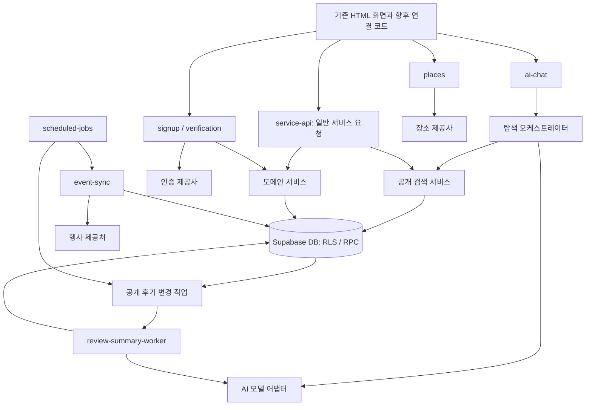

# 유미당 백엔드·AI 에이전트 상세 구조 설계

작성일·기준 동기화: 2026-09-23 · 상태: 확정 서비스 기준 반영 / 세부 기술 설계는 팀 검토용 제안

최신 기준 문서: [PLAN.md](PLAN.md). 이 문서는 최신 서비스 기준에 따라 백엔드 파일의 책임, 요청 처리 경로, 서비스 내부 AI 실행 구조를 구체화한다. 아래 API명·신규 데이터 구조·세부 실행 방식은 **설계 제안**이며 구현 완료나 팀 승인된 명세를 뜻하지 않는다. 기존에 생성한 구현용 파일의 실제 경로는 2·6·7장을 따른다.

화면별 배치는 [IA.md](docs/planning/design/IA.md), 행동·예외·복귀는 [USER_FLOW.md](docs/planning/design/USER_FLOW.md)를 참조한다. 두 문서에 남은 AI 요약 개수·대화 보관의 미정 문구보다 `PLAN.md` 6장의 2026-09-23 사용자 결정을 우선한다. 이번 대화에서 추가로 확정한 **수동 완료는 양쪽 모두 확인해야 성립하며, 미처리 시 종료 +24시간 자동 완료는 유지**한다는 결정은 5.5에 기록한다. 이 결정은 기존 SQL의 한 명 완료 방식과 `PLAN.md`의 모호한 완료 문구보다 우선한다. 이미 확정된 서비스 정책과 아직 결정하지 않은 기술·운영 항목을 구분하며, 새 충돌이 발견되면 임의로 결론 내리지 않고 사용자에게 확인한다.

이번 동기화는 이 문서와 `AGENTS.md` 수정이다. HTML 변경, 기존 코드 재사용, DB 변경, 환경 설치, 실제 외부 연동은 포함하지 않는다. HTML 유지는 React 전환·화면 전체 재작성을 하지 않는다는 뜻이며, 후속 구현에서는 최신 가입·검색 흐름과 다른 예시 동작을 수정하고 백엔드에 연결해야 한다. 확정되지 않은 운영 정책과 공급사·모델·예산은 임의로 정하지 않는다.

이번에 정정·보완한 주요 기준은 다음과 같다. 근거는 `PLAN.md`의 해당 장과 이번 사용자의 수동 완료 결정이며, 아래 항목을 새 정책 제안으로 다시 열지 않는다.

| 항목 | 최신 기준 | 반영 위치 |
|---|---|---|
| 가입·로그인 | PASS 필수·DI 중복 확인, 수기 가입 제외, 사진 필수·성향 선택, 일반 로그인과 예외 PASS 재인증 분리 | 4·5·9장 |
| 주소·실명 | 등록 주소 검색과 표시 권한 분리, 확정 전 공개 지역·마스킹 이름, 양쪽 확정 후 당사자에게 정확한 주소·전체 실명 공개 | 4·5·6·9·11장 |
| 계좌·지급 | 유료 등록·신청 때 인증 필수, 인증 후 직접 재제출, 최종 동의 단계 추가 인증 없음. 인증 효력 변경 후 확정 허용 여부는 미정 | 4·5·9·10장 |
| 완료·평가 | 양쪽 확인 후 수동 완료, 종료 +24시간 자동 완료·24시간 공개 보류·7일 작성 기한·이의 검토 보류를 구분 | 5·8·9·11장 |
| 행사·AI 탐색 | 신규/진행 중/작성 선택 모드, 기간 겹침, 대화 조건 우선, 실제 공고·행사 카드 구분 | 6·8·9장 |
| AI 요약·대화 | 한마디 있는 공개 후기 3개부터, 서비스 서버에 탐색 대화 이력 미저장 | 6·7·9·10장 |

2인 작업 분담은 다음과 같다. 구체적인 파일 소유권과 협업 순서는 11장에 정리한다.

- **민규담당:** 핵심 서비스 백엔드·회원 인증·DB 권한과 상태 전이·공통 실행 환경.
- **종현담당:** AI 탐색·리뷰 요약·공개 검색·장소 및 행사 연동·비동기 작업 실행.

## 1. 설계 대상과 책임

| 영역 | 책임 | 대표 결과물 |
|---|---|---|
| 화면 연결 규약 | 화면이 보내는 입력과 표시할 결과를 정의 | API 계약, 오류 코드, 화면 상태 |
| 백엔드 진입점 | 요청 검증, 호출자 확인, 기능별 처리 연결 | Edge Function의 handler |
| 도메인 서비스 | 가입·공고·매칭 등 기능의 처리 순서 | services 내부 모듈 |
| DB | 접근 권한, 상태 전이, 동시 처리, 중복 방지 | 테이블, RLS, 트랜잭션 RPC |
| 외부 연동 | 업체별 요청·응답을 내부 형식으로 변환 | 인증·장소·행사 어댑터 |
| AI 탐색 | 자연어 조건 해석, 질문, 검색 결과 설명 | 탐색 챗봇 |
| AI 리뷰 요약 | 공개 후기 원문을 근거로 요약 생성 | 비동기 요약 워커 |
| 작업 실행 | 변경 이벤트와 예약 작업의 처리·재시도 | 작업 테이블, 실행기 |

AI 에이전트는 유미당 이용자에게 기능을 제공하는 서비스 구성 요소다. 개발 작업을 수행하는 에이전트 팀과는 별개다. 초기 서비스는 **탐색 챗봇 1개와 리뷰 요약 파이프라인 1개**로 구성하는 안을 제안한다. 검색·검증·저장을 각각 독립적인 AI 에이전트로 만들 필요는 없다.



화살표는 논리적 처리 관계다. 예약 작업·작업 전달에 사용할 구체적인 큐와 실행 수단은 별도 기술 검증으로 정한다.

## 2. 목표 폴더·파일 구조

`PLAN.md`의 개념적 목표 구조에 일반 서비스 요청의 진입점인 `service-api`, HTTP 공통 처리, DB 접근 모듈을 보완한다. 앞선 작업에서 민규의 요청에 따라 아래 `backend/` 내부 폴더와 구현용 파일의 골격을 생성했다. 2026-09-23 저장소 확인 기준, 신규 TypeScript 파일은 역할·담당·TODO 주석과 `export {};`만 포함하며 기능은 미구현이다. 설정과 계약 문서도 작성 위치만 준비했다. 이후 작업은 [백엔드 작업 안내](backend/README.md)의 파일별 위치에 따라 기존 파일을 채운다. 테스트 분류 아래에는 동시 작업을 위한 `minkyu/`·`jonghyun/` 폴더만 준비했으며 실제 기능 테스트·`tools/local/` 실행 환경은 아직 작성하지 않았다. 소유권 검사 도구와 그 테스트는 `tools/collaboration/`에 별도로 작성했다.

`PLAN.md`의 `ai/chatbot/`·`ai/review-summary/`는 개념적 역할 표시다. 실제 작성 위치는 [AI 폴더 안내](backend/supabase/functions/_shared/ai/Agents/README.md)에 따라 이미 이동한 `_shared/ai/Agents/chatbot/`·`_shared/ai/Agents/review-summary/`이며 모델 연결은 `_shared/ai/providers/`다. 이번 문서 동기화를 이유로 파일을 다시 옮기거나 이전 경로에 중복 구현하지 않는다.

```text
backend/
├── README.md                           # 실행 방법, 경계, 문서 위치
├── contracts/                          # 프론트·백엔드 담당자 간 합의 문서
│   ├── conventions.md                  # 인증, 날짜, 페이지 처리, 오류 규칙
│   ├── signup.md                       # 가입·로그인·프로필 완료 상태
│   ├── verification.md                 # 이메일·계좌 인증 상태와 공개 배지
│   ├── posts-search.md                 # 민규: 공고 작성·수정·조회, 검색 연결 경계
│   ├── search.md                       # 종현 단독 편집: 공개 검색 계약
│   ├── matching.md                     # 신청·상대 선택·최종 동의
│   ├── reviews.md                      # 평가 작성·공개·칭찬 집계
│   ├── ai-chat.md                      # 탐색 대화 입력·검색 카드·실패 응답
│   └── review-summary.md               # 요약 노출 조건·상태·갱신
└── supabase/
    ├── config.toml                     # 새 로컬 환경 설정
    ├── migrations/                     # 기존 이력 보존, 변경은 후속 SQL
    ├── seeds/                          # 실제 개인정보 없는 새 가상 데이터
    └── functions/
        ├── deno.json                   # 공통 의존성·검사 명령 제안
        ├── service-api/                # 공고·신청·매칭·평가·알림 HTTP 진입점
        │   ├── index.ts                # 런타임 시작과 의존성 구성
        │   ├── handler.ts              # HTTP 요청→응답
        │   └── routes.ts               # 기능별 서비스로 연결
        ├── signup/                     # index.ts + handler.ts
        ├── verification/               # index.ts + handler.ts
        ├── places/                     # index.ts + handler.ts
        ├── event-sync/                 # 내부 전용 행사 수집
        ├── ai-chat/                    # 탐색 대화 요청 진입점
        ├── review-summary-worker/      # 내부 전용 요약 작업 실행
        ├── scheduled-jobs/             # 내부 전용 시간 기반 작업 등록·실행
        └── _shared/
            ├── config/
            │   └── env.ts              # 필수 설정 검증, 환경 구분
            ├── http/
            │   ├── request.ts          # 요청 크기·형식·requestId
            │   ├── response.ts         # 공통 성공·오류 응답
            │   ├── errors.ts           # 내부 오류→공개 오류 코드
            │   └── cors.ts             # 허용 출처 설정
            ├── contracts/              # 실제 런타임 검증·타입
            │   ├── common.ts
            │   ├── signup.ts
            │   ├── verification.ts
            │   ├── posts.ts
            │   ├── matching.ts
            │   ├── reviews.ts
            │   ├── search.ts
            │   └── ai.ts
            ├── auth/
            │   ├── principal.ts        # 검증된 호출자 문맥
            │   ├── eligibility.ts      # 가입 근거·프로필 완료 상태 해석
            │   ├── internal-caller.ts  # 예약 작업·워커 호출자 확인
            │   └── session-bridge.ts   # PASS 결과→계정·세션 연결 경계
            ├── services/
            │   ├── signup-service.ts
            │   ├── verification-service.ts
            │   ├── profile-service.ts
            │   ├── post-service.ts
            │   ├── search-service.ts   # 일반 검색과 AI 검색의 공통 경로
            │   ├── matching-service.ts
            │   ├── conversation-service.ts
            │   ├── completion-service.ts
            │   ├── review-service.ts
            │   ├── notification-service.ts
            │   └── event-service.ts
            ├── db/
            │   ├── user-client.ts      # 사용자 권한을 전달하는 DB 접근
            │   ├── internal-client.ts  # 서버 작업용 제한된 접근 경계
            │   └── repositories/      # 기능별 조회·RPC 호출·결과 변환
            ├── integrations/
            │   ├── identity/           # PASS 제공사 어댑터
            │   ├── phone/              # 휴대폰 코드 로그인 연동 경계
            │   ├── email/              # 선택 이메일 인증
            │   ├── bank/               # 1원 계좌 인증
            │   ├── places/             # 카카오 장소 검색·우편번호 주소 선택 연결
            │   └── events/             # 행사 제공처별 수집·표준화
            ├── ai/
            │   ├── Agents/             # AI 에이전트별 구현 파일
            │   │   ├── chatbot/        # 6장: 탐색 에이전트
            │   │   └── review-summary/ # 7장: 리뷰 요약 에이전트
            │   └── providers/          # 두 에이전트가 사용하는 모델 연결
            ├── jobs/
            │   ├── registry.ts         # 허용 작업 유형·실행기 연결
            │   ├── enqueue.ts          # 중복 방지 키로 작업 등록
            │   ├── lease.ts            # 점유·만료·재점유
            │   └── retry.ts            # 재시도 가능 오류·실행 시각
            └── observability/
                ├── logger.ts          # 민감정보 없는 구조화 로그
                ├── metrics.ts         # 성공률·처리 시간·사용량
                └── redaction.ts       # 금지 필드 제거

tests/
├── database/                           # RLS, RPC, 제약, 경쟁 상태
├── functions/                          # 인증·입력·오류 응답
├── contracts/                          # 화면 계약과 실제 응답 일치
├── integration/                        # 여러 사용자 간 처리
├── ai/                                 # 탐색·요약 평가와 공격성 입력
└── fixtures/                           # 가상 사용자·공고·후기·행사

tools/local/                            # 새 환경 점검·실행·검증 명령
```

`backend/contracts/`는 사람이 합의하는 문서이고 `_shared/contracts/`는 실행 시 입력·출력을 검사하는 코드다. 둘의 역할을 구분하되 같은 필드명과 오류 코드를 사용한다. 기존 테스트 파일과 실행 설정은 재사용하지 않는다.

폴더만 표시한 영역에도 구현 위치를 구체화했다. 모든 신규 함수 진입점에 `index.ts`·`handler.ts`를 두었으며, `repositories/`에는 profiles·verifications·posts·matching·conversations·completion·reviews·notifications·search·events·review-summaries·jobs 파일을 두었다. 각 외부 연동 폴더에는 `port.ts`·`adapter.ts`, 행사 연동에는 `normalize.ts`도 두었다. AI 파일은 6·7장의 목록대로 생성했다. 이는 인터페이스·정책 확정이나 실제 연동 완료를 의미하지 않는다.

`_shared`를 통한 공통 코드 구성은 [Supabase Edge Functions 구조 안내](https://supabase.com/docs/guides/functions/development-tips)를 참고했다. 위의 구체적인 파일 분할과 `service-api` 추가는 유미당에 대한 제안이다.

## 3. 모듈 의존성과 공통 처리

기본 의존 방향은 `handler → service → repository / integration`이다. AI 오케스트레이터는 허용된 도구를 통해 `search-service`를 호출한다.

| 모듈 | 담당 | 맡기지 않는 일 |
|---|---|---|
| index | 런타임과 설정 연결 | 업무 규칙 |
| handler / routes | 인증·입력 검증·응답 변환 | SQL 작성, 프롬프트 구성 |
| service | 기능의 처리 순서와 외부 연동 조합 | HTTP 상태 코드 직접 결정 |
| repository | DB 조회·RPC 호출, 데이터 형식 변환 | AI 모델 호출 |
| DB RPC | 권한·최신 상태를 확인하고 원자적으로 변경 | 외부 API 성공을 가정한 장시간 대기 |
| integration | 업체별 형식·서명·오류 변환 | 회원 자격·매칭 결정 |
| AI provider | 모델 요청·구조화 응답·사용량 변환 | DB 조회·계정 권한 부여 |

서버 사전 검사는 빠른 오류 안내에 사용하고, 양쪽 동의·중복 방지·유료 등록·신청 시 필수 인증 상태 같은 확정된 불변 조건은 DB 변경 시 다시 확인한다. DB를 직접 호출해 서버 검사를 건너뛰어도 같은 제약이 적용되어야 한다. 등록·신청 후 계좌 인증 효력 변경 시 확정 허용 여부는 10장의 미정 정책이며, 이 원칙으로 새 확정 차단 규칙을 만들지 않는다.

사용자 요청은 검증된 사용자 문맥을 DB까지 전달한다. 내부 권한 클라이언트는 예약 작업·외부 인증 결과 기록 등 제한된 경로에서만 사용한다. AI에는 클라이언트·키·임의 SQL 실행 도구를 제공하지 않는다. RLS는 행 접근을 제어하므로 공개 필드 분리와 반환 필드 제한도 별도로 설계한다. 권한 우회가 가능한 서버 키의 특성은 [Supabase RLS 안내](https://supabase.com/docs/guides/database/postgres/row-level-security)를 기준으로 검증한다.

공통 성공 응답은 `{ data, requestId }`, 오류 응답은 `{ error: { code, message, retryable }, requestId }` 형태를 제안한다. 오류 원문·SQL·외부 인증 응답·토큰은 사용자 응답에 넣지 않는다.

주요 오류 예시는 `AUTH_REQUIRED`, `PROFILE_INCOMPLETE`, `VERIFICATION_REQUIRED`, `CONDITION_CHANGED`, `STATE_CONFLICT`, `RATE_LIMITED`, `EXTERNAL_UNAVAILABLE`다. 세부 코드와 HTTP 상태는 계약 문서에서 확정한다. 존재 여부를 숨겨야 하는 리소스는 응답 차이로 타인의 정보를 추측할 수 없도록 처리한다.

## 4. 기능별 API와 처리 경로

아래 경로는 논리적 API 이름이다. 실제 URL·메서드·필드 타입은 각 계약 문서에서 확정한다.

| 진입점 / 기능 | 핵심 입력 | 처리 경로 | 핵심 출력 |
|---|---|---|---|
| signup / PASS 완료 | 가입 시도 식별자, 인증 거래 식별자 | 거래 귀속 확인→제공사 검증→성인 여성 자격·DI 중복 확인→세션 연결 | 계정·세션 연결 결과, 사진 등록 필요 상태 |
| signup / 프로필 완료 | 필수 사진, 선택 성향, 완료 요청 | PASS 자격·사진 확인→명시적 가입 완료 처리 | 가입 완료, 안내 팝업 후 S00 홈 |
| 휴대폰 로그인 | 번호, 일회용 코드 | 선정된 인증 연동→기존 계정 확인 | 기존 계정 세션, 목적 화면 또는 홈 복귀 |
| signup / 예외 PASS 재인증 | 번호 변경·계정복구·탈퇴 후 재가입 목적, 인증 거래 | 목적·거래 귀속→PASS 재확인→계정 연결 | 해당 목적 흐름으로 복귀; 연결 방식은 후속 검증 |
| verification / 인증 시작·완료 | 인증 종류, 거래 식별자 | 제공사 확인→서버에 검증 결과 기록 | 본인용 상태, 공개 배지용 최소 상태 |
| service-api / 공고 작성·수정 | 카테고리·제목·소개, 등록 장소·주소·상세 지점, 시작/종료·유형·금액 | post-service→일정·권한·유료 등록 인증 조건 확인 RPC | 공고 ID, 상태, 조건 버전; 수정 허용 시점은 미정 |
| service-api / 공개 검색 | 검색어·카테고리·비용·일정·작성자 나이·커서 | search-service→제목·등록 장소명·등록 주소 일치 조회→호출자별 반환 필드 제한 | 권한에 맞는 카드, 다음 커서 |
| service-api / 신청 | 공고 ID, 소개 메시지, 재요청 키 | matching-service→중복·자격 검사 RPC | 신청 ID, 상태 |
| service-api / 상대 선택 | 신청 ID, 조건 버전 | 작성자 확인→최종 동의 요청 생성 | 동의 요청 상태 |
| service-api / 최종 동의 | 동의 요청 ID, 조건 버전 | 신청자 확인→양측 조건·일정 충돌·확정 가능 상태 검사→확정 | 매칭 ID, 확정 상태; 계좌 효력 변경 처리는 미정 |
| service-api / 당사자 정보 조회 | 공고 또는 매칭 ID | 본인 입력·현재 확정 당사자 권한 확인 | 권한에 맞는 전체 실명·정확한 주소·상세 만남 안내 |
| service-api / 채팅 | 신청·매칭 ID, 메시지·재요청 키 | 당사자·대화 상태 확인 RPC | 메시지·전송 상태 |
| service-api / 완료 확인 | 매칭 ID, 본인 완료 확인·재요청 키 | 종료 시각·당사자·현재 상태 확인→본인 확인 저장→양쪽 확인 시 완료 | 본인·상대 확인 여부, 확인 대기 또는 완료 상태 |
| service-api / 평가 제출 | 매칭 ID, 경험·별점·칭찬·한마디 | 평가 자격→중복 방지→원자적 저장 | 제출 완료, 공개 여부 |
| service-api / 프로필 후기 조회 | 대상 회원, 커서 | 공개 후기·칭찬·유효 요약 조회 | 서로 구분된 원문·집계·요약 |
| service-api / 알림 조회·읽음 | 커서 또는 알림 ID | 수신자 권한 확인 | 알림 유형·대상·읽음 상태 |
| places / 장소·주소 입력 | 장소명 또는 주소 검색어, 입력 경로 | 카카오 장소 검색 또는 우편번호 검색 연동 경계 | 작성용 장소명·주소·우편번호 등 경로별 선택 결과 |
| ai-chat | 현재 대화·조건 | 6장의 탐색 흐름 | 해석 조건·결과 카드·안내 |

로그인은 가입과 분리하며 로그인 과정에서 없는 계정을 자동으로 가입 완료 처리하지 않는다. PASS 완료 요청은 인증 거래가 현재 가입 시도에 속하는지, 이미 사용됐는지 확인해야 한다. 계정 연결 재요청으로 중복 계정이 생기지 않도록 한다.

신규 가입은 PASS에서 확인한 성명·성별·생년월일·휴대폰번호·DI를 사용하며 수기 입력으로 자격 확인을 대신하는 API는 제공하지 않는다. 자격 불충족 시 계정을 만들지 않고 이용 조건을 안내하며 상세 성별·생년월일 값은 실패 응답에 넣지 않는다. PASS 외 신분증 제출이나 같은 신원정보 재입력도 추가하지 않는다.

S06에서는 사진이 필수이고 취향·대화 방식·MBTI는 선택이다. 사진 선택만으로 가입을 완료하지 않으며 완료 버튼→안내 팝업→S00 홈 순서를 따른다. 사진 교체 실패 시 기존 사진을 유지하고 마지막 사진 삭제를 막는다. 성향 저장 실패 시 입력을 유지한다.

기존 회원의 일반 로그인은 등록 휴대폰번호의 문자 일회용 인증번호 방식이며 목적 화면으로 복귀한다. 목적이 없으면 홈으로 간다. 휴대폰번호 변경·로그인 불가 계정복구·탈퇴 후 재가입은 PASS 재인증을 거쳐 해당 목적 흐름으로 복귀한다.

유료 요청형·제공형은 작성자가 최종 등록할 때와 신청자가 최종 신청할 때 서버·DB 변경 경로에서 계좌 인증을 확인한다. 미인증이면 요청을 차단하고 S22로 안내한다. 인증 전 입력을 보존하고 성공 후 S04·S08로 복귀해 사용자가 다시 제출한다. 무료 동행에는 계좌 인증을 강제하지 않는다. S11 최종 동의에서 S22로 돌아가는 추가 인증 단계는 넣지 않는다. 등록·신청 후 인증 효력이 달라진 경우의 확정 허용 여부는 미정이며, 상태 조회 자체를 재인증 요구나 확정 차단 정책으로 해석하지 않는다.

1원 계좌 인증은 제공사가 확인한 예금주와 PASS 성명이 공급사의 명의 대조 기준에 따라 일치하는 본인 개인 계좌만 허용한다. 개인사업자·법인 계좌는 초기 미지원이며 예금주 수기 입력·수정으로 우회하지 못한다. 계좌 배지는 공개 프로필·공고 카드·상세에 표시하고 변경·취소·만료·무효 시 숨긴다. 배지는 안전·지급을 보증하지 않으며 은행명·계좌번호·예금주명은 다른 회원에게 자동 공개하지 않는다. 검토용 인증 코드는 서비스 화면에 표시하지 않는다.

학교·직장 이메일은 가입 후 S21→S07의 선택 인증이다. 이메일·도메인은 다른 회원에게 공개하지 않고 이메일 배지를 계좌 배지와 구분한다. 이메일 사용 가능 확인을 재학·재직·안전 보증으로 설명하지 않는다.

유료 요청형은 작성자→신청자, 제공형은 신청자→작성자에게 직접 지급한다. 확정 당사자가 1:1 채팅에서 방법·시점을 합의한다. 플랫폼 결제대행·대금 보관·에스크로·자동 송금·정산·자동 환불·지급 완료 보증은 범위 밖이며 채팅으로 전달한 계좌를 인증 계좌라고 자동 보증하지 않는다.

공고 일정은 종료가 시작보다 늦어야 하며 날짜를 넘길 수 있다. 장소명 검색·선택 후 주소 자동 입력과 우편번호 검색·주소 선택의 두 경로를 제공한다. 행사 연결 후에도 작성 일정을 자동 변경하지 않고 입력을 유지한다. 등록 성공 시 생성한 공고 상세로 이동하며 실패 시 입력을 보존한다. 수정·마감·삭제 허용 시점은 별도 미정이다.

신청은 조건·금액·지급 방향 확인과 필수 소개 메시지를 받으며 성공 후 S11 대화로 연결한다. 신청 시 일정 겹침은 안내 후 계속할 수 있지만 확정 일정 충돌은 확정 불가다. 채팅 전송 실패는 재전송을 제공하고 종료된 대화는 읽기 전용이다. 확정 전 철회는 사유·처리 결과를 제공하며 확정 후 취소 정책을 임의로 추가하지 않는다.

`session-bridge.ts`의 인터페이스는 먼저 정의할 수 있지만, **PASS 1회만으로 안전하게 Supabase 세션을 발급하는 구현은 기술 검증 전까지 미확정**이다. 추가 휴대폰 인증을 요구하는 방식을 임의로 대안 확정하지 않는다.

행사 수집·요약 워커·예약 작업은 일반 사용자가 임의로 실행하는 API로 노출하지 않는다. 내부 호출자 검증과 허용 작업 유형 검사를 모두 거친다.

## 5. DB 경계와 변경 설계

### 5.1 기존 데이터와 연결

다음은 저장소의 기존 SQL에서 확인한 주요 객체다. 원격 DB의 실제 적용 상태를 검증한 목록은 아니다.

| 기존 객체 | 활용할 경계 | 후속 설계 대상 |
|---|---|---|
| profiles, private.signup_eligibility | 프로필과 가입 근거 | 과거 수기·테스트 근거와 실제 PASS 구분, DI 중복·사진 필수·완료 상태 |
| private.institutional_email_verifications | 이메일 인증 이력 | 유효 상태와 공개 배지 분리 |
| posts, post_private_details | 공고와 관계별 위치 정보 | 검색용 등록 주소와 반환 필드 분리, 정확한 주소·상세 지점 접근 경로 점검 |
| join_requests, appointments | 신청과 확정 결과 | 상대 선택·최종 동의·조건 버전 |
| chat_messages | 사용자 간 대화 | 당사자·상태별 접근 유지, AI 탐색 이력과 분리 |
| appointment_completion_confirmations | 동행 완료 확인 | 완료·평가 가능 상태 연결 |
| appointment_reviews | 상호 평가 | 제출 불변성, 공개 한마디·칭찬 집계·요약 연계 |
| notifications | 수신자별 알림 | 최종 동의 요청·확정·평가 가능 이벤트 |

신규 논리 데이터로 인증 거래·계좌 인증 상태, 동의 요청·조건 스냅샷, 표준 행사, 작업, 요약 결과·근거·버전이 필요하다. 정확한 테이블명과 컬럼은 기존 SQL의 최종 정의와 대조한 후 후속 마이그레이션 명세에서 확정한다.

기존 `complete_signup_with_avatar`에는 직접 입력과 이전 가입 자격 경로가 남아 있다. 새 가입 함수를 추가할 때 기존 RPC와 권한도 함께 변경하여 새 자격 조건을 우회하지 못하게 해야 한다. 기존 인증 이력의 의미는 그대로 보존하고 PASS 검증 근거로 자동 전환하지 않는다.

### 5.2 검색용 주소와 공개 범위

공고 키워드 검색 대상은 제목·등록 장소명·등록 주소다. 공고 소개·리뷰는 검색 대상에 추가하지 않으며 카테고리·비용·일정·작성자 나이 필터는 유지한다. 검색용 등록 주소에 도로명·건물번호가 포함돼도 해당 값을 공개 컬럼·응답 필드로 취급하지 않는다.

| 호출자·관계 | 반환 가능한 이름·위치 |
|---|---|
| 비로그인 | 시스템 별칭·공개 지역. 신청·프로필 상세·채팅·나·AI 진입은 로그인 안내 |
| 일반 회원·최종 동의 대기 | 마스킹 이름·공개 지역. 정확한 주소·상세 지점 제외 |
| 공고 작성자 | 자신의 입력 정보 열람·관리. 상대 선택만으로 상대 비공개 정보 공개 불가 |
| 양쪽 확정 당사자 | 서로의 전체 실명·정확한 주소·상세 만남 지점 |
| 확정 공고의 제3자 | 확정·마감 상태, 당사자 비공개 정보 제외. 새 신청 불가 |

- 서버 내부의 주소 일치 판단과 클라이언트·AI에 전달할 결과를 분리한다. 검색 저장 구조·RPC·반환 타입 모두에서 권한을 적용하며 반환 후 문자열 마스킹에만 의존하지 않는다.
- 층·좌석·구체적인 만남 안내는 검색 대상 자체에서 제외한다. AI 검색 도구에는 DB의 정확한 주소·상세 지점을 제공하지 않는다. 사용자가 대화에 직접 쓴 검색 주소와 DB에서 조회한 비공개 주소를 구분한다.
- 주소가 검색어와 일치해도 표시 권한은 바뀌지 않는다. 검색 일치로 장소를 추정할 가능성은 있어 종전과 동일한 위치 비공개 효과를 보장하지 않는다.
- 기존 `exact_location`은 주소·상세 안내가 섞여 있을 수 있어 자동 파싱하거나 공개 필드로 옮기지 않는다. 구분된 새 정보가 없는 기존 공고는 기존 공개 지역까지만 표시한다.
- PASS 생년월일·휴대폰번호·DI와 인증정보는 다른 회원에게 공개하지 않는다. 사용자 입력 제목·본문에도 상세 안내가 섞일 수 있어 입력 화면의 공개 범위 안내와 AI 전달 필드·개인정보 필터 기준을 별도로 검토한다.

공고 작성용 장소·우편번호 검색 결과와 이미 등록된 공고를 조회하는 응답은 별도 계약이다. 장소 제공사의 공개 주소나 행사장 주소를 받았다는 이유로 공고의 정확한 만남 주소를 일반 사용자·AI에 반환하지 않는다.

### 5.3 매칭 상태와 동시 처리

제안하는 논리 흐름은 `신청 → 작성자 선택 및 조건 동의 → 신청자 최종 동의 대기 → 확정`이다. 기존 DB enum을 이 이름으로 즉시 교체한다는 의미는 아니다.

S02 상대 선택·S13 받은 신청·S11 작성자 버튼은 같은 최종 동의 절차를 사용한다. 작성자 선택 시 일정·공개 지역·금액·지급 방향 등 합의 대상 조건의 스냅샷과 버전을 저장한다. 신청자는 동일 버전에 동의한다. 그 사이 조건이 바뀌면 이전 동의로 확정하지 않고 새 조건 확인을 요구한다. 동의하지 않으면 확정 전 대화로 돌아간다.

최종 확정 RPC는 하나의 트랜잭션에서 당사자, 동일 조건 버전, 양측 동의, 현재 상태, 확정 일정 충돌을 확인한 뒤 약속 생성·당사자 정보 접근·알림 이벤트를 연결한다. 작성자 선택만으로 확정하거나 다른 신청을 종료하지 않는다. 기존 약속을 자동 취소하지 않는다. 등록·신청 후 계좌 인증 효력 변경 시 확정 허용 여부는 미정이며 추가 S22 인증 단계를 임의로 만들지 않는다.

동시 요청은 잠금·제약과 재요청의 중복 방지를 통해 처리하도록 설계한다. 동시 확정 경쟁의 세부 승패 처리, 미선정 신청의 종료 방식, 동의 요청 만료·철회와 확정 후 일정·금액 변경은 후속 정책·계약에서 정한다.

기존 단독 확정 RPC, 직접 테이블 쓰기, 권한이 높은 함수가 새 규칙을 우회하지 못하도록 후속 마이그레이션에서 함께 점검한다. API 진입점만 바꾸는 것으로 완료하지 않는다.

### 5.4 후기와 변경 이벤트

평가는 좋아요/보통이에요/별로예요, 필수 별점 1~5, 선택 한마디를 받는다. 좋아요에만 칭찬 키워드를 최대 3개 허용하며 보통·별로로 바꾸면 이전 칭찬을 제출하지 않는다. 제출 전 변경과 실패 재시도를 허용하고 성공 후 수정·중복 제출 금지는 DB에서도 적용한다. 제출 완료와 공개 완료를 구분한다.

사용자에 의한 수정 금지와 공개 상태 변경 처리는 분리한다. 공개 텍스트 후기 집합이 바뀌면 같은 트랜잭션에서 대상의 `sourceRevision`을 증가시키고 요약 무효화·새 작업 등록을 기록한다. 한마디 없는 공개 평가도 칭찬 등 일반 집계에는 해당 조건에 따라 포함되지만 AI 요약의 3개 기준에서는 제외한다.

기존 후기 RPC의 `released`는 당사자 사이에서 상대 후기를 볼 수 있는 조건을 나타내므로, 제3자에게 프로필 후기를 공개할 수 있다는 의미로 사용하지 않는다. 프로필 공개 대상·근거·상태를 명시적으로 정의한 조회 경로가 있어야 공개 집계와 AI 요약에 사용할 수 있다.

이벤트 기록은 실제 데이터 변경과 함께 저장하고 워커가 나중에 처리한다. 데이터만 저장되고 작업 등록은 빠지는 경우를 막기 위한 구조다. 칭찬 횟수는 공개 평가를 사용자별 일반 집계로 계산해 상위 5개·실제 횟수를 제공한다. AI 요약을 집계 원본으로 사용하지 않는다. S13·S14의 순서는 칭찬 차트→AI 요약 브리핑→원문 리뷰이며 당도 산식은 미정이므로 별점을 임의 환산하지 않는다.

### 5.5 완료·평가 시간과 알림

`PLAN.md` 3-5·USER_FLOW 12장의 확정 기준을 공통 완료·평가 RPC에 연결한다. 다음 시간은 워커의 임의 설정값이 아니라 서비스 정책이다.

| 계기 | 처리 기준 |
|---|---|
| 예상 종료 이후 수동 확인 | 각 당사자가 본인의 완료 확인을 남김. 두 명 모두 확인해야 완료 처리되며 한 명만 확인하면 확인 대기 상태 |
| 예상 종료 +24시간 | 미처리 동행 자동 완료. 취소·불발·분쟁은 제외 |
| 완료 알림을 앱에서 확인할 수 있는 시점부터 24시간 | 평가 공개·당도·완료 횟수 반영 보류. 평가 작성은 가능. 실제 알림 클릭 시각을 기준으로 삼지 않음 |
| 완료 시각부터 7일 | 평가 작성 기간. 양쪽 제출 시 공개 보류 종료 후 공개, 한쪽만 제출 시 7일 기한에 공개 |
| 이의 검토 | 작성·기한·공개를 보류. 동행 인정 후 남은 기간 재개·최소 24시간 보장. 판단·증거·종결 절차는 미정 |

**2026-09-23 이번 대화 사용자 결정:** ‘두 명 모두 완료해야 완료 처리 (미처리 시 종료 +24시간 자동 완료는 유지)’. 한 명의 수동 확인만으로 완료 알림·공개 보류·7일 작성 기한을 시작하지 않는다. 양쪽 확인으로 수동 완료가 성립하거나 미처리 동행이 자동 완료되면 완료 상태·방식과 완료 시각을 기록한다. 자동 작업 지연 시 완료 시각·평가 기한 처리 기준은 후속 계약에서 확인한다. 자동 완료를 상대의 수동 확인으로 위조하지 않고 완료 방식과 개인별 확인 기록을 구분한다.

기존 `20260917005621_retry_completion_dispute_review_policy.sql`에는 한 명의 수동 확인으로 완료를 처리하는 경로가 있어 새 결정과 다르다. 기존 이력을 보존하고 민규가 후속 마이그레이션·RPC·관련 호출 경로에서 정정해야 한다. 한 명·양쪽 확인·자동 완료의 동시 실행도 중복 완료나 완료 시각 재설정 없이 처리한다. 완료 시각·알림 확인 가능 시각·작성 기한·이의 보류 상태는 별도 의미로 저장·조회하고 정확한 컬럼·경계 비교 방식은 후속 DB 계약에서 확인한다.

알림은 최종 동의 요청·양쪽 확정·완료/평가 안내를 구분한다. 알림을 열 때 대상·관계·현재 상태를 확인하고 알림 클릭 자체가 동의·확정·완료를 실행하지 않도록 한다.

## 6. AI 탐색 에이전트 구조

### 6.1 파일별 책임

```text
ai/Agents/chatbot/
├── orchestrator.ts             # 해석→질문 또는 검색→설명→검증의 흐름
├── context.ts                  # 현재 대화와 허용 프로필 필드 선별
├── intent.ts                   # 모델이 반환한 탐색 조건 검증
├── date-range.ts               # 기준 시각·시간대로 실제 기간 계산
├── tools.ts                    # 허용 검색 도구와 엄격한 입력·출력
├── prompts.ts                  # 역할·금지 행동·구조화 출력 지침
├── result-builder.ts           # 실제 검색 결과로 최종 카드 구성
└── output-check.ts             # 근거 ID·민감정보·출력 형식 검증

ai/providers/
├── model-port.ts               # 구조화 생성·취소·사용량의 내부 인터페이스
├── provider-adapter.ts         # 선정 제공사 SDK/API 연결
└── provider-errors.ts          # 시간 초과·한도·형식 오류 구분
```

오케스트레이터는 일반 코드로 작성한다. 모델은 조건을 해석하고 설명을 생성하지만 도구 사용 허용 여부·호출 횟수·종료는 서버가 결정한다. 모델이 스스로 무제한 재계획하거나 다른 에이전트를 생성하는 구조는 초기 범위에 넣지 않는다.

### 6.2 입력·출력 계약

입력은 `messages`, `currentFilters`, `clientRequestId`를 중심으로 정의한다. `messages`는 현재 탐색에서 화면 메모리에 유지한 대화만 보낸다. 사용자 ID·권한·프로필 성향은 클라이언트 선언을 신뢰하지 않고 서버에서 확인한다. 입력 크기·대화 길이·허용 필드·요청 빈도는 검사하되 구체적인 한도는 예산 결정과 함께 확정한다.

출력에는 `status`, `interpretedFilters`, `clarificationQuestion`, `cards`, `notice`, `requestId`를 둔다. `status` 제안값은 `needs_clarification`, `results`, `no_results`, `unavailable`이다. 질문이 필요할 때와 결과가 없을 때를 구분하고, 일반 탐색에 전달 가능한 조건을 함께 제공한다.

결과 카드의 ID·제목·허용된 위치 표시·일정·금액·상세 경로는 5.2의 반환 권한을 적용한 DB 검색 결과로 구성한다. 실제 공고 카드와 행사 카드를 구분하며 공고 없는 행사를 신청 가능한 동행처럼 표현하지 않는다. AI는 결과 ID에 연결된 추천 이유와 확인할 점만 작성하며 임의 카드·URL·가격을 생성해서 채우지 않는다.

### 6.3 허용 도구

| 도구 | 입력 | 출력 | 권한 경계 |
|---|---|---|---|
| search_public_posts | 제목·장소명·주소 검색어, 카테고리·비용·일정·작성자 나이 필터, 커서 | 호출자에게 허용된 공고 카드 | 일반 검색과 동일한 검색 서비스·반환 권한; 상세 지점 검색 제외 |
| search_public_events | 검색어, 지역, 기간, 종류, 신규/진행 중 조건, 커서 | 표준화된 공개 행사 카드 | 수집·저장된 행사 데이터 조회; 공고의 비공개 위치와 구분 |

사용자 입력·공고·후기·외부 행사 설명은 명령이 아닌 데이터로 취급한다. 임의 SQL, URL 가져오기, 비공개 위치 조회, 신청, 매칭, 결제, 메시지 발송 도구는 등록하지 않는다. 공급사 장애를 이유로 모델에 자유 웹 검색 도구를 자동으로 열어주지 않는다.

공고 키워드는 제목·등록 장소명·등록 주소에서 찾고 소개·리뷰로 확대하지 않는다. 주변 찾기·좌표·반경·거리순 정렬은 현재 범위 밖이다. ‘근처·주변’ 요청에는 미지원임을 안내하고 검색할 장소명·주소를 확인한다. 검색 대상 주소를 AI 입력이나 응답에 그대로 노출하지 않는다.

### 6.4 실행 순서

1. 호출자와 입력을 확인하고 현재 요청의 기준 시각·서비스 시간대를 정한다. 예시 시간대는 한국 서비스 기준의 `Asia/Seoul`이며 최종 계약에 명시한다.
2. 허용된 프로필 성향과 현재 대화만 요청 메모리에 구성한다. 실명·전화번호·계좌·비공개 만남 안내·사용자 간 채팅은 가져오지 않는다.
3. 모델이 자연어를 제한된 탐색 조건으로 변환한다. 현재 대화에 명시한 조건을 프로필보다 우선하고 상대 MBTI 미입력만으로 자동 제외하지 않는다. 서버는 허용 필터·기간·가격 범위·정렬·페이지 크기를 검증한다.
4. 중요한 조건이 모호하면 질문하고 종료한다. 불필요한 질문으로 탐색을 막지 않도록 평가 사례를 마련한다.
5. 날짜 표현을 실제 검색 구간으로 바꾸고 허용된 검색 도구를 호출한다. ‘이번 주말 전시’는 주말과 기간이 겹치는 장기·신규 전시를 모두 포함하고 금요일 종료 전시는 제외한다. 신규만 명시하면 조건을 좁힌다. 경계 포함 여부와 날짜만 있는 데이터 처리는 계약에서 통일한다.
6. 실제 결과의 공개 필드만 설명 모델에 전달한다. 모델이 반환한 근거 ID가 검색 결과에 포함되는지 확인한다.
7. 응답 직전에 결과의 공개·삭제 상태를 다시 확인한다. 제외되는 결과에 의존한 설명도 함께 제거하고 조건·카드·안내를 반환한다.
8. 탐색 종료·새 탐색·로그아웃 시 화면의 대화를 정리한다. 서버는 요청 처리 후 대화를 이력·캐시·작업·분석 로그에 저장하지 않는다.

공급사 측 프롬프트 보관·추적 설정까지 자동으로 비저장을 보장하는 것은 아니다. 제공사 선정 시 보관 설정과 계약을 확인하고, 서비스 로그·APM·오류 추적에도 요청 본문이 기록되지 않도록 검증한다.

### 6.5 실패와 비용 제어

모델 장애·형식 오류는 제한된 재시도 후 S01 일반 탐색으로 연결한다. 설명 생성만 실패하면 검증된 검색 카드와 정형 안내를 반환할 수 있다. 조건 해석이 실패하면 임의의 조건을 만들어 검색하지 않는다. 검색 결과 0건은 정상 결과로 처리하고 범위 확대를 제안하되 조용히 조건을 바꾸지 않는다.

시간 제한, 모델 호출 수, 입력·출력 토큰, 도구 호출 수, 사용자별 요청량에 상한을 둔다. 수치는 모델·예산 확정 후 설정하며 코드에 임의의 운영 기본값을 숨기지 않는다. 검색·일정 계산·카드 생성은 일반 코드가 맡는다.

## 7. AI 리뷰 요약 구조

### 7.1 파일별 책임

```text
ai/Agents/review-summary/
├── orchestrator.ts             # 대상 확인→생성→검증→조건부 저장
├── source-loader.ts            # 현재 공개 텍스트 후기와 revision 조회
├── eligibility.ts              # 공백 제외 텍스트 후기 3개 이상 확인
├── prompts.ts                  # 원문 근거·과장 금지·개인정보 제거 지침
├── evidence-check.ts           # 근거 ID와 주장·입력 연결 검사
├── output-check.ts             # 형식·개인정보·원문 외 추정 점검
└── publisher.ts                # 최신 revision일 때만 요약 게시
```

별도 자율 에이전트가 대화를 이어가는 구조가 아니라, 작업 하나를 처리하고 끝나는 제한된 파이프라인이다. 일반 프로필 조회는 저장된 유효 요약을 읽기만 한다.

### 7.2 입력·저장·공개 계약

작업 입력에는 `targetUserId`, `sourceRevision`, `jobId`를 둔다. 원문을 작업 메시지에 복제하지 않고 실행할 때 DB에서 현재 공개 상태를 확인해 조회한다. `PLAN.md` 6장 Q1에 따라 한마디가 있는 공개 후기 3개 이상부터 요약한다. 한마디 없는 평가·공백뿐인 한마디·비공개 후기는 기준 수에서 제외하며 공개 평가 총수와 요약 대상 텍스트 후기 수를 구분한다.

내부 요약 결과는 `summaryText`, `sourceReviewIds`, `sourceRevision`, `sourceReviewCount`, `generatedAt`, `promptVersion`, `modelVersion`, `status`를 제안한다. 생성 내용별 근거 ID 연결도 내부적으로 보관한다. 공개 응답은 요약문·기준 후기 수·갱신 시각·표시 상태만 반환한다.

사용 후기가 모델 입력 한도를 넘는 경우의 선택·묶음 요약 방식은 미확정이다. 임의로 일부만 사용하고 전체 후기를 요약한 것처럼 표시하지 않으며, 기준 후기 수는 실제 사용한 원문 수를 뜻한다.

### 7.3 실행 및 공개 상태 변경

1. 후기 공개 집합이 변경되면 대상 revision을 증가시키고 기존 요약을 무효화하며 작업을 등록한다.
2. 워커는 작업을 점유한 뒤 최신 공개 텍스트 후기 집합과 revision을 일관된 스냅샷으로 읽는다.
3. 3개 미만이면 `insufficient_reviews`로 처리하고 요약을 노출하지 않는다. 원문 후기와 칭찬 집계는 별도로 제공한다.
4. 모델에는 공개된 한마디와 임시 근거 ID만 전달한다. 작성자 신원·비공개 후기·계좌·인증 자료는 전달하지 않는다.
5. 출력 형식, 사용한 근거 ID, 개인정보와 원문 밖 추정을 검사한다. “안전한 사람”, “신뢰 보장” 같은 결론을 생성하지 않는다. 근거 ID가 유효하다는 사실만으로 문장 내용의 정확성이 보장되지는 않으므로 평가셋으로 의미 일치도도 검증한다.
6. 저장 RPC에서 대상 revision·원문 공개 상태·유효 텍스트 3개 기준을 다시 확인한다. 조건을 충족할 때만 결과를 게시한다. 생성 중 후기가 바뀌었으면 오래된 결과를 폐기하고 최신 작업으로 넘긴다.
7. 조회 시에도 게시된 요약의 revision과 현재 revision이 일치하고 공개 텍스트 3개 기준을 충족해야 반환한다. 비공개 전환 트랜잭션이 끝난 뒤 오래된 요약이 신규 조회에 노출되지 않도록 한다.

이미 화면에 전달된 응답까지 서버가 회수할 수는 없다. 화면 갱신 시 상태를 다시 조회하며, 캐시를 도입한다면 공개 상태 변경과 함께 무효화되는 경로를 먼저 설계한다. 초기에는 별도 공개 요약 캐시를 두지 않는 안을 제안한다.

요약 공개 상태는 `pending`, `ready`, `insufficient_reviews`, `failed`, `invalidated`로 구분하는 안을 제안한다. 재생성에 실패해도 무효화된 요약을 복구해 노출하지 않는다.

## 8. 행사·예약 작업·재시도

행사 수집은 공연의 KOPIS, 서울 전시·축제의 서울 열린데이터광장, 전국 축제의 TourAPI를 연결하는 설계다. 제공처별 어댑터가 데이터를 공통 형식으로 바꾸고 `event-service`가 저장한다. 제공처 ID와 행사 ID를 조합해 같은 제공처 내 중복을 방지한다. 제공처가 다른 유사 행사는 제목만 같다고 자동 병합하지 않는다. 제공처를 명시한 것이 실제 연동 완료를 뜻하지 않는다.

공통 필드는 제목, 행사 종류, 장소명·공개 주소, 시작·종료 일시, 시간대 또는 날짜 정밀도, 비용 정보, 출처 링크, 수집 시각, 원천 상태다. 공급사 원문에서 HTML·불필요한 추적 정보는 제거하고 AI 입력으로 쓸 필드를 제한한다. 비용이 없거나 모호하면 무료로 추정하지 않는다.

행사 조회는 홈·일반 목록의 ‘이번 주 신규’, 선택 기간과 겹치는 ‘진행 중 포함’, 공고 작성용 ‘진행 중·예정 행사 선택’을 구분한다. 작성 선택 모드에 일반 목록의 신규 기준을 강제하지 않는다. 행사 선택 후 작성 입력·일정을 유지하고 실제 일정·만남 지점을 재확인한다. 행사 입장료와 동행 비용은 별도 필드다. 기간 겹침은 실제 운영일·회차·잔여석을 보장하지 않으므로 제공 안내·공식 페이지 확인을 안내한다. 공연·뮤지컬 Top 10은 검토 영역으로 둔다.

행사 갱신, 종료 +24시간 자동 완료, 완료 후 공개 보류·평가 기한 도래, 요약 생성·재시도는 각각 별도 작업 유형으로 등록한다. 완료·공개 여부와 이의 검토 보류·재개는 5.5의 공통 RPC가 판단하며 워커는 대상 시각에 호출한다. 클릭 시각으로 보류 기준을 바꾸거나 분쟁 중인 동행을 자동 완료·공개하지 않는다. 취소·불발·분쟁의 판단·증거·종결 절차는 아직 미정이다.

작업 상태는 `queued → running → succeeded`를 기본으로 하고 일시 오류는 `retry_wait`, 영구 오류·재시도 소진은 `failed`, 더 최신 작업으로 대체된 경우는 `superseded`로 처리하는 안이다.

- 작업 중복 방지 키는 작업 종류·대상·revision 또는 수집 구간으로 구성한다.
- 점유에는 만료 시각을 두고 중단된 워커의 작업을 회수한다. 오래된 워커의 완료 쓰기는 점유 토큰과 revision으로 거절한다.
- 네트워크 오류·제공사 일시 장애는 간격을 늘려 재시도한다. 잘못된 권한·입력은 무한 재시도하지 않는다.
- 최대 횟수·대기 간격·동시 실행 수·실행 시간은 운영 설정으로 분리하고 외부 서비스 한도와 함께 확정한다.
- 생성·확정·알림은 같은 작업이 다시 실행되어도 중복 결과가 생기지 않도록 DB 제약과 멱등 처리로 보장한다.

## 9. 관측·검증 환경

로그에는 `requestId`, 기능명, 결과 코드, 처리 시간, 재시도 횟수, 모델·프롬프트 버전, 토큰 사용량을 기록한다. AI 대화·후기 본문·상세 만남 위치·전화번호·인증 응답·계좌·세션 토큰은 기록하지 않는다. 가명화된 대상 식별자와 보관 기간도 운영 정책에서 정한다.

로컬 환경은 기존 DB 이력과 새 가상 데이터로 구성한다. 실제 사용자 데이터를 복사하지 않으며 기존 테스트 인증을 실제 PASS 완료로 취급하지 않는다. 외부 인증·모델은 가상 어댑터를 주입해 정상·실패·지연을 검증하고, 실제 연동은 별도 단계에서 확인한다.

현재 저장소에는 이름이 ` 2.sql`로 끝나는 마이그레이션 사본도 있다. 로컬 재생 전에 정식 이력·적용 버전·사본 관계를 대조해야 하며, 모든 파일을 그대로 재생하거나 기존 이력을 임의로 삭제하지 않는다. 이번 문서 작업에서는 이 파일들을 변경하지 않았다.

| 검증 영역 | 핵심 사례 | 통과 기준 |
|---|---|---|
| 가입 | PASS 자격 불충족·DI 중복·수기 우회·테스트 계정, 사진 미완료 | 자격 불충족 계정 미생성, 수기 우회 차단, 실제 PASS 근거와 과거·가상 근거 구분 |
| 세션·프로필 완료 | PASS 중복 요청·연결 실패, 사진 선택·완료 버튼·성향 미입력 | 추가 인증 없이 연결·중복 계정 방지, 사진 필수·성향 선택, 명시적 가입 완료 후 홈 복귀 |
| 일반 로그인·예외 | 기존 회원 휴대폰 코드·미가입 번호, 번호 변경·복구·재가입 | 일반 로그인은 목적 화면 또는 홈, 예외는 PASS 재인증 후 해당 흐름 복귀 |
| 프로필 편집 | 사진 교체 실패·마지막 사진 삭제·성향 저장 실패 | 기존 사진 유지·마지막 사진 삭제 차단·입력 보존 |
| 선택 인증·배지 | 이메일 미인증, 계좌 명의 불일치·사업자 계좌·무효화 | 이메일·무료 계좌 인증 비강제, 본인 개인 계좌만 허용·무효 배지 숨김·인증정보 자동 공개 금지 |
| 유료 등록·신청 | 요청형·제공형 미인증 제출, S22 성공·실패 | 최종 제출 시 인증 확인·입력 보존·직접 재제출, 올바른 지급 방향·플랫폼 결제 없음 |
| 위치·실명 | 작성자·일반 회원·동의 대기·확정 상대·제3자·비로그인 | 5.2 권한표 준수, 정확한 주소·상세 지점·전체 실명과 PASS 비공개 정보 구분 |
| 공고·공개 검색 | 제목·등록 장소명·주소, 기존 exact_location, 장소/우편번호 입력·자정 넘는 일정 | 검색 일치와 표시 권한 분리·상세 지점 검색 제외·소개/리뷰/주변 검색 제외·종료>시작·입력 보존 |
| 매칭·채팅 | 작성자 단독 선택·조건 변경·일정 충돌·동시 동의·전송 실패 | 같은 조건의 양측 동의만 확정·신청 겹침은 안내·확정 충돌은 차단·기존 약속 자동 취소 없음·재전송 제공 |
| 수동·자동 완료 | 한 명 확인·양쪽 확인·종료 +24시간·취소/불발/분쟁·동시 실행 | 한 명이면 완료 전 유지, 양쪽 확인 시 수동 완료, 미처리만 자동 완료·예외 제외·중복 완료 및 시각 재설정 방지 |
| 평가 시간·이의 | 알림 확인 가능 시각·실제 클릭·한쪽/양쪽 제출·분쟁 보류·재개 | 24시간 공개·당도·완료 횟수 보류, 완료부터 7일, 이의 보류·최소 24시간 재개 기준 준수 |
| 평가·칭찬 | 별점 1~5·경험 변경·칭찬 0~3개·중복 제출·수정·비공개 전환 | 좋아요만 칭찬·변경 시 이전 칭찬 제외·제출 불변성·공개 칭찬 상위 5개와 실제 횟수 |
| 알림 | 동의 요청·확정·완료/평가 알림과 종료된 대상 열기 | 대상·관계·현재 상태 재확인, 클릭 자체로 동의·확정·완료 실행 안 함 |
| 행사·AI 탐색 | 신규/진행 중/작성 선택, 주말 장기 전시·금요일 종료, 대화와 성향 충돌·MBTI 미입력·0건·장애 | 모드·기간 겹침·대화 조건 우선·MBTI 미입력 자동 제외 금지·공고와 행사 구분·입장료와 동행 비용 분리 |
| AI 경계 | SQL·결제 요구, 공고 본문의 지시문 | 허용 도구 외 실행 불가, 비공개 데이터 미전달 |
| 리뷰 요약 | 한마디 있는 공개 후기 2개·3개, 공백·한마디 없는 평가·비공개 후기 | 유효 공개 텍스트 3개부터 생성·노출, 평가 총수와 요약 원문 수 구분, 실패해도 원문·칭찬 제공 |
| 요약 경쟁 상태 | 생성 중 비공개 전환·중복 워커 | 오래된 revision 게시·노출 방지 |
| 관측 | 오류·추적·가상 공급사 요청 검사 | 본문·인증정보가 로그나 이력으로 저장되지 않음 |

AI 평가 자료는 새 가상 데이터로 만든다. 검색 조건 정확도, 실제 결과 ID 일치, 기간 겹침 처리, 요약 근거 일치, 개인정보 누출, 호출 비용을 분리해 측정한다. 품질 목표와 비용 상한 수치는 평가 결과와 예산을 바탕으로 결정한다.

위 표는 후속 검증 계획이며 이번 문서 수정에서 실행한 기능 테스트가 아니다. 특히 등록·신청 이후 계좌 효력 변경 시 확정 허용 여부, 취소 후 정보 접근처럼 미정인 항목은 사용자 결정 후 기대 결과를 작성한다. 미정 상태를 임의로 통과·실패로 판정하지 않는다.

## 10. 결정이 필요한 항목과 다음 명세

| 항목 | 현재 구체화한 경계 | 결정·검증이 필요한 내용 |
|---|---|---|
| PASS·문자 | PASS 필수·DI 중복 확인, 일반 로그인·예외 재인증 분리 | 공급사, 거래 귀속 검증, 단일 PASS 세션 연결, 기존 미검증 계정 전환, 코드 만료·재시도·갱신 |
| 이메일·계좌 | 선택 이메일·본인 개인 계좌·공개 배지 구분, 무효 배지 숨김 | 공급사·지원 기관, 인증 만료·재시도·갱신, 등록·신청 후 계좌 효력 변경 시 확정 허용 여부 |
| AI | 한마디 있는 공개 후기 3개·서비스 서버 대화 이력 미저장 확정 | 모델, 외부 AI 제공사 로그 보관 조건, 예산·호출 한도 |
| 프로필 성향 | 입력 선택·현재 대화 조건 우선, 서버에서 허용 필드만 선별 | AI에 제공할 구체적인 필드 목록과 사용자 고지 |
| 작업 실행 | DB 이벤트·작업·점유·재시도 구조 | 큐·스케줄 실행 수단, 실행 시간과 동시성, 자동 작업 지연 시 완료 시각·평가 기한 처리 |
| 대량 리뷰 | revision과 근거 집합 저장 | 원문 선택 기준·묶음 요약·기준 수 표시 |
| 매칭·공고 관리 | 양쪽 동의·조건 일치·확정 일정 충돌 검사 | 동의 요청 만료·철회, 동시 확정 경쟁·미선정 신청 처리, 확정 후 일정·금액 변경, 수정·마감·삭제 시점 |
| 취소·분쟁 | 자동 완료 제외·이의 검토 보류·재개 시간은 확정 | 취소·불발·노쇼 판단, 증거·종결·제재, 취소 후 실명·주소 접근 |
| 당도·사용 기록 | 칭찬 상위 5개·실제 횟수, 서버 대화 이력 미저장 | 당도 산식·변경 내역, 최근 검색·공고 임시저장 보관 |
| 후속 영역 | 현재 기능 완료로 추가하지 않음 | 신고·차단·탈퇴·고객지원·관리자 상세 경로, 공연·뮤지컬 Top 10 정책 |

최신 정책 기준은 `PLAN.md`와 이후의 명시적 사용자 결정이다. 수기 입력 가입 제외, 직접 지급과 플랫폼 결제·대금 보관·정산·자동 환불 제외, 무효 계좌 배지 숨김, 서비스 서버의 AI 대화 이력 미저장, 한마디 있는 공개 후기 3개 기준은 이미 확정됐다. 지급 방법·시점은 확정 당사자가 합의하며 플랫폼 결제 정책으로 다시 열지 않는다. 이번 대화에서 확정한 양쪽 수동 완료 기준도 5.5에 따라 적용한다.

보조 문서 [검토필요.md](검토필요.md)에 남은 과거 정책이나 질문은 최신 결정을 덮어쓰지 않는다. 관련 문서에는 다음 동기화가 남는다.

- `PLAN.md`·IA·USER_FLOW: ‘양쪽 모두 완료 처리를 할 수 있다’를 ‘수동 완료 성립에는 양쪽 확인이 필요하다’로 명확히 하는 후속 반영. 이번 결정은 이 문서 5.5와 `AGENTS.md`에 우선 기록했다.
- IA·USER_FLOW: AI 요약 개수·대화 보관의 기존 미정 문구를 `PLAN.md` 6장 Q1·Q2에 맞춰 정리.
- 백엔드 안내·계약 문서·골격 TODO: 최신 기준 문서 안내와 직접 입력 가입·기본 주소 공개·최종 확정 계좌 인증 강제 같은 과거 설명을 담당별 구현 전에 대조·동기화. 예를 들어 `backend/contracts/signup.md`의 직접 입력 경로를 신규 서비스 정책으로 채택하지 않는다.

파일 위치는 기존 안내를 따르되 충돌하는 서비스 정책은 최신 기준과 이번 사용자 결정을 우선한다. 기존 SQL·계약 골격이 존재한다는 이유로 구현·원격 반영 완료라고 판정하지 않는다.

상세 명세는 다음 순서로 이어서 작성할 수 있다.

1. **화면 연결 계약:** 화면별 요청·응답 예시, 오류 코드, 권한표, 공개 필드 목록.
2. **DB 변경 명세:** 현재 최종 스키마와 목표 차이, 상태 전이, RLS·RPC·제약, 후속 변경 순서.
3. **AI 실행 명세:** 도구 스키마, 프롬프트, 근거 검증, revision·작업 상태, 평가 자료.
4. **연동 기술 검증:** 단일 PASS 세션 연결, 공급사 검증, 모델 보관 설정, 작업 실행 수단.
5. **구현·검증 계획:** 새 로컬 환경과 테스트를 구성하고 기능별 검증 조건에 연결.

## 11. 2인 담당 업무와 협업 경계

설계·구현 모두 같은 기능 경계를 유지하며 파일별 단독 수정 담당을 고정한다. 두 사람의 경력·선호 정보가 없으므로 기능 간 의존성과 파일 충돌을 줄이는 기준으로 배분했다. 각 담당자는 자기 기능의 계약 문서·구현·검증까지 책임지고, 상대방은 읽기 검토와 변경 요청을 한다. 실제 수정 허용 경로는 [소유권 정책](backend/ownership.json), 적용 절차는 [협업 규칙](docs/collaboration/README.md)을 따른다.

### 11.1 담당 업무

- **민규담당 — 핵심 서비스 백엔드와 데이터 무결성**
  - PASS 자격·DI 중복·수기 우회 차단, 일반 로그인·예외 재인증, 사진 필수·성향 선택, 이메일·계좌 인증을 설계한다.
  - 공고 작성·수정, 신청, 양방향 매칭 확정, 사용자 간 채팅, 완료 확인, 평가 제출, 알림을 담당한다.
  - 검색용 주소와 반환 권한의 분리, 관계별 실명·위치 공개, DB 테이블·RLS·RPC·제약과 기존 우회 경로 정리를 담당한다.
  - 양쪽 확인 후 수동 완료·종료 +24시간 자동 완료, 24시간 공개 보류·7일 작성 기한·이의 보류·재개를 공통 RPC로 보장한다.
  - 리뷰 공개 상태·revision 변경·요약 무효화·조건부 저장을 DB에서 보장한다.
  - 공통 HTTP·인증·DB 클라이언트·환경 설정과 새 로컬 Supabase 실행 기반을 담당한다.
  - 핵심 검증은 권한 누출, 단독 확정, 조건 변경, 동시 요청, 중복 평가, 가입·로그인 상태 구분이다.

- **종현담당 — AI 기능과 탐색·외부 데이터 처리**
  - 탐색 챗봇의 문맥 구성·조건 해석·검색 도구·결과 검증·실패 응답을 설계한다.
  - 리뷰 요약의 공개 원문 조회·생성·근거 검증·워커 처리와 AI 모델 어댑터를 담당한다.
  - 일반·AI가 함께 쓰는 제목·등록 장소명·주소 검색, 장소·우편번호 입력 연동, 행사 수집·표준화·조회 모드를 담당한다.
  - 작업 등록 어댑터·점유·재시도·예약 실행을 담당한다. DB 원자성·권한은 민규의 RPC에 연결한다.
  - 모델·프롬프트 버전, AI 사용량·비용 관측, 개인정보 없는 평가 자료를 담당한다.
  - 핵심 검증은 실제 결과·반환 권한·대화 조건 우선, 행사 조회 모드·기간 겹침, 한마디 있는 공개 후기 3개 기준, 대화 이력 미저장, 악성 입력·모델 장애·오래된 요약 게시 차단이다.

### 11.2 파일별 주담당

`functions/`는 `backend/supabase/functions/`를, `_shared/`는 그 아래 공통 폴더를 뜻한다. 주담당만 해당 파일을 편집한다. 다른 담당자는 자기 요청 폴더에 요구사항이나 변경안을 기록하며 상대 파일을 직접 수정하지 않는다.

| 파일·영역 | 주담당 | 협업 경계 |
|---|---|---|
| functions/service-api/ | 민규담당 | 종현이 만든 검색 서비스를 라우트에 연결 |
| functions/signup/, verification/ | 민규담당 | 인증 관련 외부 연동 포함 |
| functions/ai-chat/, review-summary-worker/ | 종현담당 | 민규가 정의한 인증·DB 계약 사용 |
| functions/places/, event-sync/, scheduled-jobs/ | 종현담당 | 내부 호출자 검증은 공통 인증 모듈 사용 |
| _shared/services/의 signup·verification·profile·post·matching·conversation·completion·review·notification | 민규담당 | 공개 후기 조회·요약 조회 경계 제공 |
| _shared/services/search-service.ts, event-service.ts | 종현담당 | 공개 필드·권한·검색 RPC는 민규와 합의 |
| _shared/auth/, http/, config/, db/user-client.ts, db/internal-client.ts | 민규담당 | 종현은 공통 인터페이스에 연결 |
| _shared/db/repositories/의 회원·공고·매칭·채팅·완료·평가·알림 모듈 | 민규담당 | AI에 비공개 데이터를 반환하지 않음 |
| _shared/db/repositories/의 검색·행사·요약·작업 모듈 | 종현담당 | SQL·RPC 정의와 권한 변경은 민규가 통합 |
| _shared/integrations/identity·phone·email·bank | 민규담당 | 인증 근거와 상태를 서버에서 검증 |
| _shared/integrations/places·events, _shared/ai/, _shared/jobs/ | 종현담당 | 데이터 상태 변경은 합의된 RPC로 처리 |
| _shared/contracts/common·signup·verification·posts·matching·reviews | 민규담당 | 공고 공개 카드와 후기 원문 계약을 종현과 합의 |
| _shared/contracts/search·ai | 종현담당 | 공통 공개 데이터 타입을 재사용 |
| _shared/observability/logger.ts, redaction.ts | 민규담당 | 민감정보 제외 규칙을 공통 적용 |
| _shared/observability/metrics.ts | 종현담당 | 두 담당자가 사용할 지표 인터페이스 제공 |
| backend/supabase/migrations/ | 민규담당 | 종현이 행사·요약·작업 데이터 요구 및 SQL 변경안을 제공, 민규가 순서·권한·통합 책임 |
| backend/supabase/config.toml, functions/deno.json, tools/local/ | 민규담당 | 종현이 필요한 작업·AI 환경 변수와 실행 명령을 전달 |
| backend/contracts/ | 파일별 단독 담당 | search·ai-chat·review-summary는 종현, posts-search·conventions 등 나머지는 민규 |
| tests/각분류/minkyu/, tests/각분류/jonghyun/ | 각자 자기 폴더만 수정 | fixtures도 동일하게 분리; 공통 설정은 민규 |
| backend/supabase/seeds/minkyu/, jonghyun/ | 각자 자기 폴더만 수정 | 로드 설정과 공통 안내는 민규 |
| 최상위 지침·상세 설계·backend/README.md·ownership.json | 민규담당 | 종현은 직접 수정하지 않고 자기 요청 폴더에 변경 요청 |
| docs/collaboration/개인별 현황·requests/개인별 폴더 | 각자 자기 파일만 수정 | 상대 요청의 답변도 자기 폴더에 별도 문서로 작성 |

### 11.3 먼저 합의할 연결 계약

두 사람이 병렬로 작업하려면 다음 계약을 먼저 고정하고 가상 응답을 만든다. 이후 변경은 제공자와 사용자가 함께 확인한다.

| 연결 계약 | 민규담당 | 종현담당 | 함께 확인할 기준 |
|---|---|---|---|
| 공개 검색 | 검색용 주소·반환 필드·접근 권한·검색 DB RPC | 검색 서비스·조건 정규화·AI 도구 | 제목·등록 장소명·주소 일치 판단과 표시 권한 분리, 상세 지점 검색 제외, 일반·AI 동일 범위 |
| 리뷰 요약 원문 | 공개 텍스트 후기·revision 조회 RPC | 원문 로더·3개 기준·요약 입력 구성 | 한마디 없는 평가·비공개 후기 제외, 기존 released를 프로필 공개로 오해하지 않음 |
| 요약 게시 | revision 비교·조건부 저장·유효 요약 조회 RPC | 생성 결과·근거 ID·버전 전달 | 생성 중 비공개 전환 시 오래된 결과 거절 |
| 작업 처리 | 작업 테이블·중복 제약·원자적 등록·점유 RPC | enqueue·lease·retry·실행기 | 중복 실행과 중단 복구에서도 상태 유지 |
| 수동·자동 완료 | 개인별 확인 기록·양쪽 확인 완료·종료 +24시간 자동 완료 RPC·예외 상태 검사 | 자동 완료 예정 시각 확인·RPC 호출·재시도 | 한 명만 확인하면 완료 전 유지, 취소·불발·분쟁 자동 완료 제외, 수동·자동 경쟁 시 중복 방지 |
| 후기 공개 시점 처리 | 알림 확인 가능부터 24시간 보류·완료부터 7일·이의 보류·재개 RPC | 예약 시각 도래 확인·RPC 호출 | 공개·당도·완료 횟수 보류, 실제 클릭 시각과 구분, 시간 정책을 워커에 중복 구현하지 않음 |
| 행사 저장·조회 | 행사 테이블·저장 권한·유일 제약 | KOPIS·서울 열린데이터광장·TourAPI 어댑터·표준화·조회 모드 | 신규/진행 중/작성 선택 구분, 기간 겹침·행사 입장료와 동행 비용의 의미 일치 |
| 인증·오류·관측 | 검증된 호출자·공통 오류·로그 규약 | AI·작업 오류 및 사용량을 공통 형식으로 변환 | 인증정보·대화·후기 본문이 로그에 남지 않음 |

### 11.4 작업 순서와 완료 기준

| 단계 | 민규담당 | 종현담당 | 단계 완료 기준 |
|---|---|---|---|
| 1. 계약 합의 | 권한·상태·공개 필드·DB 변경 명세 | AI 입출력·검색·작업 명세와 필요한 DB 계약 | 위 연결 계약에 요청·응답 예시와 오류 사례 작성 |
| 2. 독립 작업 | 로컬 환경·핵심 서비스·인증 연동 경계 | 가상 DB·모델 어댑터로 탐색·요약·행사·작업 처리 | 상대 구현 없이 각 기능의 정상·실패 경로 확인 |
| 3. 실제 연결 | RPC·권한·revision·마이그레이션 통합 | 검색 도구·워커·외부 어댑터 연결 | 가상 계약을 실제 로컬 서비스로 교체해 검증 |
| 4. 통합 검증 | 가입→공고→신청→양측 확정→양쪽 수동 완료 또는 자동 완료→평가 흐름 주도 | 검색·AI 장애·요약 무효화·재시도 흐름 주도 | 9장의 권한·경쟁 상태·실패 사례를 함께 확인 |

민규의 DB 작업이 끝날 때까지 종현이 기다리지 않도록 계약과 가상 데이터를 먼저 제공한다. 종현은 AI만 먼저 만드는 것이 아니라 행사·요약·작업에 필요한 데이터 변경안을 초기에 전달한다. 정책 미정 항목은 각 영역 담당자가 선택지와 영향을 정리하고 두 사람이 결정하며, 구현 편의를 위해 임의 확정하지 않는다.

각자 별도 clone/worktree·브랜치에서 자기 기능의 문서·코드·검증을 관리한다. 수정 전 소유권 검사를 하고 커밋 전 hook으로 다른 담당 파일이 섞였는지 확인한다. 공통 파일과 마이그레이션은 민규만 편집한다. 연결 계약이 바뀌면 상대방은 자기 소유 파일에서 필요한 수정·검증을 수행한다. 로컬 검사와 AI 지침은 파일 시스템 잠금이나 원격 브랜치 보호를 대신하지 않는다.

### 11.5 종현 인수인계 — 첫 대화에서는 계획부터 설명

민규가 이 문서를 종현에게 전달한다. 종현이 AI 도구에 **“나 종현이야”**라고 말하면, AI는 `PLAN.md`·이 문서·현재 저장소 상태를 확인하고 아래 순서로 작업 계획을 설명한다. 프로젝트 전체에 적용할 같은 지침은 [AGENTS.md](AGENTS.md)에 기록한다. 문서만 별도로 전달받은 경우에도 이 절차를 따른다.

1. **현재 상태:** 확정 정책·기술 제안·실제 구현·검증 결과를 구분한다. 기존 파일 골격을 읽고 완료된 단계만 건너뛴다. 파일 존재를 기능 완료로 설명하지 않는다.
2. **종현담당과 민규담당:** 종현은 AI·탐색·장소·행사·작업 실행, 민규는 핵심 서비스·인증·DB 권한·공통 환경을 주로 맡는다고 설명한다.
3. **우선 작업:** 공개 검색, 공개 후기와 revision, 요약 게시, 작업 처리, 완료·공개 시점, 행사 저장·조회 모드의 입출력·오류·권한 계약을 먼저 정리한다. 11.3의 최신 정책에 따라 민규와 연결할 항목과 독립적으로 진행할 항목을 나눈다.
4. **진행 순서:** 계약·가상 데이터 → 공개 검색·장소·행사 → AI 탐색 → 리뷰 요약·워커 → 실제 로컬 연결·통합 검증. 이미 완료된 단계가 있으면 현황에 맞게 조정한다.
5. **산출물과 완료 기준:** 첫 작업에서 작성할 문서·가상 응답과 확인할 사례를 구체적으로 제시한다. 이후 단계도 수정할 파일과 검증 기준을 연결해 설명한다.
6. **미정 사항:** 공급사·모델·예산·운영 정책 등 결정이 필요한 사항을 알리고, 미정 상태에서도 진행 가능한 설계 작업을 제시한다.
7. **문서 안내:** 첫 응답에 [최신 계획](PLAN.md)·[상세 설계 문서](PLAN_상세설계.md)·[프로젝트 지침](AGENTS.md)의 클릭 가능한 링크를 포함한다. 상세 설계는 11장의 담당·연결 계약부터 읽고 6~8장의 AI·작업 흐름, 9장의 검증 기준을 확인하도록 안내한다. 프로젝트 지침은 최신 기준·계획 우선 설명·담당 경계와 기존 작업 보존·복잡한 작업의 에이전트 팀 활용 기준을 담고 있다고 설명한다. 응답 링크는 종현의 현재 작업 공간 경로에 맞춰 제공한다.
8. **동시 작업 안내:** [협업 규칙](docs/collaboration/README.md)의 단독 수정 경계와 상대 변경 요청 절차를 설명한다. 자기 복제본에서 종현 작업자·커밋 검사 설정이 필요한지 확인하고 안내하며, 자기소개만으로 공유 디렉터리의 작업자 설정을 바꾸지 않는다.

첫 응답의 예시는 다음과 같다. 실제 응답은 현재 저장소 상태를 확인한 뒤 맞춰 작성한다.

> 종현님 담당은 AI 탐색·리뷰 요약과 공개 검색·장소·행사·작업 실행입니다. 먼저 민규님 백엔드와 연결할 검색·후기·요약 저장·작업 처리 계약을 정리하겠습니다. 첫 산출물은 요청·응답 예시, 오류·권한 규칙, 가상 데이터입니다. 이를 바탕으로 검색·행사 처리, 탐색 AI, 요약 워커 순으로 진행하고, 마지막에 실제 DB 연결과 권한·실패·재시도 사례를 검증합니다. 민규님 DB 구현을 기다리는 동안에는 가상 어댑터로 독립 작업할 수 있습니다.
>
> [최신 계획](PLAN.md)의 서비스 정책을 기준으로, [상세 설계 문서](PLAN_상세설계.md)는 11장의 담당 업무·연결 계약을 먼저 확인하고 6~8장의 AI·작업 흐름과 9장의 검증 기준을 이어서 읽으시면 됩니다. [프로젝트 지침](AGENTS.md)에는 최신 사용자 결정·계획부터 설명하는 절차와 기존 작업 보존·에이전트 팀 활용 기준이 정리되어 있습니다. 이를 위 작업 계획에 적용합니다.

자기소개만으로 구현을 시작하지 않고 우선 계획 설명으로 응답한다. 종현이 작업 시작도 함께 요청했거나 이전에 지시한 작업이 있다면 해당 범위에서 진행한다. 이 절차는 매 단계의 반복 승인 요구를 뜻하지 않는다.

현재까지 상세 설계·인수인계 지침과 `backend/` 내부의 목표 폴더·구현용 파일 골격을 생성했다. 기존 백엔드 파일은 유지했다. 신규 API·AI·DB 변경·실행 환경은 아직 구현하지 않았으며, 이후 작업에서 지정된 파일을 채운다.

2026-09-23 종현의 요청과 민규 담당 문서 수정까지 포함한 명시적 승인에 따라 최신 정책과 기준 문서 안내를 정리했다. 작업자·파일 소유권·hook은 변경하지 않았다. HTML·코드·기존 DB 이력은 보존했다. 문서 대조·경로 확인은 기능 검증이 아니며 API·DB·브라우저·시간 경과 테스트, 실제 외부 연동과 배포는 이번 작업에서 `NOT_RUN`이다.
