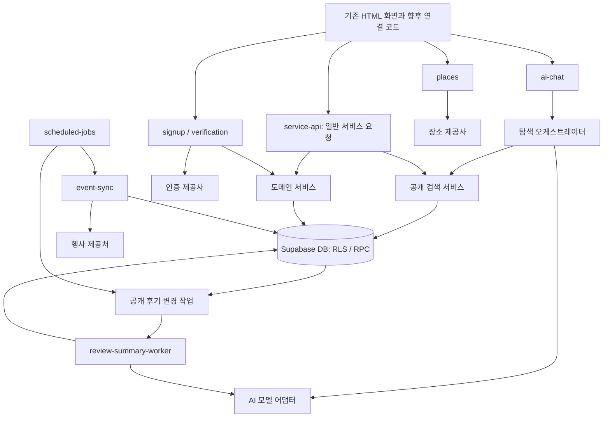

# 유미당 백엔드·AI 에이전트 상세 구조 설계

작성일: 2026-09-23 · 상태: 팀 검토용 제안

기준 문서: [PLAN_원본.md](PLAN_원본.md). 원본의 서비스 기준을 유지하면서 백엔드 파일의 책임, 요청 처리 경로, 서비스 내부 AI 실행 구조를 구체화한다. 아래 파일명·API명·신규 데이터 구조는 **설계 제안**이며 구현 완료나 팀 승인된 명세를 뜻하지 않는다.

이 문서에서 작성하는 것은 설계다. HTML 변경, 기존 코드 재사용, DB 변경, 환경 설치, 실제 외부 연동은 포함하지 않는다. 확정되지 않은 운영 정책과 공급사·모델·예산은 임의로 정하지 않는다.

2인 작업 분담은 다음과 같다. 구체적인 파일 소유권과 협업 순서는 11장에 정리한다.

- **민규담당:** 핵심 서비스 백엔드·회원 인증·DB 권한과 상태 전이·공통 실행 환경.
- **종현담당:** AI 탐색·리뷰 요약·공개 검색·장소 및 행사 연동·비동기 작업 실행.

## 1. 설계 대상과 책임

| 영역 | 책임 | 대표 결과물 |
|---|---|---|
| 화면 연결 규약 | 화면이 보내는 입력과 표시할 결과를 정의 | API 계약, 오류 코드, 화면 상태 |
| 백엔드 진입점 | 요청 검증, 호출자 확인, 기능별 처리 연결 | Edge Function의 handler |
| 도메인 서비스 | 가입·공고·매칭 등 기능의 처리 순서 | services 내부 모듈 |
| DB | 접근 권한, 상태 전이, 동시 처리, 중복 방지 | 테이블, RLS, 트랜잭션 RPC |
| 외부 연동 | 업체별 요청·응답을 내부 형식으로 변환 | 인증·장소·행사 어댑터 |
| AI 탐색 | 자연어 조건 해석, 질문, 검색 결과 설명 | 탐색 챗봇 |
| AI 리뷰 요약 | 공개 후기 원문을 근거로 요약 생성 | 비동기 요약 워커 |
| 작업 실행 | 변경 이벤트와 예약 작업의 처리·재시도 | 작업 테이블, 실행기 |

AI 에이전트는 유미당 이용자에게 기능을 제공하는 서비스 구성 요소다. 개발 작업을 수행하는 에이전트 팀과는 별개다. 초기 서비스는 **탐색 챗봇 1개와 리뷰 요약 파이프라인 1개**로 구성하는 안을 제안한다. 검색·검증·저장을 각각 독립적인 AI 에이전트로 만들 필요는 없다.



화살표는 논리적 처리 관계다. 예약 작업·작업 전달에 사용할 구체적인 큐와 실행 수단은 별도 기술 검증으로 정한다.

## 2. 목표 폴더·파일 구조

원본 구조에 일반 서비스 요청의 진입점인 `service-api`, HTTP 공통 처리, DB 접근 모듈을 보완한다. 민규의 요청에 따라 아래 `backend/` 내부 폴더와 구현용 파일의 골격을 생성했다. 신규 TypeScript 파일은 역할·담당·TODO 주석과 `export {};`만 포함하며 기능은 미구현이다. 설정과 계약 문서도 작성 위치만 준비했다. 이후 작업은 [백엔드 작업 안내](backend/README.md)에 따라 기존 파일을 채운다. 테스트 분류 아래에는 동시 작업을 위한 `minkyu/`·`jonghyun/` 폴더만 준비했으며 실제 기능 테스트·`tools/local/` 실행 환경은 아직 작성하지 않았다. 소유권 검사 도구와 그 테스트는 `tools/collaboration/`에 별도로 작성했다.

```text
backend/
├── README.md                           # 실행 방법, 경계, 문서 위치
├── contracts/                          # 프론트·백엔드 담당자 간 합의 문서
│   ├── conventions.md                  # 인증, 날짜, 페이지 처리, 오류 규칙
│   ├── signup.md                       # 가입·로그인·프로필 완료 상태
│   ├── verification.md                 # 이메일·계좌 인증 상태와 공개 배지
│   ├── posts-search.md                 # 공고 작성·수정·조회·검색
│   ├── search.md                       # 종현 단독 편집: 공개 검색 계약
│   ├── matching.md                     # 신청·상대 선택·최종 동의
│   ├── reviews.md                      # 평가 작성·공개·칭찬 집계
│   ├── ai-chat.md                      # 탐색 대화 입력·검색 카드·실패 응답
│   └── review-summary.md               # 요약 노출 조건·상태·갱신
└── supabase/
    ├── config.toml                     # 새 로컬 환경 설정
    ├── migrations/                     # 기존 이력 보존, 변경은 후속 SQL
    ├── seeds/                          # 실제 개인정보 없는 새 가상 데이터
    └── functions/
        ├── deno.json                   # 공통 의존성·검사 명령 제안
        ├── service-api/                # 공고·신청·매칭·평가·알림 HTTP 진입점
        │   ├── index.ts                # 런타임 시작과 의존성 구성
        │   ├── handler.ts              # HTTP 요청→응답
        │   └── routes.ts               # 기능별 서비스로 연결
        ├── signup/                     # index.ts + handler.ts
        ├── verification/               # index.ts + handler.ts
        ├── places/                     # index.ts + handler.ts
        ├── event-sync/                 # 내부 전용 행사 수집
        ├── ai-chat/                    # 탐색 대화 요청 진입점
        ├── review-summary-worker/      # 내부 전용 요약 작업 실행
        ├── scheduled-jobs/             # 내부 전용 시간 기반 작업 등록·실행
        └── _shared/
            ├── config/
            │   └── env.ts              # 필수 설정 검증, 환경 구분
            ├── http/
            │   ├── request.ts          # 요청 크기·형식·requestId
            │   ├── response.ts         # 공통 성공·오류 응답
            │   ├── errors.ts           # 내부 오류→공개 오류 코드
            │   └── cors.ts             # 허용 출처 설정
            ├── contracts/              # 실제 런타임 검증·타입
            │   ├── common.ts
            │   ├── signup.ts
            │   ├── verification.ts
            │   ├── posts.ts
            │   ├── matching.ts
            │   ├── reviews.ts
            │   ├── search.ts
            │   └── ai.ts
            ├── auth/
            │   ├── principal.ts        # 검증된 호출자 문맥
            │   ├── eligibility.ts      # 가입 근거·프로필 완료 상태 해석
            │   ├── internal-caller.ts  # 예약 작업·워커 호출자 확인
            │   └── session-bridge.ts   # PASS 결과→계정·세션 연결 경계
            ├── services/
            │   ├── signup-service.ts
            │   ├── verification-service.ts
            │   ├── profile-service.ts
            │   ├── post-service.ts
            │   ├── search-service.ts   # 일반 검색과 AI 검색의 공통 경로
            │   ├── matching-service.ts
            │   ├── conversation-service.ts
            │   ├── completion-service.ts
            │   ├── review-service.ts
            │   ├── notification-service.ts
            │   └── event-service.ts
            ├── db/
            │   ├── user-client.ts      # 사용자 권한을 전달하는 DB 접근
            │   ├── internal-client.ts  # 서버 작업용 제한된 접근 경계
            │   └── repositories/      # 기능별 조회·RPC 호출·결과 변환
            ├── integrations/
            │   ├── identity/           # PASS 제공사 어댑터
            │   ├── phone/              # 휴대폰 코드 로그인 연동 경계
            │   ├── email/              # 선택 이메일 인증
            │   ├── bank/               # 1원 계좌 인증
            │   ├── places/             # 카카오 장소 검색
            │   └── events/             # 행사 제공처별 수집·표준화
            ├── ai/
            │   ├── Agents/             # AI 에이전트별 구현 파일
            │   │   ├── chatbot/        # 6장: 탐색 에이전트
            │   │   └── review-summary/ # 7장: 리뷰 요약 에이전트
            │   └── providers/          # 두 에이전트가 사용하는 모델 연결
            ├── jobs/
            │   ├── registry.ts         # 허용 작업 유형·실행기 연결
            │   ├── enqueue.ts          # 중복 방지 키로 작업 등록
            │   ├── lease.ts            # 점유·만료·재점유
            │   └── retry.ts            # 재시도 가능 오류·실행 시각
            └── observability/
                ├── logger.ts          # 민감정보 없는 구조화 로그
                ├── metrics.ts         # 성공률·처리 시간·사용량
                └── redaction.ts       # 금지 필드 제거

tests/
├── database/                           # RLS, RPC, 제약, 경쟁 상태
├── functions/                          # 인증·입력·오류 응답
├── contracts/                          # 화면 계약과 실제 응답 일치
├── integration/                        # 여러 사용자 간 처리
├── ai/                                 # 탐색·요약 평가와 공격성 입력
└── fixtures/                           # 가상 사용자·공고·후기·행사

tools/local/                            # 새 환경 점검·실행·검증 명령
```

`backend/contracts/`는 사람이 합의하는 문서이고 `_shared/contracts/`는 실행 시 입력·출력을 검사하는 코드다. 둘의 역할을 구분하되 같은 필드명과 오류 코드를 사용한다. 기존 테스트 파일과 실행 설정은 재사용하지 않는다.

폴더만 표시한 영역에도 구현 위치를 구체화했다. 모든 신규 함수 진입점에 `index.ts`·`handler.ts`를 두었으며, `repositories/`에는 profiles·verifications·posts·matching·conversations·completion·reviews·notifications·search·events·review-summaries·jobs 파일을 두었다. 각 외부 연동 폴더에는 `port.ts`·`adapter.ts`, 행사 연동에는 `normalize.ts`도 두었다. AI 파일은 6·7장의 목록대로 생성했다. 이는 인터페이스·정책 확정이나 실제 연동 완료를 의미하지 않는다.

`_shared`를 통한 공통 코드 구성은 [Supabase Edge Functions 구조 안내](https://supabase.com/docs/guides/functions/development-tips)를 참고했다. 위의 구체적인 파일 분할과 `service-api` 추가는 유미당에 대한 제안이다.

## 3. 모듈 의존성과 공통 처리

기본 의존 방향은 `handler → service → repository / integration`이다. AI 오케스트레이터는 허용된 도구를 통해 `search-service`를 호출한다.

| 모듈 | 담당 | 맡기지 않는 일 |
|---|---|---|
| index | 런타임과 설정 연결 | 업무 규칙 |
| handler / routes | 인증·입력 검증·응답 변환 | SQL 작성, 프롬프트 구성 |
| service | 기능의 처리 순서와 외부 연동 조합 | HTTP 상태 코드 직접 결정 |
| repository | DB 조회·RPC 호출, 데이터 형식 변환 | AI 모델 호출 |
| DB RPC | 권한·최신 상태를 확인하고 원자적으로 변경 | 외부 API 성공을 가정한 장시간 대기 |
| integration | 업체별 형식·서명·오류 변환 | 회원 자격·매칭 결정 |
| AI provider | 모델 요청·구조화 응답·사용량 변환 | DB 조회·계정 권한 부여 |

서버 사전 검사는 빠른 오류 안내에 사용하고, 양쪽 동의·중복 방지·필수 인증 상태 같은 불변 조건은 DB 변경 시 다시 확인한다. DB를 직접 호출해 서버 검사를 건너뛰어도 같은 제약이 적용되어야 한다.

사용자 요청은 검증된 사용자 문맥을 DB까지 전달한다. 내부 권한 클라이언트는 예약 작업·외부 인증 결과 기록 등 제한된 경로에서만 사용한다. AI에는 클라이언트·키·임의 SQL 실행 도구를 제공하지 않는다. RLS는 행 접근을 제어하므로 공개 필드 분리와 반환 필드 제한도 별도로 설계한다. 권한 우회가 가능한 서버 키의 특성은 [Supabase RLS 안내](https://supabase.com/docs/guides/database/postgres/row-level-security)를 기준으로 검증한다.

공통 성공 응답은 `{ data, requestId }`, 오류 응답은 `{ error: { code, message, retryable }, requestId }` 형태를 제안한다. 오류 원문·SQL·외부 인증 응답·토큰은 사용자 응답에 넣지 않는다.

주요 오류 예시는 `AUTH_REQUIRED`, `PROFILE_INCOMPLETE`, `VERIFICATION_REQUIRED`, `CONDITION_CHANGED`, `STATE_CONFLICT`, `RATE_LIMITED`, `EXTERNAL_UNAVAILABLE`다. 세부 코드와 HTTP 상태는 계약 문서에서 확정한다. 존재 여부를 숨겨야 하는 리소스는 응답 차이로 타인의 정보를 추측할 수 없도록 처리한다.

## 4. 기능별 API와 처리 경로

아래 경로는 논리적 API 이름이다. 실제 URL·메서드·필드 타입은 각 계약 문서에서 확정한다.

| 진입점 / 기능 | 핵심 입력 | 처리 경로 | 핵심 출력 |
|---|---|---|---|
| signup / PASS 완료 | 가입 시도 식별자, 인증 거래 식별자 | 거래 귀속 확인→제공사 검증→자격 확인→세션 연결 | 계정·세션 연결 결과, 사진 등록 필요 상태 |
| signup / 직접 입력 | 이름·생년월일·조건 동의 | PASS 전 정책에 따른 등록 | 직접 입력 근거, 미인증 상태 |
| 휴대폰 로그인 | 번호, 일회용 코드 | 선정된 인증 연동→기존 계정 확인 | 기존 계정 세션 |
| verification / 인증 시작·완료 | 인증 종류, 거래 식별자 | 제공사 확인→서버에 검증 결과 기록 | 본인용 상태, 공개 배지용 최소 상태 |
| service-api / 공고 작성·수정 | 공개 정보, 비공개 안내, 일정·금액 | post-service→권한·계좌 조건 확인 RPC | 공고 ID, 상태, 조건 버전 |
| service-api / 공개 검색 | 검색어·지역·기간·비용·커서 | search-service→공개 검색 전용 조회 | 공개 카드, 다음 커서 |
| service-api / 신청 | 공고 ID, 소개 메시지, 재요청 키 | matching-service→중복·자격 검사 RPC | 신청 ID, 상태 |
| service-api / 상대 선택 | 신청 ID, 조건 버전 | 작성자 확인→최종 동의 요청 생성 | 동의 요청 상태 |
| service-api / 최종 동의 | 동의 요청 ID, 조건 버전 | 신청자 확인→양측 조건·최신 인증 검사→확정 | 매칭 ID, 확정 상태 |
| service-api / 비공개 안내 조회 | 공고 또는 매칭 ID | 현재 작성자·확정 상대 권한 확인 | 비공개 만남 안내 |
| service-api / 채팅·완료 확인 | 신청·매칭 ID, 기능별 입력 | 당사자·진행 상태 확인 RPC | 메시지 또는 완료 상태 |
| service-api / 평가 제출 | 매칭 ID, 경험·별점·칭찬·한마디 | 평가 자격→중복 방지→원자적 저장 | 제출 완료, 공개 여부 |
| service-api / 프로필 후기 조회 | 대상 회원, 커서 | 공개 후기·칭찬·유효 요약 조회 | 서로 구분된 원문·집계·요약 |
| service-api / 알림 조회·읽음 | 커서 또는 알림 ID | 수신자 권한 확인 | 알림 유형·대상·읽음 상태 |
| places | 장소 검색어 | 장소 제공사 검색→공개 필드 변환 | 장소명·기본 주소·장소 ID |
| ai-chat | 현재 대화·조건 | 6장의 탐색 흐름 | 해석 조건·결과 카드·안내 |

로그인은 가입과 분리하며 로그인 과정에서 없는 계정을 자동으로 가입 완료 처리하지 않는다. PASS 완료 요청은 인증 거래가 현재 가입 시도에 속하는지, 이미 사용됐는지 확인해야 한다. 계정 연결 재요청으로 중복 계정이 생기지 않도록 한다.

기존 회원의 일반 로그인은 휴대폰 인증번호 방식이며 로그인마다 PASS를 다시 요구하지 않는다. 유료 공고의 등록·신청·최종 확정 세 단계에서는 필요한 계좌 인증 상태를 서버와 DB 변경 경로에서 확인한다.

`session-bridge.ts`의 인터페이스는 먼저 정의할 수 있지만, **PASS 1회만으로 안전하게 Supabase 세션을 발급하는 구현은 기술 검증 전까지 미확정**이다. 추가 휴대폰 인증을 요구하는 방식을 임의로 대안 확정하지 않는다.

행사 수집·요약 워커·예약 작업은 일반 사용자가 임의로 실행하는 API로 노출하지 않는다. 내부 호출자 검증과 허용 작업 유형 검사를 모두 거친다.

## 5. DB 경계와 변경 설계

### 5.1 기존 데이터와 연결

다음은 저장소의 기존 SQL에서 확인한 주요 객체다. 원격 DB의 실제 적용 상태를 검증한 목록은 아니다.

| 기존 객체 | 활용할 경계 | 후속 설계 대상 |
|---|---|---|
| profiles, private.signup_eligibility | 프로필과 가입 근거 | 직접 입력·PASS·테스트 근거 분리, 완료 상태 |
| private.institutional_email_verifications | 이메일 인증 이력 | 유효 상태와 공개 배지 분리 |
| posts, post_private_details | 공개 공고와 비공개 안내 | 공개 장소·기본 주소 추가, 비공개 접근 경로 점검 |
| join_requests, appointments | 신청과 확정 결과 | 상대 선택·최종 동의·조건 버전 |
| chat_messages | 사용자 간 대화 | 당사자·상태별 접근 유지, AI 탐색 이력과 분리 |
| appointment_completion_confirmations | 동행 완료 확인 | 완료·평가 가능 상태 연결 |
| appointment_reviews | 상호 평가 | 제출 불변성, 공개 한마디·칭찬 집계·요약 연계 |
| notifications | 수신자별 알림 | 최종 동의 요청·확정·평가 가능 이벤트 |

신규 논리 데이터로 인증 거래·계좌 인증 상태, 동의 요청·조건 스냅샷, 표준 행사, 작업, 요약 결과·근거·버전이 필요하다. 정확한 테이블명과 컬럼은 기존 SQL의 최종 정의와 대조한 후 후속 마이그레이션 명세에서 확정한다.

기존 `complete_signup_with_avatar`에는 직접 입력과 이전 가입 자격 경로가 남아 있다. 새 가입 함수를 추가할 때 기존 RPC와 권한도 함께 변경하여 새 자격 조건을 우회하지 못하게 해야 한다. 기존 인증 이력의 의미는 그대로 보존하고 PASS 검증 근거로 자동 전환하지 않는다.

### 5.2 공개·비공개 위치

- 공개 검색 데이터: 제목, 등록 장소명, 시구동, 도로명·건물번호, 일정, 비용 등 허용 필드만 포함한다.
- 비공개 데이터: 층·좌석·구체적인 만남 안내. 작성자와 현재 확정 상대만 조회한다.
- 기존 `exact_location`은 자동 파싱해서 공개 주소로 옮기지 않는다. 새로운 공개 주소가 없는 기존 공고는 기존 공개 지역까지만 반환한다.
- 공개 검색 쿼리·결과 타입·AI 입력 구성 단계에서 비공개 테이블을 제외한다. 반환 후 문자열 마스킹에만 의존하지 않는다.
- 사용자 입력 제목·본문에도 상세 안내가 섞일 수 있으므로 공고 입력 화면에 공개 범위를 명시하고, AI에 전달할 자유 서술 필드와 개인정보 필터 기준을 별도로 검토한다.

### 5.3 매칭 상태와 동시 처리

제안하는 논리 흐름은 `신청 → 작성자 선택 및 조건 동의 → 신청자 최종 동의 대기 → 확정`이다. 기존 DB enum을 이 이름으로 즉시 교체한다는 의미는 아니다.

작성자 선택 시 일정·금액·거래 유형 등 합의 대상 조건의 스냅샷과 버전을 저장한다. 신청자는 동일 버전에 동의한다. 그 사이 조건이 바뀌면 이전 동의로 확정하지 않고 새 조건 확인을 요구한다.

최종 확정 RPC는 하나의 트랜잭션에서 당사자, 동일 조건 버전, 양측 동의, 현재 상태, 필요한 계좌 인증을 확인한 뒤 확정과 알림 이벤트를 기록한다. 동시 요청은 잠금과 제약으로 직렬화하고 중복 요청은 같은 결과를 반환하도록 설계한다. 공고별 확정 가능 인원 등 모집 규칙은 기획과 대조해 제약을 정한다.

기존 단독 확정 RPC, 직접 테이블 쓰기, 권한이 높은 함수가 새 규칙을 우회하지 못하도록 후속 마이그레이션에서 함께 점검한다. API 진입점만 바꾸는 것으로 완료하지 않는다.

### 5.4 후기와 변경 이벤트

제출된 평가의 수정 금지는 DB에서도 적용한다. 사용자에 의한 수정 금지와 공개 상태 변경 처리는 분리한다. 공개 텍스트 후기 집합이 바뀌면 같은 트랜잭션에서 대상의 `sourceRevision`을 증가시키고 요약 무효화·새 작업 등록을 기록한다.

기존 후기 RPC의 `released`는 당사자 사이에서 상대 후기를 볼 수 있는 조건을 나타내므로, 제3자에게 프로필 후기를 공개할 수 있다는 의미로 사용하지 않는다. 프로필 공개 대상·근거·상태를 명시적으로 정의한 조회 경로가 있어야 공개 집계와 AI 요약에 사용할 수 있다.

이벤트 기록은 실제 데이터 변경과 함께 저장하고 워커가 나중에 처리한다. 데이터만 저장되고 작업 등록은 빠지는 경우를 막기 위한 구조다. 칭찬 횟수는 공개 평가를 일반 집계로 계산하며 AI 요약을 집계 원본으로 사용하지 않는다.

## 6. AI 탐색 에이전트 구조

### 6.1 파일별 책임

```text
ai/Agents/chatbot/
├── orchestrator.ts             # 해석→질문 또는 검색→설명→검증의 흐름
├── context.ts                  # 현재 대화와 허용 프로필 필드 선별
├── intent.ts                   # 모델이 반환한 탐색 조건 검증
├── date-range.ts               # 기준 시각·시간대로 실제 기간 계산
├── tools.ts                    # 허용 검색 도구와 엄격한 입력·출력
├── prompts.ts                  # 역할·금지 행동·구조화 출력 지침
├── result-builder.ts           # 실제 검색 결과로 최종 카드 구성
└── output-check.ts             # 근거 ID·민감정보·출력 형식 검증

ai/providers/
├── model-port.ts               # 구조화 생성·취소·사용량의 내부 인터페이스
├── provider-adapter.ts         # 선정 제공사 SDK/API 연결
└── provider-errors.ts          # 시간 초과·한도·형식 오류 구분
```

오케스트레이터는 일반 코드로 작성한다. 모델은 조건을 해석하고 설명을 생성하지만 도구 사용 허용 여부·호출 횟수·종료는 서버가 결정한다. 모델이 스스로 무제한 재계획하거나 다른 에이전트를 생성하는 구조는 초기 범위에 넣지 않는다.

### 6.2 입력·출력 계약

입력은 `messages`, `currentFilters`, `clientRequestId`를 중심으로 정의한다. `messages`는 현재 탐색에서 화면 메모리에 유지한 대화만 보낸다. 사용자 ID·권한·프로필 성향은 클라이언트 선언을 신뢰하지 않고 서버에서 확인한다. 입력 크기·대화 길이·허용 필드·요청 빈도는 검사하되 구체적인 한도는 예산 결정과 함께 확정한다.

출력에는 `status`, `interpretedFilters`, `clarificationQuestion`, `cards`, `notice`, `requestId`를 둔다. `status` 제안값은 `needs_clarification`, `results`, `no_results`, `unavailable`이다. 질문이 필요할 때와 결과가 없을 때를 구분하고, 일반 탐색에 전달 가능한 조건을 함께 제공한다.

결과 카드의 ID·제목·장소·일정·금액·상세 경로는 DB 검색 결과로 구성한다. AI는 결과 ID에 연결된 추천 이유와 확인할 점만 작성하며, 임의 카드·URL·가격을 생성해서 채우지 않는다.

### 6.3 허용 도구

| 도구 | 입력 | 출력 | 권한 경계 |
|---|---|---|---|
| search_public_posts | 검색어, 지역, 기간, 비용 조건, 커서 | 허용된 공개 공고 카드 | 일반 검색과 동일한 공개 검색 서비스 |
| search_public_events | 검색어, 지역, 기간, 종류, 커서 | 표준화된 공개 행사 카드 | 수집·저장된 행사 데이터 조회 |

사용자 입력·공고·후기·외부 행사 설명은 명령이 아닌 데이터로 취급한다. 임의 SQL, URL 가져오기, 비공개 위치 조회, 신청, 매칭, 결제, 메시지 발송 도구는 등록하지 않는다. 공급사 장애를 이유로 모델에 자유 웹 검색 도구를 자동으로 열어주지 않는다.

주변 반경 검색은 제공하지 않는다. 지역·등록 장소명·공개 주소를 기준으로 탐색한다.

### 6.4 실행 순서

1. 호출자와 입력을 확인하고 현재 요청의 기준 시각·서비스 시간대를 정한다. 예시 시간대는 한국 서비스 기준의 `Asia/Seoul`이며 최종 계약에 명시한다.
2. 허용된 프로필 성향과 현재 대화만 요청 메모리에 구성한다. 실명·전화번호·계좌·비공개 만남 안내·사용자 간 채팅은 가져오지 않는다.
3. 모델이 자연어를 제한된 탐색 조건으로 변환한다. 서버는 허용 지역·기간·가격 범위·정렬·페이지 크기를 검증한다.
4. 중요한 조건이 모호하면 질문하고 종료한다. 불필요한 질문으로 탐색을 막지 않도록 평가 사례를 마련한다.
5. 날짜 표현을 실제 검색 구간으로 바꾸고 허용된 검색 도구를 호출한다. 행사 기간과 검색 구간이 겹치는지 검사하여 장기 전시도 포함한다. 경계 포함 여부와 날짜만 있는 데이터 처리는 계약에서 통일한다.
6. 실제 결과의 공개 필드만 설명 모델에 전달한다. 모델이 반환한 근거 ID가 검색 결과에 포함되는지 확인한다.
7. 응답 직전에 결과의 공개·삭제 상태를 다시 확인한다. 제외되는 결과에 의존한 설명도 함께 제거하고 조건·카드·안내를 반환한다.
8. 탐색 종료·새 탐색·로그아웃 시 화면의 대화를 정리한다. 서버는 요청 처리 후 대화를 이력·캐시·작업·분석 로그에 저장하지 않는다.

공급사 측 프롬프트 보관·추적 설정까지 자동으로 비저장을 보장하는 것은 아니다. 제공사 선정 시 보관 설정과 계약을 확인하고, 서비스 로그·APM·오류 추적에도 요청 본문이 기록되지 않도록 검증한다.

### 6.5 실패와 비용 제어

모델 장애·형식 오류는 제한된 재시도 후 일반 탐색으로 연결한다. 설명 생성만 실패하면 검증된 검색 카드와 정형 안내를 반환할 수 있다. 조건 해석이 실패하면 임의의 조건을 만들어 검색하지 않는다. 검색 결과 0건은 정상 결과로 처리하고 범위 확대를 제안하되 조용히 조건을 바꾸지 않는다.

시간 제한, 모델 호출 수, 입력·출력 토큰, 도구 호출 수, 사용자별 요청량에 상한을 둔다. 수치는 모델·예산 확정 후 설정하며 코드에 임의의 운영 기본값을 숨기지 않는다. 검색·일정 계산·카드 생성은 일반 코드가 맡는다.

## 7. AI 리뷰 요약 구조

### 7.1 파일별 책임

```text
ai/Agents/review-summary/
├── orchestrator.ts             # 대상 확인→생성→검증→조건부 저장
├── source-loader.ts            # 현재 공개 텍스트 후기와 revision 조회
├── eligibility.ts              # 공백 제외 텍스트 후기 3개 이상 확인
├── prompts.ts                  # 원문 근거·과장 금지·개인정보 제거 지침
├── evidence-check.ts           # 근거 ID와 주장·입력 연결 검사
├── output-check.ts             # 형식·개인정보·원문 외 추정 점검
└── publisher.ts                # 최신 revision일 때만 요약 게시
```

별도 자율 에이전트가 대화를 이어가는 구조가 아니라, 작업 하나를 처리하고 끝나는 제한된 파이프라인이다. 일반 프로필 조회는 저장된 유효 요약을 읽기만 한다.

### 7.2 입력·저장·공개 계약

작업 입력에는 `targetUserId`, `sourceRevision`, `jobId`를 둔다. 원문을 작업 메시지에 복제하지 않고 실행할 때 DB에서 현재 공개 상태를 확인해 조회한다. 별점만 있는 후기와 공백뿐인 한마디는 텍스트 후기 수에 포함하지 않는다.

내부 요약 결과는 `summaryText`, `sourceReviewIds`, `sourceRevision`, `sourceReviewCount`, `generatedAt`, `promptVersion`, `modelVersion`, `status`를 제안한다. 생성 내용별 근거 ID 연결도 내부적으로 보관한다. 공개 응답은 요약문·기준 후기 수·갱신 시각·표시 상태만 반환한다.

사용 후기가 모델 입력 한도를 넘는 경우의 선택·묶음 요약 방식은 미확정이다. 임의로 일부만 사용하고 전체 후기를 요약한 것처럼 표시하지 않으며, 기준 후기 수는 실제 사용한 원문 수를 뜻한다.

### 7.3 실행 및 공개 상태 변경

1. 후기 공개 집합이 변경되면 대상 revision을 증가시키고 기존 요약을 무효화하며 작업을 등록한다.
2. 워커는 작업을 점유한 뒤 최신 공개 텍스트 후기 집합과 revision을 일관된 스냅샷으로 읽는다.
3. 3개 미만이면 `insufficient_reviews`로 처리하고 요약을 노출하지 않는다. 원문 후기와 칭찬 집계는 별도로 제공한다.
4. 모델에는 공개된 한마디와 임시 근거 ID만 전달한다. 작성자 신원·비공개 후기·계좌·인증 자료는 전달하지 않는다.
5. 출력 형식, 사용한 근거 ID, 개인정보와 원문 밖 추정을 검사한다. “안전한 사람”, “신뢰 보장” 같은 결론을 생성하지 않는다. 근거 ID가 유효하다는 사실만으로 문장 내용의 정확성이 보장되지는 않으므로 평가셋으로 의미 일치도도 검증한다.
6. 저장 RPC에서 대상 revision과 원문 공개 상태를 다시 확인한다. 일치할 때만 결과를 게시한다. 생성 중 후기가 바뀌었으면 오래된 결과를 폐기하고 최신 작업으로 넘긴다.
7. 조회 시에도 게시된 요약의 revision과 현재 revision이 일치해야 반환한다. 비공개 전환 트랜잭션이 끝난 뒤 오래된 요약이 신규 조회에 노출되지 않도록 한다.

이미 화면에 전달된 응답까지 서버가 회수할 수는 없다. 화면 갱신 시 상태를 다시 조회하며, 캐시를 도입한다면 공개 상태 변경과 함께 무효화되는 경로를 먼저 설계한다. 초기에는 별도 공개 요약 캐시를 두지 않는 안을 제안한다.

요약 공개 상태는 `pending`, `ready`, `insufficient_reviews`, `failed`, `invalidated`로 구분하는 안을 제안한다. 재생성에 실패해도 무효화된 요약을 복구해 노출하지 않는다.

## 8. 행사·예약 작업·재시도

행사 수집은 제공처별 어댑터가 데이터를 공통 형식으로 바꾸고 `event-service`가 저장하는 구조다. 제공처 ID와 행사 ID를 조합해 같은 제공처 내 중복을 방지한다. 제공처가 다른 유사 행사는 제목만 같다고 자동 병합하지 않는다.

공통 필드는 제목, 행사 종류, 장소명·공개 주소, 시작·종료 일시, 시간대 또는 날짜 정밀도, 비용 정보, 출처 링크, 수집 시각, 원천 상태다. 공급사 원문에서 HTML·불필요한 추적 정보는 제거하고 AI 입력으로 쓸 필드를 제한한다. 비용이 없거나 모호하면 무료로 추정하지 않는다.

행사 갱신, 후기 공개 시점 도래, 요약 재시도는 각각 별도 작업 유형으로 등록한다. 후기 공개 시점과 취소·분쟁 조건의 구체적인 정책은 확정된 요구사항에 연결하며 이 문서에서 시간을 임의로 정하지 않는다.

작업 상태는 `queued → running → succeeded`를 기본으로 하고 일시 오류는 `retry_wait`, 영구 오류·재시도 소진은 `failed`, 더 최신 작업으로 대체된 경우는 `superseded`로 처리하는 안이다.

- 작업 중복 방지 키는 작업 종류·대상·revision 또는 수집 구간으로 구성한다.
- 점유에는 만료 시각을 두고 중단된 워커의 작업을 회수한다. 오래된 워커의 완료 쓰기는 점유 토큰과 revision으로 거절한다.
- 네트워크 오류·제공사 일시 장애는 간격을 늘려 재시도한다. 잘못된 권한·입력은 무한 재시도하지 않는다.
- 최대 횟수·대기 간격·동시 실행 수·실행 시간은 운영 설정으로 분리하고 외부 서비스 한도와 함께 확정한다.
- 생성·확정·알림은 같은 작업이 다시 실행되어도 중복 결과가 생기지 않도록 DB 제약과 멱등 처리로 보장한다.

## 9. 관측·검증 환경

로그에는 `requestId`, 기능명, 결과 코드, 처리 시간, 재시도 횟수, 모델·프롬프트 버전, 토큰 사용량을 기록한다. AI 대화·후기 본문·상세 만남 위치·전화번호·인증 응답·계좌·세션 토큰은 기록하지 않는다. 가명화된 대상 식별자와 보관 기간도 운영 정책에서 정한다.

로컬 환경은 기존 DB 이력과 새 가상 데이터로 구성한다. 실제 사용자 데이터를 복사하지 않으며 기존 테스트 인증을 실제 PASS 완료로 취급하지 않는다. 외부 인증·모델은 가상 어댑터를 주입해 정상·실패·지연을 검증하고, 실제 연동은 별도 단계에서 확인한다.

현재 저장소에는 이름이 ` 2.sql`로 끝나는 마이그레이션 사본도 있다. 로컬 재생 전에 정식 이력·적용 버전·사본 관계를 대조해야 하며, 모든 파일을 그대로 재생하거나 기존 이력을 임의로 삭제하지 않는다. 이번 문서 작업에서는 이 파일들을 변경하지 않았다.

| 검증 영역 | 핵심 사례 | 통과 기준 |
|---|---|---|
| 가입 | 직접 입력·PASS·테스트 계정, 사진 미완료 | 인증 근거와 가입 완료 상태가 혼동되지 않음 |
| 세션 연결 | PASS 성공·중복 완료 요청·연결 실패 | 추가 인증 없이 안전하게 연결, 중복 계정 방지 |
| 일반 로그인 | 기존 회원 휴대폰 코드·미가입 번호 | 기존 회원은 PASS 재요구 없이 로그인, 미가입자는 가입 완료로 자동 전환되지 않음 |
| 위치 | 작성자·확정 상대·제3자·비로그인 | 비공개 안내는 허용 당사자만 조회 |
| 공개 검색 | 기존 exact_location, 새 기본 주소 | 기존 상세 정보 누출 없이 공개 필드만 검색 |
| 매칭 | 조건 변경·동시 최종 동의·계좌 상태 변경 | 같은 조건의 양측 동의만 확정 |
| 평가 | 중복 제출·수정·공개 상태 변경 | 제출 불변성과 최신 공개 조건 유지 |
| AI 탐색 | 주말 장기 전시·모호한 날짜·0건·모델 장애 | 실제 결과만 제시, 조건과 실패 상태가 명확 |
| AI 경계 | SQL·결제 요구, 공고 본문의 지시문 | 허용 도구 외 실행 불가, 비공개 데이터 미전달 |
| 리뷰 요약 | 텍스트 2개·3개, 공백·별점만 있는 후기 | 유효 공개 텍스트 3개부터 생성 |
| 요약 경쟁 상태 | 생성 중 비공개 전환·중복 워커 | 오래된 revision 게시·노출 방지 |
| 관측 | 오류·추적·가상 공급사 요청 검사 | 본문·인증정보가 로그나 이력으로 저장되지 않음 |

AI 평가 자료는 새 가상 데이터로 만든다. 검색 조건 정확도, 실제 결과 ID 일치, 기간 겹침 처리, 요약 근거 일치, 개인정보 누출, 호출 비용을 분리해 측정한다. 품질 목표와 비용 상한 수치는 평가 결과와 예산을 바탕으로 결정한다.

## 10. 결정이 필요한 항목과 다음 명세

| 항목 | 현재 구체화한 경계 | 결정·검증이 필요한 내용 |
|---|---|---|
| PASS·문자 | signup, identity, session-bridge, phone | 공급사, 거래 귀속 검증, 단일 PASS 세션 연결 |
| 이메일·계좌 | verification과 공개 배지 분리 | 공급사, 유효기간·변경·해지·취소 정책 |
| AI | 탐색·요약·모델 어댑터 분리 | 모델, 데이터 보관 설정, 예산·호출 한도 |
| 프로필 성향 | 서버에서 허용 필드만 선별 | 제공할 필드 목록과 사용자 고지 |
| 작업 실행 | DB 이벤트·작업·점유·재시도 구조 | 큐·스케줄 실행 수단, 실행 시간과 동시성 |
| 대량 리뷰 | revision과 근거 집합 저장 | 원문 선택 기준·묶음 요약·기준 수 표시 |
| 거래·분쟁 | 합의 조건과 상태 전이 경계 | 취소·노쇼·분쟁 세부 정책 |
| 문서 정합성 | 원본 기준으로 구조 확장 | 아래 문서 간 확정 수준 차이 정리 |

보조 문서인 [검토필요.md](검토필요.md)는 직접 거래, 행사 제공처, 선택 인증 등 추가 맥락을 담고 있다. 원본은 최종 확정 시 계좌 상태 확인을 확정 기준으로 쓰지만 보조 문서는 일부를 팀 결정 질문으로 남긴다. PASS 전 직접 입력 가입의 허용 범위도 보조 문서에서는 공개 베타 정책 질문과 연결된다. 이 문서는 원본의 구조를 기준으로 작성했으며, 문서 간 우선순위와 실제 운영 허용 범위는 팀이 정리해야 한다.

상세 명세는 다음 순서로 이어서 작성할 수 있다.

1. **화면 연결 계약:** 화면별 요청·응답 예시, 오류 코드, 권한표, 공개 필드 목록.
2. **DB 변경 명세:** 현재 최종 스키마와 목표 차이, 상태 전이, RLS·RPC·제약, 후속 변경 순서.
3. **AI 실행 명세:** 도구 스키마, 프롬프트, 근거 검증, revision·작업 상태, 평가 자료.
4. **연동 기술 검증:** 단일 PASS 세션 연결, 공급사 검증, 모델 보관 설정, 작업 실행 수단.
5. **구현·검증 계획:** 새 로컬 환경과 테스트를 구성하고 기능별 검증 조건에 연결.

## 11. 2인 담당 업무와 협업 경계

설계·구현 모두 같은 기능 경계를 유지하며 파일별 단독 수정 담당을 고정한다. 두 사람의 경력·선호 정보가 없으므로 기능 간 의존성과 파일 충돌을 줄이는 기준으로 배분했다. 각 담당자는 자기 기능의 계약 문서·구현·검증까지 책임지고, 상대방은 읽기 검토와 변경 요청을 한다. 실제 수정 허용 경로는 [소유권 정책](backend/ownership.json), 적용 절차는 [협업 규칙](docs/collaboration/README.md)을 따른다.

### 11.1 담당 업무

- **민규담당 — 핵심 서비스 백엔드와 데이터 무결성**
  - 가입·로그인·프로필 완료 상태, PASS 세션 연결, 이메일·계좌 인증을 설계한다.
  - 공고 작성·수정, 신청, 양방향 매칭 확정, 사용자 간 채팅, 완료 확인, 평가 제출, 알림을 담당한다.
  - 공개·비공개 데이터 경계, DB 테이블·RLS·RPC·제약과 기존 우회 경로 정리를 담당한다.
  - 리뷰 공개 상태·revision 변경·요약 무효화·조건부 저장을 DB에서 보장한다.
  - 공통 HTTP·인증·DB 클라이언트·환경 설정과 새 로컬 Supabase 실행 기반을 담당한다.
  - 핵심 검증은 권한 누출, 단독 확정, 조건 변경, 동시 요청, 중복 평가, 가입·로그인 상태 구분이다.

- **종현담당 — AI 기능과 탐색·외부 데이터 처리**
  - 탐색 챗봇의 문맥 구성·조건 해석·검색 도구·결과 검증·실패 응답을 설계한다.
  - 리뷰 요약의 공개 원문 조회·생성·근거 검증·워커 처리와 AI 모델 어댑터를 담당한다.
  - 일반 검색과 AI가 함께 쓰는 공개 검색 서비스, 장소 검색, 행사 수집·표준화를 담당한다.
  - 작업 등록 어댑터·점유·재시도·예약 실행을 담당한다. DB 원자성·권한은 민규의 RPC에 연결한다.
  - 모델·프롬프트 버전, AI 사용량·비용 관측, 개인정보 없는 평가 자료를 담당한다.
  - 핵심 검증은 실제 결과만 추천하는지, 장기 행사 기간 검색, 후기 3개 기준, 악성 입력, 모델 장애, 오래된 요약 게시 차단이다.

### 11.2 파일별 주담당

`functions/`는 `backend/supabase/functions/`를, `_shared/`는 그 아래 공통 폴더를 뜻한다. 주담당만 해당 파일을 편집한다. 다른 담당자는 자기 요청 폴더에 요구사항이나 변경안을 기록하며 상대 파일을 직접 수정하지 않는다.

| 파일·영역 | 주담당 | 협업 경계 |
|---|---|---|
| functions/service-api/ | 민규담당 | 종현이 만든 검색 서비스를 라우트에 연결 |
| functions/signup/, verification/ | 민규담당 | 인증 관련 외부 연동 포함 |
| functions/ai-chat/, review-summary-worker/ | 종현담당 | 민규가 정의한 인증·DB 계약 사용 |
| functions/places/, event-sync/, scheduled-jobs/ | 종현담당 | 내부 호출자 검증은 공통 인증 모듈 사용 |
| _shared/services/의 signup·verification·profile·post·matching·conversation·completion·review·notification | 민규담당 | 공개 후기 조회·요약 조회 경계 제공 |
| _shared/services/search-service.ts, event-service.ts | 종현담당 | 공개 필드·권한·검색 RPC는 민규와 합의 |
| _shared/auth/, http/, config/, db/user-client.ts, db/internal-client.ts | 민규담당 | 종현은 공통 인터페이스에 연결 |
| _shared/db/repositories/의 회원·공고·매칭·채팅·완료·평가·알림 모듈 | 민규담당 | AI에 비공개 데이터를 반환하지 않음 |
| _shared/db/repositories/의 검색·행사·요약·작업 모듈 | 종현담당 | SQL·RPC 정의와 권한 변경은 민규가 통합 |
| _shared/integrations/identity·phone·email·bank | 민규담당 | 인증 근거와 상태를 서버에서 검증 |
| _shared/integrations/places·events, _shared/ai/, _shared/jobs/ | 종현담당 | 데이터 상태 변경은 합의된 RPC로 처리 |
| _shared/contracts/common·signup·verification·posts·matching·reviews | 민규담당 | 공고 공개 카드와 후기 원문 계약을 종현과 합의 |
| _shared/contracts/search·ai | 종현담당 | 공통 공개 데이터 타입을 재사용 |
| _shared/observability/logger.ts, redaction.ts | 민규담당 | 민감정보 제외 규칙을 공통 적용 |
| _shared/observability/metrics.ts | 종현담당 | 두 담당자가 사용할 지표 인터페이스 제공 |
| backend/supabase/migrations/ | 민규담당 | 종현이 행사·요약·작업 데이터 요구 및 SQL 변경안을 제공, 민규가 순서·권한·통합 책임 |
| backend/supabase/config.toml, functions/deno.json, tools/local/ | 민규담당 | 종현이 필요한 작업·AI 환경 변수와 실행 명령을 전달 |
| backend/contracts/ | 파일별 단독 담당 | search·ai-chat·review-summary는 종현, posts-search·conventions 등 나머지는 민규 |
| tests/각분류/minkyu/, tests/각분류/jonghyun/ | 각자 자기 폴더만 수정 | fixtures도 동일하게 분리; 공통 설정은 민규 |
| backend/supabase/seeds/minkyu/, jonghyun/ | 각자 자기 폴더만 수정 | 로드 설정과 공통 안내는 민규 |
| 최상위 지침·상세 설계·backend/README.md·ownership.json | 민규담당 | 종현은 직접 수정하지 않고 자기 요청 폴더에 변경 요청 |
| docs/collaboration/개인별 현황·requests/개인별 폴더 | 각자 자기 파일만 수정 | 상대 요청의 답변도 자기 폴더에 별도 문서로 작성 |

### 11.3 먼저 합의할 연결 계약

두 사람이 병렬로 작업하려면 다음 계약을 먼저 고정하고 가상 응답을 만든다. 이후 변경은 제공자와 사용자가 함께 확인한다.

| 연결 계약 | 민규담당 | 종현담당 | 함께 확인할 기준 |
|---|---|---|---|
| 공개 검색 | 공개 필드·접근 권한·검색 DB RPC | 검색 서비스·조건 정규화·AI 도구 | 일반 검색과 AI가 같은 공개 범위를 사용 |
| 리뷰 요약 원문 | 공개 텍스트 후기·revision 조회 RPC | 원문 로더·3개 기준·요약 입력 구성 | 기존 released를 프로필 공개로 오해하지 않음 |
| 요약 게시 | revision 비교·조건부 저장·유효 요약 조회 RPC | 생성 결과·근거 ID·버전 전달 | 생성 중 비공개 전환 시 오래된 결과 거절 |
| 작업 처리 | 작업 테이블·중복 제약·원자적 등록·점유 RPC | enqueue·lease·retry·실행기 | 중복 실행과 중단 복구에서도 상태 유지 |
| 후기 공개 시점 처리 | 공개 가능 정책·상태 변경 RPC | 예약 시각 도래 확인·RPC 호출 | 시간 정책을 워커에 중복 구현하지 않음 |
| 행사 저장 | 행사 테이블·저장 권한·유일 제약 | 제공처 어댑터·표준 형식·저장 모듈 | 제공처 식별자·기간·비용의 의미 일치 |
| 인증·오류·관측 | 검증된 호출자·공통 오류·로그 규약 | AI·작업 오류 및 사용량을 공통 형식으로 변환 | 인증정보·대화·후기 본문이 로그에 남지 않음 |

### 11.4 작업 순서와 완료 기준

| 단계 | 민규담당 | 종현담당 | 단계 완료 기준 |
|---|---|---|---|
| 1. 계약 합의 | 권한·상태·공개 필드·DB 변경 명세 | AI 입출력·검색·작업 명세와 필요한 DB 계약 | 위 연결 계약에 요청·응답 예시와 오류 사례 작성 |
| 2. 독립 작업 | 로컬 환경·핵심 서비스·인증 연동 경계 | 가상 DB·모델 어댑터로 탐색·요약·행사·작업 처리 | 상대 구현 없이 각 기능의 정상·실패 경로 확인 |
| 3. 실제 연결 | RPC·권한·revision·마이그레이션 통합 | 검색 도구·워커·외부 어댑터 연결 | 가상 계약을 실제 로컬 서비스로 교체해 검증 |
| 4. 통합 검증 | 가입→공고→신청→양측 확정→평가 흐름 주도 | 검색·AI 장애·요약 무효화·재시도 흐름 주도 | 9장의 권한·경쟁 상태·실패 사례를 함께 확인 |

민규의 DB 작업이 끝날 때까지 종현이 기다리지 않도록 계약과 가상 데이터를 먼저 제공한다. 종현은 AI만 먼저 만드는 것이 아니라 행사·요약·작업에 필요한 데이터 변경안을 초기에 전달한다. 정책 미정 항목은 각 영역 담당자가 선택지와 영향을 정리하고 두 사람이 결정하며, 구현 편의를 위해 임의 확정하지 않는다.

각자 별도 clone/worktree·브랜치에서 자기 기능의 문서·코드·검증을 관리한다. 수정 전 소유권 검사를 하고 커밋 전 hook으로 다른 담당 파일이 섞였는지 확인한다. 공통 파일과 마이그레이션은 민규만 편집한다. 연결 계약이 바뀌면 상대방은 자기 소유 파일에서 필요한 수정·검증을 수행한다. 로컬 검사와 AI 지침은 파일 시스템 잠금이나 원격 브랜치 보호를 대신하지 않는다.

### 11.5 종현 인수인계 — 첫 대화에서는 계획부터 설명

민규가 이 문서를 종현에게 전달한다. 종현이 AI 도구에 **“나 종현이야”**라고 말하면, AI는 원본·이 문서·현재 저장소 상태를 확인하고 아래 순서로 작업 계획을 설명한다. 프로젝트 전체에 적용할 같은 지침은 [AGENTS.md](AGENTS.md)에 기록한다. 문서만 별도로 전달받은 경우에도 이 절차를 따른다.

1. **현재 상태:** 무엇이 설계이고 무엇이 구현되어 있는지 구분한다. 이 문서의 파일 트리는 목표 구조다.
2. **종현담당과 민규담당:** 종현은 AI·탐색·장소·행사·작업 실행, 민규는 핵심 서비스·인증·DB 권한·공통 환경을 주로 맡는다고 설명한다.
3. **우선 작업:** 공개 검색, 공개 후기와 revision, 요약 게시, 작업 처리, 행사 저장의 입출력·오류·권한 계약을 먼저 정리한다. 민규와 연결할 항목과 독립적으로 진행할 항목을 나눈다.
4. **진행 순서:** 계약·가상 데이터 → 공개 검색·장소·행사 → AI 탐색 → 리뷰 요약·워커 → 실제 로컬 연결·통합 검증. 이미 완료된 단계가 있으면 현황에 맞게 조정한다.
5. **산출물과 완료 기준:** 첫 작업에서 작성할 문서·가상 응답과 확인할 사례를 구체적으로 제시한다. 이후 단계도 수정할 파일과 검증 기준을 연결해 설명한다.
6. **미정 사항:** 공급사·모델·예산·운영 정책 등 결정이 필요한 사항을 알리고, 미정 상태에서도 진행 가능한 설계 작업을 제시한다.
7. **문서 안내:** 첫 응답에 [상세 설계 문서](PLAN_상세설계.md)와 [프로젝트 지침](AGENTS.md)의 클릭 가능한 링크를 반드시 포함한다. 상세 설계는 11장의 담당·연결 계약부터 읽고 6~8장의 AI·작업 흐름, 9장의 검증 기준을 확인하도록 안내한다. 프로젝트 지침은 계획 우선 설명·담당 경계와 기존 작업 보존·복잡한 작업의 에이전트 팀 활용 기준을 담고 있다고 설명한다. 응답 링크는 종현의 현재 작업 공간 경로에 맞춰 제공한다.
8. **동시 작업 안내:** [협업 규칙](docs/collaboration/README.md)의 단독 수정 경계와 상대 변경 요청 절차를 설명한다. 자기 복제본에서 종현 작업자·커밋 검사 설정이 필요한지 확인하고 안내하며, 자기소개만으로 공유 디렉터리의 작업자 설정을 바꾸지 않는다.

첫 응답의 예시는 다음과 같다. 실제 응답은 현재 저장소 상태를 확인한 뒤 맞춰 작성한다.

> 종현님 담당은 AI 탐색·리뷰 요약과 공개 검색·장소·행사·작업 실행입니다. 먼저 민규님 백엔드와 연결할 검색·후기·요약 저장·작업 처리 계약을 정리하겠습니다. 첫 산출물은 요청·응답 예시, 오류·권한 규칙, 가상 데이터입니다. 이를 바탕으로 검색·행사 처리, 탐색 AI, 요약 워커 순으로 진행하고, 마지막에 실제 DB 연결과 권한·실패·재시도 사례를 검증합니다. 민규님 DB 구현을 기다리는 동안에는 가상 어댑터로 독립 작업할 수 있습니다.
>
> [상세 설계 문서](PLAN_상세설계.md)는 11장의 담당 업무·연결 계약을 먼저 확인하고, 6~8장의 AI·작업 흐름과 9장의 검증 기준을 이어서 읽으시면 됩니다. [프로젝트 지침](AGENTS.md)에는 계획부터 설명하는 절차와 기존 작업 보존·에이전트 팀 활용 기준이 정리되어 있습니다. 이 두 문서를 기준으로 위 작업 계획을 진행합니다.

자기소개만으로 구현을 시작하지 않고 우선 계획 설명으로 응답한다. 종현이 작업 시작도 함께 요청했거나 이전에 지시한 작업이 있다면 해당 범위에서 진행한다. 이 절차는 매 단계의 반복 승인 요구를 뜻하지 않는다.

현재까지 상세 설계·인수인계 지침과 `backend/` 내부의 목표 폴더·구현용 파일 골격을 생성했다. 기존 백엔드 파일은 유지했다. 신규 API·AI·DB 변경·실행 환경은 아직 구현하지 않았으며, 이후 작업에서 지정된 파일을 채운다.
