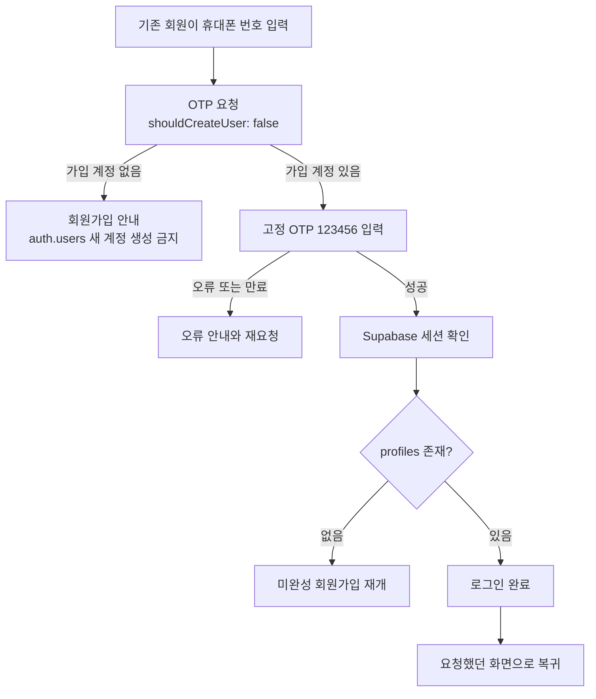

> 보관본: 2026-09-20 폴더 정리 전 문서. 현재 지시로 실행하지 않는다. [최신 시작점](../../../../README.md). 상대 링크만 보관 위치에 맞췄다.

# 유미당 Supabase 재구축 인수인계

기준일: 2026-09-16\
작업 폴더: `/Users/b/Documents/Antigravity/yumidang`\
현재 상태: **기존 `App.tsx` UI를 유지한 채 사용자 흐름 1~9 (회원가입 → 로그인 → 공고 → 상대 프로필 → 참여 요청 → 매칭 채팅 → 최종 확정 → 동행 완료 → 블라인드 상호 평가)을 Supabase에 연결했고, 원격 A/B/C/익명 브라우저 전체 사이클까지 PASS했다.** 최종 결과는 `docs/backend-implementation/HARNESS-REPORT.md`. 아래 "과거 기록" 절들은 기능 1·2 당시 기록이며 `nickname`, `3번부터 미구현` 등은 더 이상 최신이 아니다.

> **최신 작업 방향(2026-09-20): [작업 분담·화면 구조 인수인계](../../../handoffs/WORK_SPLIT_2026-09-20.md)**. 팀원 1은 정책, 팀원 2는 API, 사용자+GPT는 팀 합의용 전체 화면 구조를 설계한다. 구현 배경·정책 D-A1~D-A16은 [9월 18일 인수인계](../../../handoffs/CLAUDE_CODE_인수인계_2026-09-18.md)에 보존돼 있다. 아래는 그 이전 기록이다.

## 최신 완료: UT 신청 알림 Expansion 적용·권한 검증 (2026-09-17, Codex)

- 대상은 Supabase `bndguguarijmghnkenvt` 하나다. 적용 직전 `notifications` table/function/trigger/policy와 Realtime publication이 모두 0임을 확인했다.
- `20260917122744_ut_notifications_and_discovery` 적용: 수신자 전용 알림 테이블/RLS, 신규 신청 trigger, 본인 읽음 RPC 2개, 인증 사용자용 작성자 성별·만 나이 조회 RPC, Realtime publication을 추가했다.
- 기존 신청 backfill은 사용자 결정에 따라 제거했다. 적용 직후 `notifications` 0행을 확인했고 적용 이후 신규 신청부터 생성된다.
- 실제 A/B/C 테스트 PASS: A의 신규 신청 알림은 작성자 B만 SELECT·Realtime 수신했고 A·제3자 C·익명은 조회하지 못했다. A의 단건 읽음과 C의 전체 읽음 RPC는 B의 알림을 바꾸지 못했고 B만 읽음 처리했다. 기존 로그인과 공개 공고 조회도 PASS했다.
- 검증용 공고 1행, 신청 1행, 읽음 알림 1행을 추가했다. 기존 행은 수정·삭제하지 않았고 테스트 행도 삭제하지 않았다. 원문 전화번호·OTP·JWT·UUID는 출력·증거에 남기지 않았다.
- 적용 후 advisor의 새 Performance INFO에 따라 forward-only `20260917141449_notifications_join_request_index`를 적용했다. 요청 당시 로컬 `20260917123159_notifications_join_request_index.sql`의 SQL만 실행했으며 MCP가 부여한 실제 원격 version에 파일명을 맞췄다. 인덱스는 valid/ready, 알림 행 수는 1행으로 불변, 외래키 미인덱스 finding은 0건이다. 적용 직후 사용 통계가 없어 같은 인덱스에 `unused_index` INFO가 표시되며 실제 부하 후 재평가한다.
- Security advisor의 새 WARN 3건은 authenticated가 호출해야 하는 `SECURITY DEFINER` RPC를 탐지한 것이다. `PUBLIC`/`anon` 실행 회수, `auth.uid()`/수신자 조건, 실제 교차 사용자 테스트를 확인했다.
- Git commit/push와 Vercel Production 배포는 수행하지 않았다. Production은 계속 기준 SHA `2433add0ac2c45521849864b454e5fcdc03236ab`이다.
- 상세 기록: `docs/ut-improvements/IMPLEMENTATION-2026-09-17.md`. 원격 회귀: `tests/harness/ut-notifications.mjs`.

## 최신 완료: 프로필 사진 필수 원격 적용·운영 검증 (2026-09-17, Codex)

- 대상은 Supabase `bndguguarijmghnkenvt`와 Vercel `jjackbb-projects/yumidang`이다. 존재하지 않는 `yumidang6`을 만들지 않았고 `.vercel/project.json`을 실제 `yumidang` 프로젝트 ID로 정정했다.
- Expansion `20260917052827_profile_images_required` 적용: private JPEG 2MB bucket, authenticated read/본인 INSERT·DELETE, 객체 소유·MIME·크기 검증, 사진 포함 가입과 변경/삭제 RPC, 직접 avatar 열 변경 차단.
- 첫 Expansion은 SQLSTATE `42601`로 전체 롤백됐다. size 검사를 명시적인 형식/범위 조건으로 분리하고 전체 로컬 검사를 다시 통과한 뒤 같은 version으로 적용했다. 부분 적용이나 데이터 변경은 없었다.
- Production은 이미 기능 커밋 `fb8de7a`/READY였고 공개 번들의 Supabase ref가 대상과 일치했다. 여성 직접 가입과 남성 추천 가입에서 실제 Storage 업로드, 통제 업로드/RPC 실패 재시도, stable path, signed URL 재로딩, 교체, 삭제, 로그인 유지를 모두 확인했다.
- Contraction `20260917094753_disable_legacy_signup_without_avatar` 적용: Production READY 이후 구 RPC 호출 0회와 실제 사진 가입 PASS를 확인한 뒤 `authenticated`의 구 `complete_signup` 실행만 회수했다. `service_role`은 유지했다.
- 최종 원격: Auth 19 / profile 17 / post 36 / join request 14 / message 176 / appointment 11 / review 10 / profile image object 0. 시작 Auth 14 / profile 13 / post 36 대비 통제 테스트 Auth +5, profile +4뿐이다. 기존 profile 13개와 post 36개의 체크섬은 동일하다.
- 기존 회원 `5555` 로그인, 익명/로그인 공고, 모집 중 지정 공고 5개, 작성자 `남성 · 만 30세`를 Contraction 후에도 재확인했다. 지정 6번째 공고는 삭제가 아니라 `closed` 상태라 기본 목록에서 제외된다.
- authenticated 전체 bucket SELECT 범위는 인터뷰에서 더 좁은 공개 계약이 정해지지 않아 그대로 유지했다. 비로그인 공개는 차단되지만 로그인 회원 사이 객체 목록 범위가 넓은 운영 위험은 남는다.
- 상세 기록: `docs/backend-implementation/PROFILE-IMAGE-REQUIRED-2026-09-17.md`. 실제 테스트 명령은 `tests/browser/signup-profile-photo-production.cjs`, `tests/profile-images-remote.mjs`.

## 최신 추가 구현: 회원가입 성별 분기·작성자 성별/만 나이 (2026-09-17, Codex)

- 원격 `20260917043418_signup_eligibility_author_demographics.sql` 적용. 기존 4개 프로필은 `legacy`, 신규 여성은 직접 완료, 신규 남성은 여성 추천 코드 또는 기관 이메일 확인을 `complete_signup`이 원자적으로 강제한다.
- 직접 profile INSERT와 gender UPDATE를 차단했고 private 가입/추천/이메일 테이블은 deny-all RLS로 잠갔다. 기존 허용 profile 편집과 기존 계정 로그인은 유지한다.
- `test-institutional-email-auth`를 JWT 검증 enabled로 배포하고 별도 flag/expiry를 2026-09-24 09:00 KST까지 설정했다. 기존 `test-phone-auth`는 변경하지 않았다.
- 모바일 원격 스모크: 익명 RPC 0회/정보 미표시, 기존 5555 계정 로그인 후 `남성 · 만 30세`, 지정 공고 6개 존재 PASS. 신규 원격 가입은 fixture를 남기지 않기 위해 NOT_RUN.
- 실제 기준 수량은 요청서의 1/1/6과 달리 적용 전후 4 Auth / 4 profile / 10 post였으며 삭제·축소하지 않았다.
- 상세 결과: `docs/backend-implementation/SIGNUP-ELIGIBILITY-AUTHOR-DEMO-2026-09-17.md`.

## 최신 재개 결과: 기존 UI 통합 완료 (2026-09-17, Codex)

- 별도 `LiveApp` 화면으로 교체했던 방향을 폐기하고 기존 홈·탐색·신청 모달·채팅·마이페이지 UI에 `src/live/useLiveBackend.ts`와 어댑터를 연결했다. 삭제된 `src/live/*` 화면 파일은 이 통합 과정의 의도된 결과다.
- 원격 적용된 `20260916131906_existing_ui_gender_category_author_cards.sql`을 로컬 이력에 추가했다. 가입 성별, 공고 상대 성별 조건의 서버 검증, 기존 UI의 `지금` 카테고리, 로그인 목록용 마스킹 작성자 카드 RPC가 포함된다.
- 중단 원인이던 평가 모달 locator를 하단 `닫기` 버튼의 정확한 접근성 이름으로 수정했다. 이어 발견된 빈 이미지 `src` 경고는 참여 신청 모달과 마이페이지 공개 후기 카드에 중립 기본 아바타를 적용해 해결했다.
- 최종 원격 브라우저 run `run-codex-fc4`: 기능 전체 사이클 17단계와 콘솔 무오류 검사 PASS. A/B 독립 세션, Realtime 양방향 채팅, 종료 전 완료 거부, 블라인드 평가, 재로그인 복구, C/익명 차단, 원본 개인정보 차단을 기존 UI에서 확인했다.
- 최종 사전 검사 `run-codex-preflight1`: 7/7 PASS. 대상은 `bndguguarijmghnkenvt`이며 다른 프로젝트에 요청하지 않았다.
- 로컬 재검증: `npm test` 95/95 PASS, `npm run lint` PASS, `npm run build` PASS(기존 500 kB 청크 경고), `git diff --check` PASS.
- Notion 도구가 이 세션에 없어 원격 Notion은 `NOT_RUN`; 대체 기록은 `docs/backend-implementation/NOTION-UPDATE.md`에 남겼다.

## 최신 상태: 기능 1 감사 + 기능 2~9 구현 (2026-09-16, Claude Code)

- 대상: `yumidang` / `bndguguarijmghnkenvt` / ap-northeast-2. 첫 원격 조회·첫 원격 변경 직전 ref 확인. 다른 Supabase 프로젝트 요청·변경 없음. service-role/secret 키 미사용.
- **기능 1 감사 결함 수정:** `profiles.nickname` → `real_name`(데이터 보존 RENAME, 열 권한 유지), 서버 `mask_real_name`/`korean_age` 추가, 프론트 "닉네임" → "실명"(신분증 검증 아님 안내), 4글자 마스킹 규칙 `변**미`로 통일.
- **기능 2 감사 결함 수정:** 테스트 인증 로그인 모드가 미가입 번호 계정을 만들던 문제 → Edge Function `mode` 추가, v3 배포(secrets·만료 설정 미변경). 외부 `next` 기본 복귀 `/`로. 인증 훅의 늦은 응답 덮어쓰기 방지.
- **기능 3 범위 충돌 해소:** 최소 공고 작성 + `posts`/`post_private_details` 원자적 저장 추가(수정·삭제 없음).
- 일반 실행은 새 `src/live/`(Supabase 전용)로 분리했다. 기존 프로토타입은 `?demo=1`에서만 실행되며 일반 실행에서 샘플 데이터로 돌아가지 않는다.
- 원격 마이그레이션(로컬 파일명 = 원격 version): `20260916101123_profiles_real_name_contract`, `20260916105220_feature03_posts`, `20260916105738_feature04_post_author_profile`, `20260916105916_feature05_join_requests`, `20260916110052_feature06_matching_chat`, `20260916110758_feature07_final_match`, `20260916110943_feature08_completion`, `20260916111030_feature09_mutual_review`, `20260916111437_appointments_request_post_fk_index`, `20260916114036_rpc_unavailable_errors_as_404`. 기존 3개 마이그레이션은 수정하지 않았다.
- 테스트 데이터: 하네스 계정 A/B/C(`010-9270-0001~0003`), run마다 가입 검증 계정 1개, `[run_id]` 제목 공고와 그 요청·메시지·동행·평가, 삭제 상태 고정 공고 1건(관리자 SQL). 기존 사용자·프로필·공고는 삭제하지 않았다.
- 관리자 SQL 사용: 스키마 조회, 삭제 상태 고정 공고 1건 생성, 평가 기한 검증용 run 공고 1건 일정 이동. 사용자 행동 성공을 관리자 권한으로 대신하지 않았다.
- 기능별 인수인계: `docs/backend-plans/02-login-HANDOFF.md` ~ `09-mutual-review-HANDOFF.md`. 실행 방법: `docs/backend-implementation/RUNBOOK.md`. 상태: `docs/backend-implementation/STATE.md`.
- Git: 작업 중 GitHub Desktop 브랜치 전환으로 변경분이 `stash@{0}`(회원가입까지만)에 보관돼 사용자 선택에 따라 main에 `stash apply`로 복구했다. stash 항목은 삭제하지 않았다. 커밋·푸시·Vercel 배포는 하지 않았다.
- 테스트 인증 서버 만료: **2026-09-23 18:30 KST**. 이후 하네스 사전 검사가 실패하며 임의 연장하지 않는다.

---

# 과거 기록 (기능 1·2 단계)

## 최신 상태: 임의 번호 테스트 인증 활성화 (2026-09-16 18:35 KST)

- 사용자 승인: Supabase 테스트 인증 활성화 허용. 이어 Vercel `yumidang`의 **Production·Preview 환경 변수 추가**를 명시 승인받았다. Git 커밋·푸시·Vercel 사이트 배포는 수행하지 않았다.
- 대상 재확인: `jjjackbbb` / `uyighfgdivmjhmqtokna`, 프로젝트 `yumidang` / `bndguguarijmghnkenvt`, `ACTIVE_HEALTHY`. 다른 Supabase 프로젝트는 변경하지 않았다.
- **PASS / 실제 적용:** Supabase 플러그인으로 `test-phone-auth` version 1 배포, 로그인 전 endpoint의 `verify_jwt=false` + 함수 내부 고정 코드 검사. CLI로 대상 ref를 명시해 서버 secrets 3개 설정. 비밀값은 브라우저·Git·문서에 기록하지 않았다.
- **활성 만료:** `2026-09-23T09:30:00Z` = **9월 23일 18:30 KST**. 7일 기본값을 사용자에게 안내했다. 만료는 신규 인증만 막고 기존 계정·프로필을 삭제하거나 이미 발급된 세션을 취소하지 않는다.
- `.env.local`: `VITE_TEST_PHONE_AUTH=true`. `.env.example`은 안전한 비활성 기본값 유지.
- **PASS / 설정 재조회:** Vercel `jjackbb-projects/yumidang` Production·Preview에 `VITE_SUPABASE_URL`, `VITE_SUPABASE_PUBLISHABLE_KEY`, `VITE_TEST_PHONE_AUTH=true` 추가. 기존 GEMINI/APP_URL은 보존했다. Vercel UI의 Sensitive 표시와 무관하게 `VITE_*` 값은 웹 빌드에서 공개된다. 관리자 키를 넣지 않았다.
- **오래된 연결 주의:** `.vercel/project.json`의 `yumidang6`은 잔여 데이터다. 해당 ID 원격 조회는 실패했고 변경하지 않았다. 현재 프로젝트는 `--project yumidang`으로 명시해 조회·환경 변수 설정했다. 동시 진행 중인 사용자 배포와 충돌하지 않도록 로컬 링크는 임의로 덮어쓰지 않았다.
- **PASS / 실제 원격:** `tests/remote-test-phone-auth.mjs` — 새 계정·실제 토큰, 010이 아닌 11자리, 잘못된 코드·길이 거부, 프로필 저장, 동일 UUID 재로그인, refresh, A/B/anon RLS, 시스템 열 쓰기 거부, 기존 0010 native OTP, 로그아웃. 요청만 하거나 잘못된 코드로 검사한 번호의 사용자 수는 SQL로 0 확인.
- **PASS / 실제 로컬 브라우저 + 원격:** `tests/browser/test-phone-auth-live.cjs` — 자동 하이픈, 틀린 OTP, 인증 후 미완성 프로필 새로고침 복구, 프로필 저장, 26살 표시, 새로고침 후 세션·프로필 복구, 로그아웃. API mock 없이 수행했다.
- 검증 과정의 초기 실패: 원격 테스트의 upsert가 수정 금지 `id` 열 권한에 걸려 앱과 동일한 INSERT/입력 열 UPDATE로 수정했다. 브라우저 테스트는 가입 후 창이 자동 닫히는 앱 동작에 맞춰 대기를 수정했다. 보안 권한이나 앱 동작을 느슨하게 바꾸지 않았다.
- 검증 데이터: `010-9161-0001`, `987-9161-0002`, `010-9161-0003`, `010-9161-0004` 테스트 계정·프로필을 보존. 0003은 첫 브라우저 검사 중 실제 저장 후 검사 대기만 실패한 기록이다.
- 최종 SQL 재조회: Auth 사용자 16명, 프로필 14행. 기존 12/10에서 검증용 4/4가 추가됐다. Notion 지정 페이지에 기능·키·검증·만료·Vercel 후속 단계를 갱신하고 재조회로 확인했다.
- **PASS / 로컬:** 88/88 tests, TypeScript lint, Vite production build. 임시 폴더 출력, 기존 500 kB 청크 경고 유지.
- **보안 Advisor:** 기존 유출 비밀번호 보호 비활성 1건. 신규 임의 번호 경로는 내부 phone/password를 사용하므로 과거의 '비밀번호 없음' 설명은 기존 native OTP에만 해당한다. 서버 HMAC 비밀번호이며 사용자 비밀번호 입력은 없다. 공개 운영 전 공유 코드 자체를 제거한다.
- **NOT_RUN:** Vercel 사이트 재배포·공개 URL 인증 확인, 실제 SMS, 실제 7일 만료 경계 대기, Git 커밋·푸시.
- **다음 단계:** 사용자가 진행 중인 Vercel 배포에 최신 파일이 포함됐는지 확인하고 환경 변수 추가 이후 새 빌드를 실행한다. 변경 전 시작한 빌드는 새 설정을 포함하지 않을 수 있다. 기능 3~9는 구현하지 않았다.

## 이전 준비 기록: 전화번호 표시 / 임의 번호 테스트 로그인 (활성화 전)

- 사용자 요청: 숫자 입력 시 `010-0000-0001` 자동 표시, 임의 11자리 + `123456`, Supabase 실제 저장 유지.
- **PASS:** `PhoneInput`을 일반/데모 인증 입력에 적용. 내부 숫자 상태와 표시 하이픈을 분리하고 중간 수정·하이픈 삭제·붙여넣기를 지원한다.
- **준비 / 미활성:** `supabase/functions/test-phone-auth/`와 `src/auth/testPhone.ts`. 서버에서 고정 코드 확인 후 실제 Auth 사용자·세션을 발급받아 기존 `setSession`/프로필/RLS를 사용하도록 작성했다. 기존 20개 번호는 기존 native OTP 경로를 유지한다. 미등록 임의 번호는 코드 확인 뒤 계정을 생성하고 기본 프로필을 입력한다.
- `.env.example`의 `VITE_TEST_PHONE_AUTH=false`가 기본값이다. `.env.local`에는 활성화하지 않았다. 따라서 아래의 기존 20개 번호 인증 계약은 현재 실행 경로이고, 임의 번호 인증은 아직 사용자에게 제공되지 않는다.
- 원격 `list_edge_functions` 결과는 빈 목록이었다. 이전 배포 금지 지시 때문에 Edge Function 배포·서버 secrets 설정을 실행하지 않았다. 활성화 절차와 키 역할은 `supabase/functions/test-phone-auth/README.md` 참조.
- **PASS:** 로컬 테스트 88/88, TypeScript, Vite build. 빌드 산출물은 저장소 밖 임시 폴더로 출력. 500 kB 청크 경고는 기존과 동일.
- **PASS / 실제 로컬 브라우저·API mock:** `tests/browser/phone-input.cjs`로 숫자 타이핑, 하이픈 포함 입력, 하이픈 앞뒤 삭제, E.164 요청값, 번호 변경 시 OTP 초기화를 검증했다.
- **PASS / mock:** 서버 비활성·만료·대상 ref·잘못된 OTP 검사, 번호별 비밀번호 분리·재로그인 안정성, 기존 20개 OTP 경로, 비테스트 계정 차단.
- **NOT_RUN:** 임의 번호 원격 계정/세션 생성, 동일 UUID 재로그인, 원격 A/B RLS 회귀. 서버 코드의 mock 통과를 실제 Supabase 성공으로 표현하지 않는다.
- **다음 단계:** `bndguguarijmghnkenvt`에 테스트 인증 Edge Function 배포 예외 허용을 먼저 확인한다. 서버 활성화/만료/비밀 설정 후 원격 회귀를 통과해야 프론트 플래그를 켠다. 사이트 배포·Git 커밋·푸시는 계속 금지다.
- **후속 기능 영향:** 공유 OTP는 실제 번호 소유 인증이 아니다. `app_metadata.phone_ownership_verified=false`인 신규 테스트 계정은 인증 배지를 표시하지 않는다. 사용자 UUID가 생겨도 기능 3~9의 원격 상호작용은 아직 미구현이다.
- **Notion:** 지정 페이지에 이번 변경, 환경 키, mock PASS/원격 NOT_RUN을 추가 기록했다.

## 1. 범위 경계

현재 완료 범위는 아래 두 흐름이다.

`약관 확인 → 휴대폰 번호 입력 → 테스트 OTP 확인 → auth.users 생성 → 기본 프로필 입력 → public.profiles 저장 → 새로고침 후 가입 상태 유지`

`로그인 버튼 → 휴대폰 번호 입력 → OTP 요청(shouldCreateUser:false) → OTP 확인 → 자기 프로필 복구 → 로그아웃`

- 3번부터 9번 `평가`까지는 구현하지 않는다.
- 공고·신청·채팅·매칭·평가 데이터를 Supabase로 옮기지 않는다.
- 기존 브라우저 프로토타입 데이터를 전체 백엔드로 일괄 이관하지 않는다.
- Git 커밋·푸시·배포는 사용자가 별도로 요청하기 전 수행하지 않는다.

## 2. 확인된 Supabase 상태

반드시 아래 새 프로젝트만 사용한다.

- 프로젝트 이름: `yumidang`
- 프로젝트 ref: `bndguguarijmghnkenvt`
- 리전: `ap-northeast-2`
- 프로젝트 URL: `https://bndguguarijmghnkenvt.supabase.co`
- 상태 확인 당시: `ACTIVE_HEALTHY`
- 프로젝트 고정 MCP URL: `https://mcp.supabase.com/mcp?project_ref=bndguguarijmghnkenvt&features=database,development,debugging,docs`

이 ref가 아닌 프로젝트는 모두 대상이 아니다. 프로젝트 이름이나 ref가 다르면 변경하지 말고 중단한다.

2026-09-16 구현은 위 ref가 URL에 고정된 `supabase_yumidang` MCP로만 원격 DB를 확인·변경했다. 다른 Supabase 프로젝트는 조회하거나 변경하지 않았다. 프론트엔드에는 MCP가 반환한 활성 modern publishable key만 사용하며 secret/service-role key는 사용하지 않는다. 실제 값은 Git 제외 파일 `.env.local`에만 있다.

원격 DB 최종 상태:

- 마이그레이션 `20260916080335 create_profiles` 적용
- 마이그레이션 `20260916081429 remove_profiles_neighborhood` 적용
- 마이그레이션 `20260916081750 restrict_profiles_column_writes` 적용
- `public.profiles`: 7개 열, RLS 활성, 정책 3개(`select/insert/update own`), 테스트 행 10개
- `auth.users`: 테스트 휴대폰 사용자 12명. `0001`, 진단 중 OTP 요청만 성공한 `0010`은 프로필이 없고, `0002`~`0009`, `0012`, `0013`은 프로필이 있다. `0011`은 `shouldCreateUser:false` 로그인 차단 검증에 사용해 계정을 만들지 않았다.
- 열 권한은 클라이언트가 프로필 입력 열만 쓰게 제한했다. `created_at`, `updated_at`은 클라이언트가 INSERT/UPDATE할 수 없고 DB 기본값·트리거가 관리한다.
- 최종 Supabase Advisor: 성능 경고 0건. 보안 경고는 비밀번호 로그인용 `Leaked Password Protection Disabled` 1건이며 이번 휴대폰 OTP 흐름에는 비밀번호가 없다. 기능 2 이후 비밀번호 로그인을 추가한다면 다시 판단한다.

### 휴대폰 테스트 인증

- 테스트 번호: `+821000000001` ~ `+821000000020`
- 국내 표시: `010-0000-0001` ~ `010-0000-0020`
- 고정 OTP: `123456`
- 휴대폰 가입 허용: 적용 완료
- 휴대폰 확인 요구: 적용 완료
- 실제 SMS: 발송하지 않음
- `+821000000001`: 기존 직접 검증으로 세션 생성됨. 프로필은 없음.
- `+821000000002`~`+821000000009`, `+821000000012`, `+821000000013`: 웹 검증으로 세션과 프로필 생성됨.
- `+821000000010`: 인증번호 요청 실패 진단에서 Supabase 요청이 실제 성공해 Auth 사용자가 생성·확인됐지만 프로필은 없음. 로그인하면 가입 기본 프로필 단계로 복구해야 한다.
- `+821000000011`: 미가입 로그인 차단 검증용. `shouldCreateUser:false`라 Auth 사용자가 생기지 않았다.
- 다음 신규 가입 검증에는 `+821000000014`~`+821000000020`을 우선 사용한다.

고정 OTP는 테스트용 우회 수단이다. 공개 운영 전에는 제거하거나 만료일을 설정하고 실제 SMS 공급자로 교체해야 한다. 현재 만료일은 설정하지 않았다.

## 3. 로컬 저장소 상태

- 브랜치: `main`
- 원격: `https://github.com/jjackbb/yumidang.git`
- 확인 당시 HEAD: `f03e6e5`
- 앱은 React 19 + Vite 6 + TypeScript다.
- `@supabase/supabase-js`는 `2.116.0`으로 고정 설치했다.
- `.env.example`에는 `VITE_SUPABASE_URL`, `VITE_SUPABASE_PUBLISHABLE_KEY`의 빈 자리만 있다.
- `.env.local`은 Git에서 제외되며 지정 프로젝트 URL과 modern publishable key가 있다.
- `supabase/migrations/`에는 원격 이력과 같은 세 마이그레이션이 있다.
- 일반 실행은 `AuthModal.tsx`가 실제 Supabase OTP와 `profiles`를 사용한다. `DemoAuthModal`은 `?demo=1`에만 남겼다.
- 실제 Supabase 사용자·프로필을 프로토타입 `localStorage` 데이터에 복제하지 않는다. Supabase 세션 자체는 SDK의 영구 저장을 사용한다.
- 앱 시작 시 세션과 자기 프로필을 함께 읽고 `anonymous / profile-incomplete / authenticated / error` 상태를 구분한다.
- 일반 실행 첫 진입은 `로그인`이며, 로그인 화면 하단 `회원가입`을 눌러야 가입 약관 단계로 이동한다.
- 기존 회원 OTP 요청은 `shouldCreateUser:false`로 미가입 계정 생성을 막는다. 로그인 성공 시 자기 프로필을 복구하고, 프로필이 없으면 가입 기본 정보 단계로 보낸다.
- 일반 실행 로그아웃은 `supabase.auth.signOut()`으로 세션을 끝내고 개인 화면 상태를 닫은 뒤 홈으로 이동한다.
- `src/utils/profile.ts`의 `ageOn()`은 서울 날짜 기준 만 나이를 이미 계산한다.
- `ageGroupOf()`의 `20대` 표시는 새 가입 프로필에서 사용하지 말고 `25살` 같은 만 나이를 표시한다.

루트 `.overnight/`의 과거 생성물 482개는 2026-09-16에 삭제했고 `.gitignore`에 등록했다. `docs/overnight/`는 문서이므로 보존했다. 삭제된 생성물의 Supabase 코드·키·SQL을 복사하거나 복원하지 않는다.

## 4. 회원가입 데이터 계약

`auth.users`는 Supabase가 관리하고, 앱 프로필은 `public.profiles`에 둔다. 전화번호를 `profiles`에 중복 저장하지 않는다.

프로필에는 지역 정보를 저장하지 않는다. 만남 장소는 기능 3의 공고 데이터에서 별도로 설계한다.

최소 스키마:

| 키 | 형식 | 규칙 | 역할 |
|---|---|---|---|
| `id` | `uuid` | PK, `auth.users.id` FK, 삭제 연쇄 | 인증 계정과 프로필을 1:1 연결 |
| `nickname` | `text` | 필수, 앞뒤 공백 제거, 길이 제한 | 서비스에 공개할 이름 |
| `birth_date` | `date` | 필수, 본인만 원본 조회 | 만 나이 계산의 기준 |
| `avatar_url` | `text` | 선택 | 이후 프로필 기능에서 사용할 사진 주소 |
| `bio` | `text` | 선택 | 이후 프로필 기능에서 사용할 소개 |
| `created_at` | `timestamptz` | 필수, 기본값 `now()` | 프로필 등록 완료 시각 |
| `updated_at` | `timestamptz` | 필수, 변경 시 자동 갱신 | 마지막 프로필 수정 시각 |

`auth.users.created_at`도 유지한다. 세 시각의 의미는 다르다.

- `auth.users.created_at`: 인증 계정이 만들어진 시각. 가입 오류·계정 수명 확인에 사용한다.
- `profiles.created_at`: 기본 프로필 저장이 완료된 시각. 인증만 끝나고 프로필이 빠진 계정을 구분한다.
- `profiles.updated_at`: 프로필이 마지막으로 바뀐 시각. 최신 정보·동기화 오류 확인에 사용한다.

나이는 DB에 고정 숫자로 저장하지 않는다. `birth_date`와 현재 서울 날짜로 만 나이를 계산해 `25살`처럼 표시한다. 생일이 지나면 데이터 수정 없이 나이가 바뀌어야 한다. 정확한 생년월일은 다른 사용자에게 공개하지 않는다.

기존 프로토타입의 실명·성별·추천인·직장 이메일 규칙은 이번 최소 스키마에 승인된 항목이 아니다. 사용자 확인 없이 DB 계약에 추가하지 않는다. 현재 약관 문구도 법률 검토된 동의 이력이 아니므로, 영구 동의 기록을 구현했다고 표현하지 않는다.

## 5. 권한과 실패 처리

`public.profiles`에 RLS를 켠다.

- 로그인 사용자는 자기 `id = auth.uid()` 행만 `select`, `insert`, `update`할 수 있다.
- 다른 사람의 프로필 조회 권한은 사용자 흐름 4번에서 별도로 설계한다.
- anon 접근과 다른 사용자의 수정은 거부한다.
- 브라우저 입력 검증만 믿지 말고 DB 제약과 RLS를 함께 둔다.
- 프로필 생성은 OTP 성공 뒤 클라이언트가 수행한다. 자동 트리거로 빈 프로필을 만들지 않는다. 그래야 `profiles.created_at`이 프로필 등록 완료 시각을 뜻한다.
- OTP 성공 뒤 프로필 저장에 실패하면 인증 세션을 없애지 않는다. 다시 열거나 새로고침했을 때 미완성 프로필 입력부터 재개한다.
- `auth.users`는 있는데 `profiles`가 없으면 가입 완료가 아니라 `프로필 미완성`으로 처리한다.

## 6. 프론트엔드 구현 계약

1. `@supabase/supabase-js`를 정확한 버전으로 고정 설치한다.
2. `.env.example`에 `VITE_SUPABASE_URL`, `VITE_SUPABASE_PUBLISHABLE_KEY` 이름만 추가한다.
3. 실제 값은 Git에서 제외되는 `.env.local`에 둔다. service-role/secret key는 사용하지 않는다.
4. `src/lib/supabase.ts`에서 환경변수 누락을 명시적으로 처리한다.
5. 회원가입 OTP 요청은 `supabase.auth.signInWithOtp({ phone, options: { shouldCreateUser: true } })`를 사용한다.
6. OTP 확인은 `verifyOtp({ phone, token, type: 'sms' })`를 사용한다.
7. 국내 입력 `01000000002`를 요청 전에 `+821000000002`로 변환한다.
8. 브라우저에서 `otpCode === '123456'`처럼 직접 통과시키지 않는다. 반드시 Supabase 응답으로 성공을 판정한다.
9. 첫 가입 검증에는 미사용 번호 `010-0000-0002` 이후를 사용한다.
10. 인증 세션과 자신의 프로필을 복구한 뒤에만 회원 영역을 보여준다.
11. 기존 데모 모드가 필요하면 `?demo=1` 안에만 격리한다. 일반 실행에서 실패 시 로컬 가짜 로그인으로 돌아가지 않는다.
12. 기본 헤더 버튼은 `로그인`이다. 로그인 화면에 휴대폰 번호·인증번호 요청·인증번호 입력을 두고 하단 `회원가입` 버튼으로 가입 흐름에 진입한다.
13. 기존 회원 로그인 OTP 요청은 `shouldCreateUser: false`를 사용한다. 미가입 번호에는 가입 안내를 보여주며 계정을 만들지 않는다.
14. Supabase/Auth 네트워크·요청 제한·공급자·미가입 오류를 구분해 안내하고, 알 수 없는 오류에는 안전한 오류 코드만 표시한다.

## 7. 구현·검증 결과

기능 1은 아래처럼 실제 실행해 완료 판정했다.

- **PASS / 실제 웹·원격:** `010-0000-0002`~`0009`로 반복 회귀했고, 최종 검증은 `0008`/`0009`에서 수행했다. Supabase가 `123456`을 검증하고 세션을 만들었다.
- **PASS / 실제 웹·원격:** 잘못된 OTP에 만료 안내가 표시됐고, 즉시 재요청은 Supabase 제한을 받아 “잠시 기다린 뒤 다시 요청” 안내가 표시됐다.
- **PASS / 실제 웹·원격:** 프로필 INSERT를 브라우저에서 1회 강제 실패시켰을 때 입력과 인증 세션이 유지됐고, 새로고침 뒤 `profile-incomplete`에서 기본 프로필 단계가 자동 재개됐다.
- **PASS / 실제 웹·원격:** 닉네임·생년월일 저장, `25살` 표시, 새로고침 후 같은 세션·프로필 복구를 확인했다.
- **PASS / 실제 A/B REST:** A는 자신의 행을 조회·수정했고 `updated_at`이 증가했다. A가 B를 조회·수정하면 모두 0행이었고 B 데이터는 바뀌지 않았다. anon도 행을 얻지 못했다.
- **PASS / 실제 REST:** 클라이언트가 `created_at`을 포함한 INSERT와 `created_at/updated_at` UPDATE는 권한 오류로 거부됐다.
- **PASS / Supabase MCP:** RLS 활성, 정책 3개, 7개 최소 열, 열 단위 쓰기 권한을 재확인했다. 로그인 회귀 후 최종 수량은 `auth.users` 12명, `profiles` 10행이다.
- **PASS / 로컬:** `npm test` 80/80, `npm run lint`, `npm run build`, `git diff --check` 통과. 빌드는 500 kB 초과 청크 경고만 있고 실패는 아니다.
- **PASS / 실제 로그인 UI:** 헤더 `로그인` → 휴대폰/OTP 입력 화면 → 하단 `회원가입` → 약관/가입 흐름을 확인했다.
- **PASS / 미가입 로그인:** `0011`에 `shouldCreateUser:false` 요청 시 Supabase가 `422 otp_disabled / Signups not allowed for otp`를 반환했고, 화면은 가입 안내를 표시했다. Auth 사용자는 생성되지 않았다.
- **PASS / 기존 회원 로그인·로그아웃:** `0012` 가입 후 `supabase.auth.signOut()` → 로그인 화면 → OTP `123456` → 기존 프로필 복구를 실제 브라우저로 확인했다.
- **PASS / 사용자 제보 재현:** `0010` 가입 OTP 요청을 같은 프로젝트·키로 직접 재시도했을 때 `messageId: test-otp`, `error: null`로 성공했다. 번호 형식·원격 설정 문제가 아니라 당시 일시적 연결/제한 오류가 일반 문구로 뭉개진 문제였고 오류 분기를 보강했다.
- **PASS / 최종 Supabase MCP:** `auth.users` 테스트 사용자 12명, `profiles` 10행, 최신 `0012/0013` confirmed를 재확인했다.
- 실제 회귀 스크립트는 `tests/browser/supabase-signup.cjs`다. 다음 실행자는 미사용 가입 번호 두 개를 `LIVE_SIGNUP_PHONE_A`, `LIVE_SIGNUP_PHONE_B`, 계정 생성 금지 검증 번호를 `LIVE_UNREGISTERED_PHONE`으로 명시해야 하며 기본값은 없다.
- **NOT_RUN:** 유효했던 OTP가 실제 시간 경과로 만료되는 정확한 경계 시각 대기. 잘못된 OTP에 대한 만료 안내 분기와 재요청 제한은 실제 확인했다.
- **NOT_RUN (범위 외):** 실제 SMS 공급자, 운영용 테스트 OTP 제거, 법률 검토된 약관 동의 이력, 배포·배포 URL 검증.
- **NOT_RUN (사용자 지시):** Git 커밋·푸시.

테스트 통과와 로컬 저장만으로 배포 성공이라 쓰지 않는다. 배포 검증은 `NOT_RUN`이다.

## 8. Notion 기록

구현과 실제 검증이 끝난 뒤 다음 페이지에 `기능 1. 회원가입` 항목을 기록한다.

`https://app.notion.com/p/3dd626093f2e801881f8e73f47c9618e`

**PASS / 2026-09-16:** `기능 1. 회원가입` 항목을 기록하고 다시 불러와 확인했다. 환경 키, `auth.users` 핵심 키, `profiles` 7개 키마다 형식·PK/FK·공개 범위·RLS·생성/수정 주체·필요 이유를 적었고, 세 시각의 차이와 실제 PASS/NOT_RUN도 구분했다.

**PASS / 2026-09-16:** 같은 페이지에 `기능 2. 기존 회원 로그인` 항목을 기록하고 다시 불러와 확인했다. 로그인 UI, `shouldCreateUser: false`, 로그아웃, 오류 처리, 실제 검증 결과와 NOT_RUN을 구분해 남겼다.

## 9. 완료: 2번 기존 회원 로그인

2026-09-16 사용자 요청으로 구현 범위가 2번 로그인까지 확장됐다. 3번 이후 기능은 구현하지 않았다.

기능 2에서 확정된 계약:

- 기존 회원 OTP 요청은 반드시 `shouldCreateUser: false`를 써야 한다. 기능 1의 `true` 경로를 그대로 재사용하면 미가입 번호가 새 계정이 된다.
- `useSupabaseAuth`의 상태 모델과 자기 프로필 로더를 재사용한다. 세션이 있어도 프로필이 없으면 로그인 완료가 아니라 `profile-incomplete`로 회원가입 기본 정보 단계에 보낸다.
- 실제 `supabase.auth.signOut()`과 개인 화면 상태 초기화를 구현했다.
- 보호 경로 복귀는 `safeReturnPath`를 유지하되 외부 URL을 허용하지 않는다.
- A/B 브라우저 간 세션·프로필 혼합 방지 검증을 유지한다. 공개 프로필 조회 정책은 기능 4에서 별도로 추가하며, 기능 2 때문에 현재 자기 행 전용 RLS를 넓히지 않는다.
- `profiles`에는 활동 지역을 넣지 않았다. 만남 장소는 기능 3의 공고 계약에서 설계한다.

2번 완료 결과:

- **PASS:** `shouldCreateUser: false`로 미가입 번호가 계정으로 생성되지 않는다.
- **PASS:** 기존 회원은 OTP 검증 후 자신의 프로필을 불러온다.
- **PASS:** 새로고침 후 세션이 유지된다.
- **PASS:** `/chat`, `/me` 같은 보호 화면은 익명 사용자를 로그인으로 보낸다.
- **PASS:** 로그인 뒤 안전한 내부 경로 복귀 계약을 기존 `safeReturnPath`로 유지했다.
- **PASS:** 로그아웃하면 Supabase 세션과 개인 화면 상태가 사라진다.
- **PASS:** 가입 A/B RLS 격리와 별도 브라우저 컨텍스트 검증을 유지했다.

## 10. 다음 Codex 세션 시작 프롬프트

아래 문장을 새 세션에 그대로 붙여 넣는다.

> `/Users/b/Documents/Antigravity/yumidang/HANDOFF.md`를 먼저 읽고 저장소와 ref bndguguarijmghnkenvt Supabase MCP 상태를 직접 확인해줘. 기능 1 회원가입과 기능 2 기존 회원 로그인은 완료됐으므로 회귀시키지 말고, 다음 사용자 흐름은 구현 전에 현재 계약과 완료 기준부터 사용자와 확인해. 테스트 번호/고정 OTP 설정을 다시 만들지 말고, 다른 Supabase 프로젝트는 절대 변경하지 마. 실제 확인과 NOT_RUN을 구분하고 Git 커밋·푸시·배포는 하지 마.`
