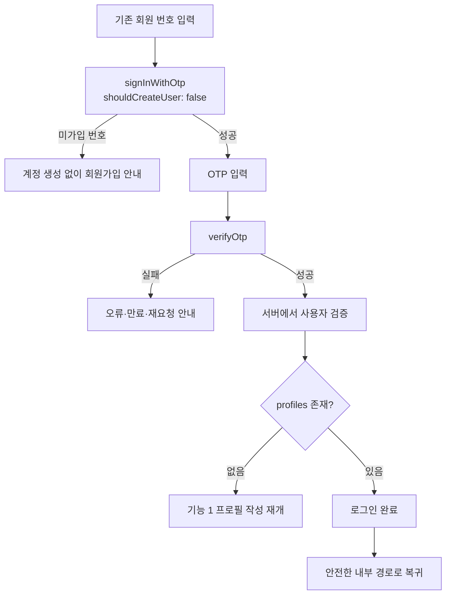

# 기능 2 기존 회원 로그인 구현 인수인계

기준일: 2026-09-16  
작업 폴더: `/Users/b/Documents/Antigravity/yumidang`  
상태: **구현·원격·브라우저 검증 완료 (2026-09-16 Claude Code 감사)** — 아래 "과거 기록" 절의 `구현 대기`는 감사 전 지시서 원문이다.

## 최신 결과: 감사·보완 (2026-09-16)

기능 2는 루트 HANDOFF에 완료로 기록돼 있었지만 이 문서는 `구현 대기`였다. 코드·원격 Auth·브라우저로 직접 감사했고 **누락만 보완**했다. 새 테이블·열·RPC는 없다.

### 감사에서 발견한 결함과 수정

| 결함 | 영향 | 수정 |
|---|---|---|
| 테스트 인증(`VITE_TEST_PHONE_AUTH=true`) 경로에서 로그인 모드도 `test-phone-auth`가 **미가입 번호의 계정을 생성** | "로그인은 계정을 만들지 않는다" 계약 위반 | Edge Function에 `mode: login/signup` 추가. `login`은 관리자 생성 호출을 하지 않고, 미가입이면 `404 not_registered`. 기존 20개 번호는 `create_user:false`. `mode`가 없는 구버전 클라이언트는 기존 `signup` 동작 유지. 원격 **v3 배포**(`verify_jwt=false` 유지, secrets 미변경) |
| `safeReturnPath` 기본값이 `/me` | 외부·알 수 없는 `next`가 홈이 아니라 `/me`로 이동 | 기본값 `/`로 수정, 외부 URL·`//`·`javascript:`·`?demo=1` 조작 차단 단위 테스트 추가 |
| 인증 상태 훅이 늦게 도착한 이전 세션의 프로필 조회로 최신 상태를 덮을 수 있음 | 계정 전환 시 이전 사용자 상태 잔존 가능 | 요청 순번 가드 추가. 같은 사용자의 토큰 갱신은 화면을 다시 마운트하지 않음 |
| 일반 실행 화면이 localStorage 샘플 데이터를 사용 | 로그아웃·계정 전환 후 private 상태가 브라우저 샘플과 섞임 | 일반 실행을 `src/live/LiveApp.tsx`로 분리, 화면 상태를 사용자 ID로 키잉해 로그아웃·전환 시 폐기. 프로토타입은 `?demo=1` 전용 |

### 실제 변경 파일

- `supabase/functions/test-phone-auth/handler.ts` (원격 v3 배포)
- `src/auth/testPhone.ts`, `src/components/AuthModal.tsx` — 로그인/가입 모드 전달, 실명 라벨(기능 1)
- `src/auth/routes.ts`, `src/auth/useSupabaseAuth.ts`, `src/App.tsx`, `src/live/LiveApp.tsx`
- `tests/test-phone-auth.test.ts`, `tests/auth.test.ts`, `tests/harness/feature-02-login.mjs`

### 데이터와 권한

- 새 DB 키 없음. 읽는 키: `auth.users.id`(세션), `profiles`의 본인 행(`real_name`, `birth_date`, `avatar_url`, `bio`, `created_at`, `updated_at`).
- `profiles` RLS는 `auth.uid() = id` 본인 행 전용 그대로다. 상대 정보는 기능 4 이후 서버 RPC의 마스킹 값만 쓴다.
- 세션 토큰은 supabase-js 저장소만 사용하며 DB·로그·URL·증거 파일에 남기지 않는다.

### 실행 명령과 결과

최종 통합 run: `npm run test:harness` → `run-20260916T115621-lu3w` 전 단계 PASS.

| 검사 | 계층 | 결과 |
|---|---|---|
| `npm run harness:02` — 미가입 임의 번호 로그인 거부(재시도 시에도 계정 없음), 미사용 기존 번호 `shouldCreateUser:false` 거부, 잘못된 코드/알 수 없는 mode 거부, 동일 UUID 재로그인, A/B 세션 분리, refresh·로그아웃 | REMOTE | PASS |
| 단위: 로그인 모드 계정 미생성·404, 반환 경로 allowlist | LOCAL | PASS |
| 전체 사이클 1·15단계 — A/B/C UI 로그인, 헤더 마스킹 이름·만 나이, 로그아웃 후 private 데이터 사라짐, 재로그인 후 상태 복구 | BROWSER | PASS |
| 전체 사이클 15단계 — 로그아웃 상태 `/me` 접근 → `/login?next=%2Fme` → 로그인 후 `/me` 복귀, 조작한 외부 `next`는 `/`로 | BROWSER | PASS (`/chat` 복귀는 같은 allowlist 단위 테스트만) |
| 실제 SMS | — | NOT_RUN (범위 밖) |

### 남은 위험

- 테스트 인증은 공유 코드이며 번호 소유 확인이 아니다. 서버 만료 2026-09-23 18:30 KST.
- 미가입 안내는 번호 가입 여부를 드러낸다(계정 열거). 공개 운영 전 재검토.
- Vercel에 배포된 이전 빌드는 `mode`를 보내지 않아 로그인 화면에서도 가입 동작을 유지한다. 재배포는 사용자 요청 전 수행하지 않았다.

재실행: `npm run harness:02`, 전체: `npm run test:harness`

---

## 과거 기록: 감사 전 구현 지시서 (원문 보존)

구현 도구: Claude Code `2.1.268`

## 목표

기능 1에서 가입과 프로필 생성을 끝낸 사용자가 휴대폰 OTP로 다시 로그인하고, 자신의 프로필과 안전한 내부 복귀 경로를 복원한다.

상세 계획은 먼저 아래 파일에서 읽는다.

- `/Users/b/Documents/Antigravity/yumidang/docs/backend-plans/02-login.md`
- `/Users/b/Documents/Antigravity/yumidang/HANDOFF.md`

## 시작 조건

기능 1 구현과 동시에 시작하지 않는다. 두 기능이 `AuthModal`, 인증 상태 모듈, `App.tsx`, 테스트를 함께 수정하기 때문이다.

이 문서를 최종 확인할 때 `.env.example`, `package.json`, `App.tsx`, `AuthModal.tsx`, `src/auth/`, `src/lib/`, `supabase/` 등이 Git 기준으로 변경되는 것이 관찰됐다. 기능 1 구현 세션이 진행 중인 상태이므로 지금 기능 2를 동시에 시작하지 않는다. 기능 1 세션이 종료됐다는 사용자 확인을 받은 뒤 최신 파일을 다시 읽는다. 사용자의 침묵을 작업 완료로 간주하지 않는다.

다음 조건을 모두 확인한 후 구현한다.

1. 기능 1 구현 세션이 종료됐다.
2. `@supabase/supabase-js`와 실제 Supabase 클라이언트가 존재한다.
3. `public.profiles` 마이그레이션과 자기 행 RLS가 적용됐다.
4. `profiles`에는 `neighborhood` 또는 `neighborhood_id`가 없다.
5. 웹에서 테스트 계정 하나 이상이 OTP 인증과 프로필 저장을 완료했다.
6. 현재 `npm test`, `npm run lint`, `npm run build` 결과를 기준선으로 확인했다.

조건이 충족되지 않으면 기능 2 코드를 별도로 만들지 말고 누락된 선행 조건을 보고한다.

## 고정 인프라

- Supabase 프로젝트: `yumidang`
- 프로젝트 ref: `bndguguarijmghnkenvt`
- URL: `https://bndguguarijmghnkenvt.supabase.co`
- 테스트 전화번호: `+821000000001` ~ `+821000000020`
- 고정 OTP: `123456`
- 실제 SMS: 발송하지 않음

명령 실행 전에 프로젝트 ref를 다시 확인한다. 다른 Supabase 프로젝트는 조회 목적이라도 구현 대상으로 삼지 않는다. 프론트엔드는 publishable key만 사용한다.

현재 Claude Code에는 `supabase` MCP 서버가 등록되어 있지 않다. 이미 새 계정으로 로그인된 Supabase CLI를 사용하되, 첫 원격 명령 전에 `projects list`로 대상 ref가 정확한지 확인한다. MCP 연결 추가 자체를 기능 2 범위에 넣지 않는다.

## 구현 범위

구현해야 할 항목:

1. 국내 번호를 E.164 형식으로 변환한다.
2. 로그인 OTP 요청에 반드시 `shouldCreateUser: false`를 사용한다.
3. OTP를 브라우저에서 직접 비교하지 않고 `verifyOtp` 결과로 확인한다.
4. 앱 시작·새로고침 시 세션을 복구하고 서버에서 사용자를 검증한다.
5. 검증된 ID로 자기 `profiles`만 불러온다.
6. 프로필이 없으면 로그인 완료가 아니라 기능 1 미완성 화면으로 보낸다.
7. 로그인 전 `/chat` 또는 `/me`를 요청했다면 성공 후 해당 내부 경로로 돌아간다.
8. 외부 URL이나 허용되지 않은 `next` 값은 홈으로 보낸다.
9. 로그아웃 시 Supabase 세션과 화면의 private 상태를 함께 비운다.
10. 계정 전환 시 이전 계정의 비동기 응답과 데이터가 남지 않게 한다.

## 데이터와 권한

- 새 테이블·컬럼·RPC를 만들지 않는다.
- `auth.users`는 Auth API로만 다루고 프론트에서 직접 조회하지 않는다.
- `profiles`는 `auth.uid() = id`인 자기 행만 읽는다.
- 로그인 기능은 `profiles`를 자동 생성하거나 수정하지 않는다.
- 전화번호를 `profiles`에 중복 저장하지 않는다.
- 지역 정보는 프로필에 넣지 않는다. 만남 장소는 기능 3 공고에서 설계한다.
- 세션 토큰·OTP를 DB, 로그, URL에 저장하지 않는다.

## 실패 처리

- 미가입 번호: 계정을 만들지 않고 회원가입 안내
- 잘못된 OTP: 같은 입력 단계 유지
- 만료된 OTP: 재요청 안내
- 요청 제한: Supabase 응답에 맞춰 대기 안내
- 네트워크 오류: 익명 상태 유지와 재시도
- 세션 검증 실패: private UI 비공개
- 프로필 없음: 기능 1 입력 재개
- 환경변수 누락: 로컬 가짜 로그인으로 우회하지 않고 설정 오류 표시

## 완료 검증

다음 항목을 실제로 확인한다.

1. 가입 완료 계정이 로그아웃 후 다시 로그인한다.
2. 미가입 번호의 로그인 시도 전후 `auth.users` 수가 증가하지 않는다.
3. 잘못된 OTP로 세션이 생기지 않는다.
4. 올바른 OTP로 자기 프로필을 불러온다.
5. 새로고침 뒤 세션과 프로필이 유지된다.
6. `/me`와 `/chat`의 로그인 후 복귀가 각각 동작한다.
7. 외부 `next` 주소가 차단된다.
8. 로그아웃 후 뒤로가기로 private 화면이 보이지 않는다.
9. 두 브라우저의 A/B 계정 상태가 섞이지 않는다.
10. A가 B의 원본 프로필을 조회·수정하지 못한다.
11. `npm test`, `npm run lint`, `npm run build`, `git diff --check`가 통과한다.

브라우저·원격 실행을 하지 않았다면 `NOT_RUN`으로 기록한다. 로컬 단위 테스트만으로 실제 Supabase 로그인을 검증했다고 쓰지 않는다.

## 범위 밖

- 기능 1 회원가입 재설계
- 실제 SMS 공급자
- 상대 프로필 공개
- 공고·신청·채팅·매칭·평가 DB
- 소셜·이메일·비밀번호 로그인
- 로그인 이력·기기 관리·관리자 기능
- Git 커밋·푸시·배포

## 문서화

구현과 실제 검증이 끝난 뒤 Notion 페이지 `https://app.notion.com/p/3dd626093f2e801881f8e73f47c9618e`에 `기능 2. 기존 회원 로그인`을 기록한다.

새 DB 키가 없다는 점, 읽는 기존 키, `shouldCreateUser: false`, 세션 검증, RLS, 로그아웃 정리, 오류별 처리를 설명한다. 실행하지 못한 검증은 `NOT_RUN`으로 표시한다.

구현 후 이 문서에 실제 변경 파일, 테스트 결과, 원격 검증, 미실행 항목, 기능 3에 영향을 준 발견을 갱신한다. 기능 3은 구현하지 않는다.

## 새 Claude Code 세션 시작 프롬프트

> `/Users/b/Documents/Antigravity/yumidang/docs/backend-plans/02-login-HANDOFF.md`와 `/Users/b/Documents/Antigravity/yumidang/docs/backend-plans/02-login.md`를 먼저 읽어줘. 기능 1 구현 세션이 끝났는지와 현재 Git 변경을 확인하고, 완료되지 않았거나 다른 세션이 같은 인증 파일을 수정 중이면 기능 2 구현을 시작하지 말고 충돌 위험과 선행 조건을 보고해. Claude Code에는 현재 Supabase MCP가 없으므로 이미 로그인된 Supabase CLI를 사용하고, 첫 원격 명령 전에 프로젝트 목록에서 ref `bndguguarijmghnkenvt`를 확인해. 준비됐다면 이 프로젝트만 사용해서 사용자 흐름 2번 기존 회원 로그인만 구현해. 로그인 OTP 요청은 `shouldCreateUser: false`로 미가입 계정 생성을 막고, 실제 `verifyOtp`·서버 사용자 검증·자기 profiles 조회·세션 복구·안전한 내부 경로 복귀·로그아웃과 계정 전환 정리까지 연결해. 새 테이블이나 지역 정보는 추가하지 말고 기능 3 이후는 구현하지 마. 테스트 번호와 고정 OTP 설정은 이미 완료됐으므로 다시 만들지 마. 계획서의 완료 검증을 실제로 실행하고 PASS와 NOT_RUN을 구분해. 검증 후 지정된 Notion 페이지에 기능 2와 기존 키·권한을 설명하되 실행하지 못하면 NOT_RUN으로 남겨. Git 커밋·푸시·배포는 하지 마.`
