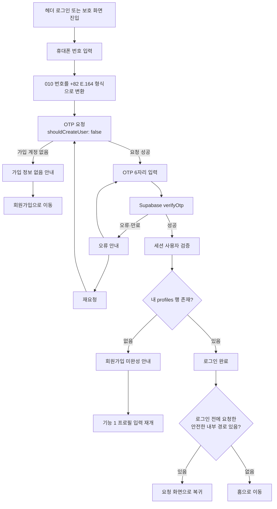
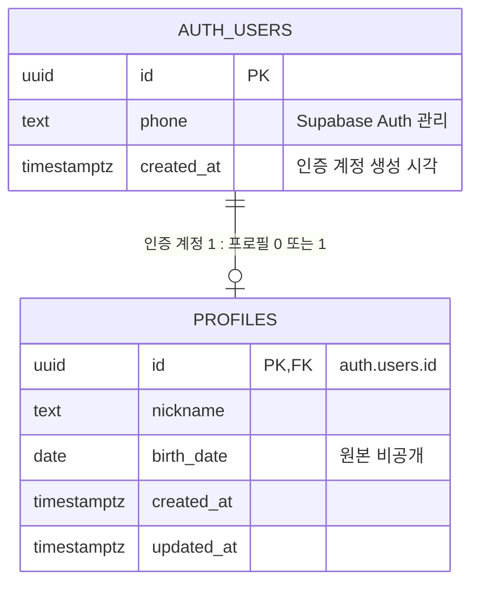
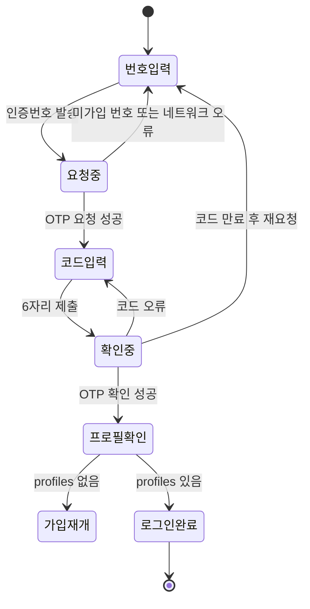

# 기능 2. 기존 회원 로그인 계획

상태: `PLAN_ONLY`  
구현: `NOT_RUN`  
선행 조건: 기능 1 회원가입이 구현되어 `auth.users`와 `public.profiles`가 실제로 연결되어 있어야 한다.

## 목표

이미 회원가입을 마친 사용자가 휴대폰 번호와 OTP로 로그인하고, 새로고침 뒤에도 같은 세션과 자신의 프로필을 복구한다.

핵심 규칙은 **로그인 시 새 회원을 만들지 않는 것**이다. OTP 요청에 `shouldCreateUser: false`를 사용한다.

## 사용자 흐름

## 데이터 관계

로그인 기능에서 새 테이블을 추가하지 않는다.

Supabase 세션 토큰은 `auth.users`나 `profiles`의 컬럼이 아니다. `supabase-js`가 브라우저 세션으로 관리하며, 앱이 별도의 비밀번호·OTP·토큰 테이블을 만들지 않는다.

프로필 지역 정보는 기능 1·2에서 수집하거나 조회하지 않는다. 만남 장소는 기능 3의 공고 데이터에서 다룬다.

## 화면 상태

각 비동기 요청 중에는 버튼을 잠가 중복 요청을 막는다. 재요청 가능 시점은 화면의 임의 타이머가 아니라 Supabase의 실제 응답을 기준으로 안내한다.

## 기능 계약

### 1. OTP 요청

- 입력: 국내 휴대폰 번호 11자리
- 변환: `01012345678` → `+821012345678`
- 호출: `supabase.auth.signInWithOtp({ phone, options: { shouldCreateUser: false } })`
- 성공 결과: OTP 입력 화면 표시
- 미가입 번호: `auth.users`를 만들지 않고 회원가입 안내
- 테스트 환경: 등록된 번호에서 실제 SMS 없이 고정 OTP `123456` 사용

### 2. OTP 확인

- 입력: E.164 전화번호, OTP 6자리
- 호출: `supabase.auth.verifyOtp({ phone, token, type: 'sms' })`
- 성공 판정: 브라우저의 문자열 비교가 아니라 Supabase가 반환한 세션으로 판정
- 실패: 잘못된 코드·만료·요청 제한을 서로 구분해 안내

### 3. 세션 복구

- 앱 시작 시 저장된 세션 유무를 확인한다.
- private UI를 열기 전에 서버에서 현재 사용자를 검증한다.
- `onAuthStateChange`로 로그인·로그아웃·토큰 갱신·계정 전환을 반영한다.
- 오래된 비동기 응답이 로그아웃 또는 다른 계정의 최신 상태를 덮지 못하게 한다.
- Supabase 세션 외에 자체 로그인 상태를 별도 `localStorage` 키로 만들지 않는다.

### 4. 프로필 확인

- 검증된 사용자 ID로 자기 `profiles` 한 행만 조회한다.
- 행이 있으면 로그인 완료로 처리한다.
- 행이 없으면 인증 계정은 존재하지만 회원가입은 미완성이다. 기능 1의 프로필 입력으로 이동한다.
- 로그인 과정에서는 프로필을 자동 생성하거나 임의 기본값으로 채우지 않는다.

### 5. 안전한 복귀

- `/chat`, `/me` 같은 보호 화면에서 로그인했다면 성공 후 해당 화면으로 돌아간다.
- 앱 내부 allowlist에 포함된 경로만 허용한다.
- 외부 URL, 스킴이 포함된 값, 알 수 없는 경로는 홈으로 보낸다.

### 6. 로그아웃

- `supabase.auth.signOut()` 성공 후 현재 사용자와 private 화면 데이터를 비운다.
- 로그아웃한 사용자가 브라우저 뒤로가기로 개인 화면을 다시 볼 수 없어야 한다.
- 다른 계정으로 로그인할 때 이전 계정의 프로필·알림·채팅 상태를 먼저 제거한다.

## 권한

| 대상 | 허용 | 금지 |
|---|---|---|
| `auth.users` | Supabase Auth API를 통한 로그인·세션 확인 | 프론트엔드에서 테이블 직접 조회·수정 |
| 내 `profiles` | 인증된 사용자가 자기 행 조회 | 다른 사용자의 생년월일 등 원본 조회 |
| 다른 사용자의 `profiles` | 기능 2에서는 없음 | 임시 public 정책 추가 |
| 세션 토큰 | `supabase-js` 관리 | 앱 DB 저장, 로그 출력, URL 포함 |

RLS는 `auth.uid() = id`인 자신의 `profiles` 조회만 허용한다. 상대 프로필 공개 범위는 기능 4에서 별도 정책으로 설계한다.

## 실패 화면

| 상황 | 사용자 안내 | 다음 행동 |
|---|---|---|
| 미가입 번호 | 가입된 번호가 아니라고 안내 | 회원가입으로 이동 |
| 잘못된 OTP | 인증번호가 맞지 않음 | 다시 입력 |
| 만료된 OTP | 인증 시간이 지남 | 재요청 |
| 요청 제한 | 다시 요청 가능한 시점 안내 | 대기 후 재요청 |
| 네트워크 오류 | 연결 문제 안내 | 같은 단계에서 재시도 |
| 세션 검증 실패 | 로그인 상태를 확인할 수 없음 | 익명 상태 유지·재시도 |
| `profiles` 없음 | 회원가입이 끝나지 않음 | 기능 1 프로필 작성 재개 |
| 환경변수 누락 | 서비스 설정 오류 | 가짜 로그인 없이 중단 |

오류 문구로 번호의 가입 여부가 과도하게 노출될 수 있으므로 공개 운영 전에는 계정 열거 위험을 다시 검토한다. 현재 테스트 단계에서는 사용자가 회원가입과 로그인을 구분할 수 있도록 미가입 안내를 제공한다.

## 구현 대상 파일 예상

- `src/lib/supabase.ts`: Supabase 클라이언트
- `src/auth/useAuth.ts` 또는 동등한 인증 상태 모듈: 세션 검증과 상태 변경 구독
- `src/components/AuthModal.tsx`: 실제 OTP 로그인 UI
- `src/components/AuthGate.tsx`: 로딩·익명·오류·재시도 상태
- `src/auth/routes.ts`: 안전한 복귀 경로 검증
- `src/App.tsx`: 로그인 사용자와 private 상태 연결
- 인증 관련 단위·브라우저 테스트

파일명은 구현 과정에서 조정할 수 있지만 인증 상태를 `App.tsx` 한 파일에 흩어놓지 않는다.

## 완료 기준

아래를 모두 실제로 확인해야 기능 2를 완료로 표시한다.

1. 기능 1을 완료한 테스트 계정이 로그아웃 후 다시 로그인한다.
2. 미가입 번호의 로그인 시도 뒤 `auth.users` 수가 늘지 않는다.
3. 잘못된 OTP로 세션이 생성되지 않는다.
4. 올바른 OTP로 로그인하고 자기 `profiles`를 불러온다.
5. 새로고침 뒤 로그인과 프로필이 유지된다.
6. `/me`에서 로그인하면 `/me`로, `/chat`에서 로그인하면 `/chat`으로 돌아간다.
7. 조작한 외부 `next` 주소는 무시하고 홈으로 이동한다.
8. 로그아웃 즉시 개인 화면과 이전 사용자 데이터가 사라진다.
9. 두 브라우저에서 사용자 A와 B의 세션·프로필이 섞이지 않는다.
10. 사용자 A가 사용자 B의 원본 `profiles` 행을 읽거나 수정하지 못한다.
11. `npm test`, `npm run lint`, `npm run build`, `git diff --check`를 통과한다.

## 이번 단계에서 하지 않는 것

- 회원가입 기능 재구현
- 실제 SMS 공급자 연결
- 상대 프로필 공개
- 공고·참여 요청·채팅·매칭·평가 DB 연결
- 로그인 이력·기기 관리·관리자 화면
- 소셜 로그인·이메일 로그인·비밀번호 로그인

## 기능 3으로 넘길 정보

기능 2 구현 중에는 다음 사실만 기록한다. 기능 3을 미리 구현하지 않는다.

- 공고 목록은 익명 사용자에게도 보일지
- 공고 상세에서 로그인이 필요한 최초 행동이 무엇인지
- 로그인 전 선택한 공고·필터를 로그인 후 복원해야 하는지
