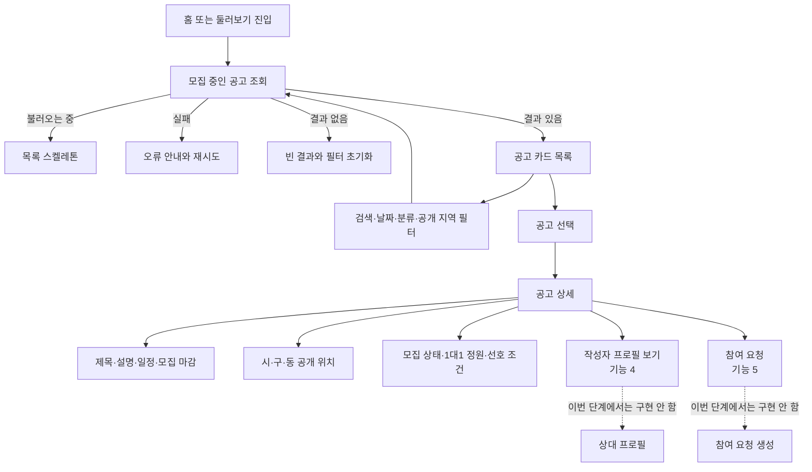
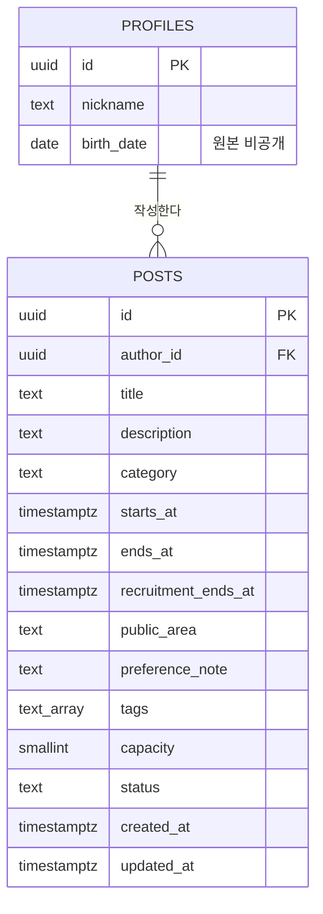
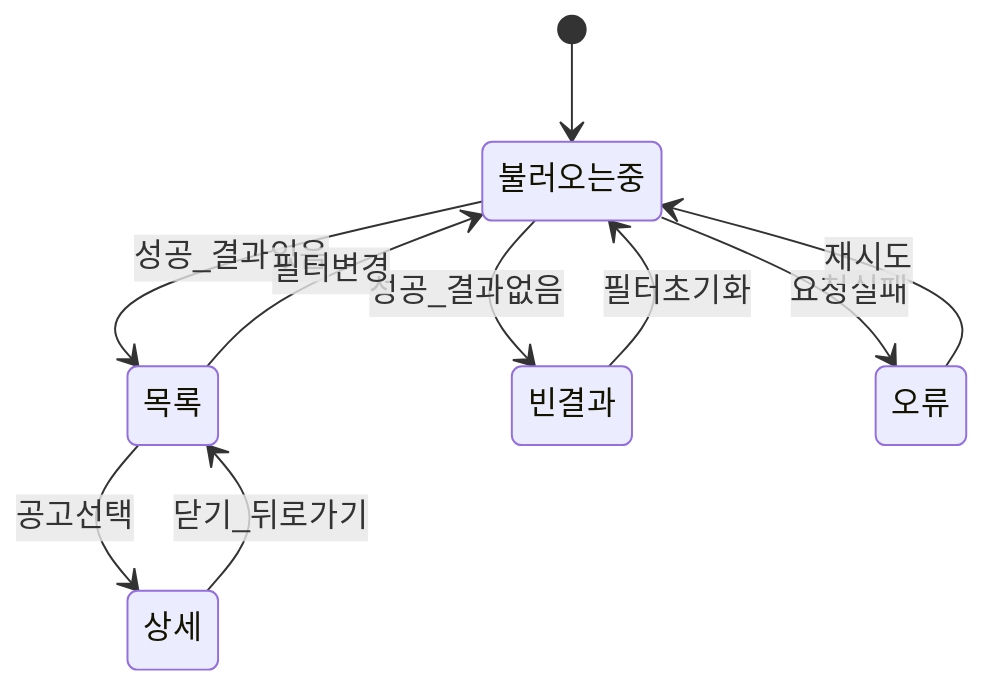

# 기능 3. 동행 공고 목록·상세 조회 계획

상태: `PLAN_ONLY`  
구현: `NOT_RUN`  
선행 조건: 기능 1의 `profiles`가 존재해야 테스트 공고의 작성자를 연결할 수 있다. 기능 2 로그인은 공개 조회 자체의 필수 조건이 아니다.

## 목표

사용자가 모집 중인 동행 공고를 목록에서 비교하고 상세 내용을 확인한다. 공고 조회는 비회원에게도 허용하고, 상대 프로필 확인은 기능 4, 참여 요청 생성은 기능 5로 넘긴다.

## 사용자 흐름



목록과 상세에는 `서울특별시 성동구 성수동`처럼 시·구·동까지만 공개한다. 정확한 만남 장소와 역·건물·출구 같은 랜드마크는 내려받지 않으며 `posts` 데이터 자체에도 저장하지 않는다.

## 데이터 관계



`profiles`의 공개 범위는 기능 4에서 정한다. 기능 3의 공고 응답은 `author_id`만 제공하며 생년월일이나 다른 프로필 원본을 조인해 반환하지 않는다.

## `posts` 키 계획

| 키 | 형식 | 필수 | 설명과 이유 |
|---|---|---:|---|
| `id` | `uuid` | O | 공고 식별자. URL·참여 요청·채팅 연결에 사용 |
| `author_id` | `uuid` | O | `profiles.id` FK. 가입을 완료한 작성자와 연결 |
| `title` | `text` | O | 목록에서 공고 목적을 빠르게 비교 |
| `description` | `text` | O | 상세에서 활동 방식과 기대 내용을 설명 |
| `category` | `text` | O | 전시·공연·산책 등 기본 필터 |
| `starts_at` | `timestamptz` | O | 동행 시작 시각 |
| `ends_at` | `timestamptz` | O | 동행 종료 시각. 이후 완료·평가 가능 시점의 기준 |
| `recruitment_ends_at` | `timestamptz` | O | 참여 요청을 받을 수 있는 마지막 시각 |
| `public_area` | `text` | O | 목록·상세에 공개할 시·구·동. 예: `서울특별시 성동구 성수동` |
| `preference_note` | `text` | 선택 | 상세에 공개할 원하는 동행 조건. 자동 신청 제한에는 사용하지 않음 |
| `tags` | `text[]` | O | 공고 특징 표시와 간단 검색 보조. 기본값 빈 배열 |
| `capacity` | `smallint` | O | 최소 사이클에서는 1대1이므로 값은 `2`로 고정 |
| `status` | `text` | O | `recruiting`, `closed`, `expired`, `deleted` 상태 |
| `created_at` | `timestamptz` | O | 공고 생성 시각과 정렬·운영 확인 |
| `updated_at` | `timestamptz` | O | 마지막 변경 시각과 캐시·동기화 확인 |

이번 최소 스키마에는 다음을 넣지 않는다.

- `secret_location`: 정확한 위치는 확정된 참여자만 접근할 별도 약속 데이터에서 나중에 저장
- `public_landmark`: 공개 위치를 동까지만 제한하므로 역·건물·출구 정보는 저장하지 않음
- `current_members`: 신청·확정 데이터로 계산해야 하며 직접 저장하면 불일치 위험이 있음
- `neighborhood_id`: 프로필 지역 정보와 무관하며 현재 지역 마스터 테이블이 없음
- `event_id`: 실제 행사 데이터 계약이 아직 없으므로 샘플 행사 ID를 DB 계약으로 굳히지 않음
- 작성자 닉네임·나이 복사본: 프로필과 중복되어 오래된 값이 될 수 있음

## 데이터 제약

- `title`: 앞뒤 공백 제거, 2~80자
- `description`: 1~2,000자
- `preference_note`: 입력 시 1~300자
- `public_area`: 정해진 시·구·동 형식만 허용하며 상세 주소·역·건물·출구 입력 금지
- `starts_at < ends_at`
- `recruitment_ends_at <= starts_at`
- 새 공고 기준 `recruitment_ends_at > now()`
- `capacity = 2`
- `status`는 허용된 네 값만 사용
- `author_id`는 존재하는 `profiles.id`를 참조
- `updated_at`은 실제 변경 시 자동 갱신

## 공개 범위와 RLS

`posts`에는 공개 가능한 필드만 둔다.

| 역할 | 조회 | 생성·수정·삭제 |
|---|---|---|
| `anon` | `deleted`가 아닌 공고의 공개 필드 | 금지 |
| `authenticated` | `deleted`가 아닌 공고의 공개 필드 | 기능 3에서는 금지 |
| 테스트 데이터 관리자 | 검증용 공고 생성 | 서버/SQL 작업에서만 허용 |

- RLS 조회 정책은 `status <> 'deleted'`인 행만 허용한다.
- 삭제된 공고 ID를 직접 요청해도 행이 반환되지 않아야 한다.
- 정확한 장소, 전화번호, 생년월일, 세션 정보는 공고 API 응답에 포함하지 않는다.
- 작성 정책은 공고 작성 기능을 설계할 때 별도로 추가한다. 기능 3을 위해 광범위한 `insert/update` 정책을 열지 않는다.

## 목록 조회 계약

기본 목록은 지금 신청할 수 있는 공고를 먼저 보여준다.

```text
status = recruiting
recruitment_ends_at > now
starts_at > now
order by starts_at asc, id asc
limit 20
```

- 첫 화면: 가까운 일정순 모집 공고 20개
- 다음 페이지: 마지막 `starts_at`, `id`를 기준으로 이어서 조회
- 검색: 제목·설명·공개 지역의 단순 검색
- 필터: 날짜, 카테고리, 공개 지역
- AI 자연어 검색과 공연 데이터 수집은 이번 범위가 아님
- 필터는 상세를 열었다가 돌아와도 유지
- 현재 결과 수와 적용 중인 조건을 화면에 표시

시간이 지나 모집 마감된 공고는 DB 상태 갱신 작업이 없어도 목록 조건에서 자동 제외한다. `status`를 자동 변경하는 Cron은 기능 3의 필수 범위가 아니다.

## 카드에 표시할 정보

- 제목
- 카테고리와 태그
- 동행 시작·종료 시각
- 모집 마감
- 시·구·동 형식의 `public_area`
- `1/2명`과 모집 상태

작성자 닉네임·사진·만 나이·후기는 기능 4의 공개 프로필 계약이 정해진 뒤 연결한다. 기능 3에서 `birth_date`를 직접 읽어 나이를 노출하지 않는다.

## 상세에 표시할 정보

- 카드의 모든 정보
- 전체 설명
- 일정과 모집 마감의 명확한 날짜·시각
- 시·구·동까지만 표시하는 공개 지역
- 정원 2명과 현재 상태
- 작성자가 입력한 공개 선호 조건
- `preference_note`는 안내 문구이며 신청 가능 여부를 자동 판정하지 않음
- 작성자 프로필 진입점: 기능 4 연결 자리만 준비
- 참여 요청 진입점: 기능 5 연결 자리만 준비

`closed`·`expired` 공고는 직접 링크로 열 수 있지만 새 신청이 불가능하다는 상태를 분명히 보여준다. `deleted` 공고는 공개 응답에서 제외한다.

## 화면 상태



필터가 바뀔 때 이전 요청의 늦은 응답이 최신 목록을 덮지 않도록 요청 순서를 관리한다.

## 테스트 공고 준비

기능 1에서 프로필을 완료한 테스트 사용자 두 명의 실제 `profiles.id`를 사용한다.

- 사용자 A 작성 공고 1개
- 사용자 B 작성 공고 1개
- 모집 마감 공고 1개
- 삭제 상태 공고 1개

테스트 데이터는 개발 프로젝트에만 넣는다. 프론트엔드에서 service-role key로 삽입하지 않는다. 자동 운영 시드와 실제 데이터로 표현하지 않고 테스트 데이터임을 기록한다.

## 완료 기준

아래를 실제로 확인해야 기능 3을 완료로 표시한다.

1. 로그아웃 상태에서 모집 공고 목록과 상세를 볼 수 있다.
2. 로그인한 사용자 A와 B가 동일한 공개 목록을 확인한다.
3. A와 B가 작성자로 연결된 테스트 공고가 각각 표시된다.
4. 검색·날짜·카테고리·공개 지역 필터가 서버 결과와 일치한다.
5. 상세를 닫아도 목록의 필터와 위치가 유지된다.
6. 모집 마감 공고는 기본 목록에서 제외되고 직접 상세에서는 마감 상태를 표시한다.
7. 삭제 공고는 목록과 직접 ID 조회 모두에서 반환되지 않는다.
8. 익명 사용자가 공고를 생성·수정·삭제할 수 없다.
9. 공고 응답에 정확한 장소·전화번호·생년월일이 없다.
10. 20개 단위 페이지 연결에서 중복·누락이 없다.
11. 로딩·빈 결과·오류·재시도 화면이 동작한다.
12. `npm test`, `npm run lint`, `npm run build`, `git diff --check`가 통과한다.

두 브라우저와 원격 Supabase를 사용하지 않았다면 다중 사용자·RLS 검증은 `NOT_RUN`으로 표시한다.

## 이번 단계에서 하지 않는 것

- 공고 작성·수정·삭제 UI
- 작성자 상세 프로필 조회
- 참여 요청 생성
- 정확한 만남 장소 저장·조회
- 채팅·매칭 상태 연결
- 행사 수집·실시간 좌석·가격·예매 정보
- AI 자연어 검색
- 관심친구·추천 순위·개인화

## 기능 4로 넘길 정보

기능 3 구현 중에는 아래 사실만 기록하고 상대 프로필을 미리 구현하지 않는다.

- 상세에서 작성자 프로필 진입에 사용하는 `author_id`
- 공고에 노출하기 적절한 최소 작성자 요약 정보
- 차단·탈퇴 사용자의 공고와 프로필 처리 필요성
- 정확한 생년월일을 숨기면서 만 나이를 공개하는 방식

## Notion 기록 예정

구현과 원격 검증이 끝난 뒤 지정된 Notion 페이지의 `기능 3. 동행 공고 조회`에 각 `posts` 키의 형식·FK·공개 여부·작성 주체·필요 이유를 기록한다. 정확한 장소를 `posts`에서 제외한 이유와 RLS 조회 조건도 설명한다. 실행하지 못한 검증은 `NOT_RUN`으로 남긴다.
