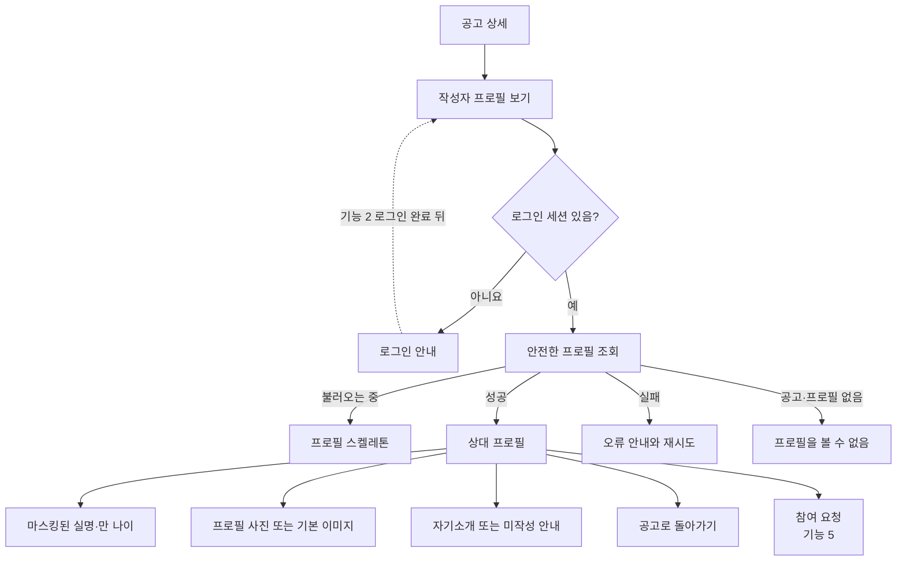
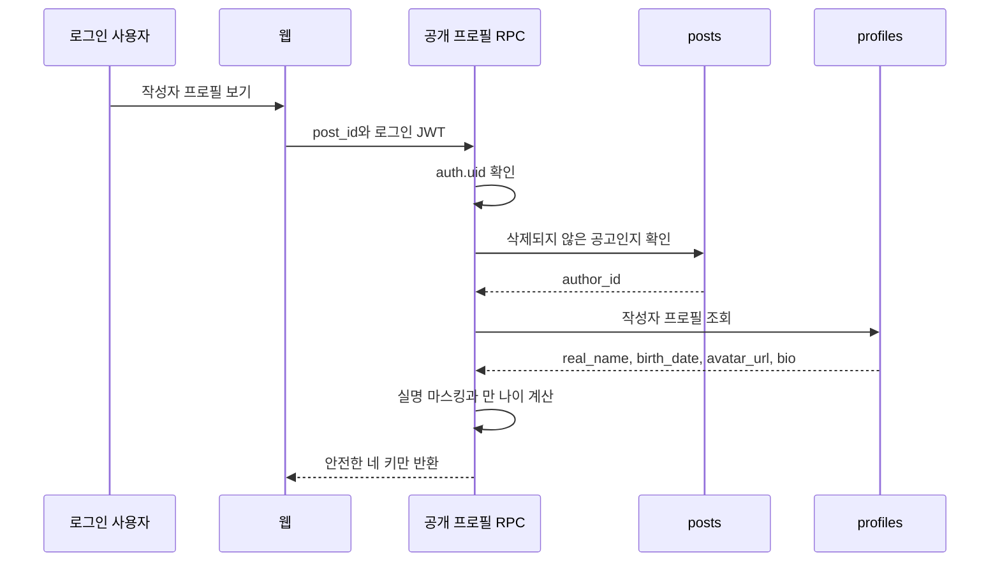
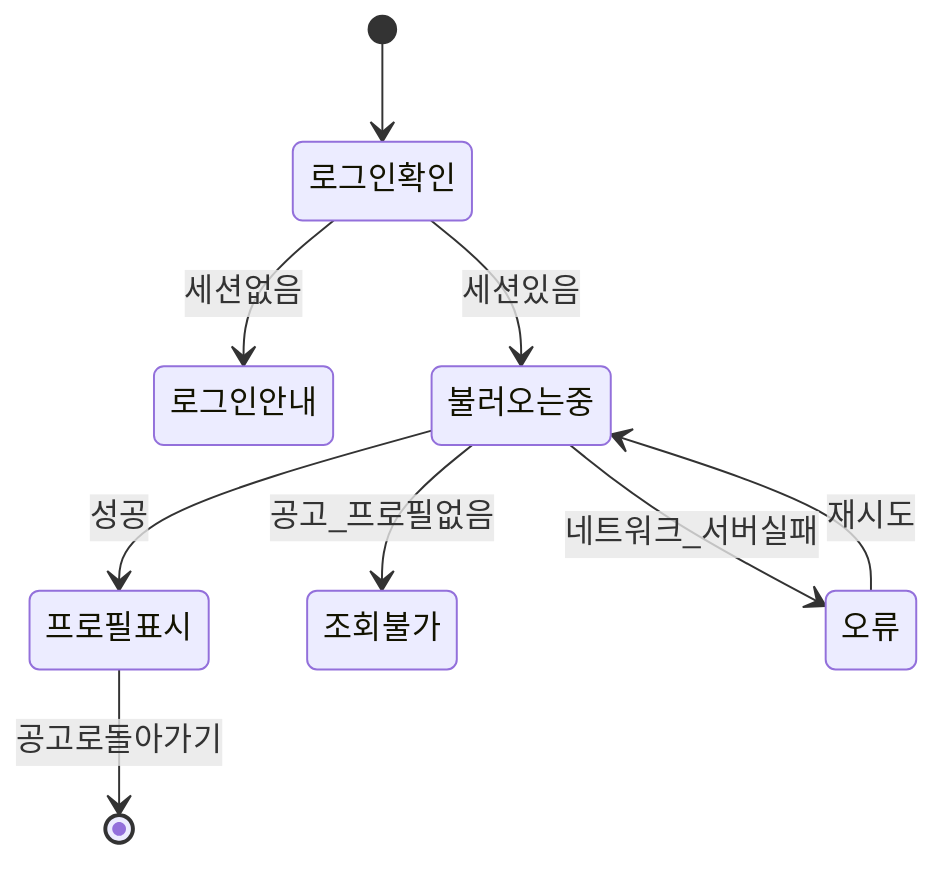

# 기능 4. 상대 프로필 조회 구현 계획

상태: `PLAN_ONLY`  
구현: `NOT_RUN`  
현재 순서: 기능 1은 구현·개선 중이며 기능 2·3은 구현 시작 전이다. 기능 4 구현은 기능 1~3이 끝난 뒤 시작한다.

## 목표

로그인한 사용자가 동행 공고 상세에서 작성자의 프로필을 열어 보고, 참여 요청 전에 상대의 마스킹된 실명·만 나이·사진·소개를 확인한다.

공고는 비회원도 볼 수 있지만 상대 프로필 상세는 로그인한 회원에게만 제공한다. 정확한 생년월일과 휴대폰 번호는 어떤 상대 프로필 응답에도 포함하지 않는다.

## 사용자 흐름



## 데이터 관계

```mermaid
erDiagram
    AUTH_USERS ||--o| PROFILES : "인증 계정의 프로필"
    PROFILES ||--o{ POSTS : "공고를 작성한다"

    AUTH_USERS {
        uuid id PK
        timestamptz created_at
    }

    PROFILES {
        uuid id PK_FK
        text real_name "원본 비공개"
        date birth_date "원본 비공개"
        text avatar_url "선택"
        text bio "선택"
        timestamptz created_at
        timestamptz updated_at
    }

    POSTS {
        uuid id PK
        uuid author_id FK
        text status
    }
```

기능 4를 위해 새 프로필 테이블을 만들지 않는다. 기능 1의 `profiles`를 사용하되, 다른 사용자가 원본 행을 직접 조회하지 못하게 한다. 기능 1의 최종 스키마가 아직 `nickname`을 사용한다면 기능 4 구현 전에 `real_name` 계약으로 정리해야 한다.

## 공개 응답 계약

공고 ID를 입력받아 해당 공고 작성자의 공개 가능한 정보만 반환한다.

| 응답 키 | 형식 | 출처 | 공개 이유 |
|---|---|---|---|
| `masked_name` | `text` | `profiles.real_name`을 서버에서 마스킹 | 원본 실명을 노출하지 않고 상대를 구분 |
| `age` | `integer` | `birth_date`로 서버 계산 | 정확한 만 나이 표시 |
| `avatar_url` | `text \| null` | `profiles.avatar_url` | 선택한 프로필 사진 표시 |
| `bio` | `text \| null` | `profiles.bio` | 상대의 자기소개 표시 |

화면에는 `25살`처럼 표시한다. `age`는 저장된 고정 숫자가 아니라 조회 시점의 서울 날짜를 기준으로 계산한다.

## 실명 마스킹 규칙

실명 원본은 `profiles.real_name`에 저장하고 본인만 읽을 수 있다. 상대 프로필 RPC는 원본을 서버 안에서 마스킹한 `masked_name`만 반환한다.

| 입력한 실명 | 상대에게 보이는 값 |
|---|---|
| `변종` | `변*` |
| `변종현` | `변*현` |
| `변종현미` | `변**미` |

- 앞뒤 공백을 제거한 뒤 화면에 보이는 문자 수를 기준으로 계산한다.
- 2글자는 첫 글자만 남기고 나머지를 `*`로 표시한다.
- 3글자 이상은 첫 글자와 마지막 글자만 남기고 가운데 글자 수만큼 `*`를 표시한다.
- 1글자 이름을 허용한다면 전체를 `*`로 표시한다. 기능 1에서 최소 2글자로 제한하면 이 분기는 사용하지 않는다.
- 마스킹은 프론트엔드가 아니라 RPC에서 수행한다. 브라우저 네트워크 응답·상태·로그에 `real_name`이 없어야 한다.
- 사용자가 이름을 입력했다는 사실만으로 정부 문서나 본인확인 서비스로 검증된 실명이라고 표시하지 않는다.

## 공개 응답에서 제외할 정보

- `real_name`: 서버에서 마스킹에만 사용하고 원본은 반환하지 않음
- `birth_date`: 만 나이 계산에만 사용하고 원본은 반환하지 않음
- 휴대폰 번호와 `auth.users` 메타데이터
- `created_at`, `updated_at`: 상대를 판단하는 데 필요하지 않은 운영 정보
- 지역 정보: 프로필에는 저장하지 않으며 공고의 `public_area`만 사용
- 성별: 현재 실제 `profiles`에 수집하지 않음
- 취미·성향: 현재 프로토타입 샘플일 뿐 실제 DB 키가 아님
- 당도·후기: 상호 평가 기능 9가 구현되기 전까지 실제 정보로 표시하지 않음
- 본인 인증 배지: 별도의 검증 계약이 없으므로 표시하지 않음

프로토타입에 보이는 샘플 당도·후기·관심사·성향을 실제 Supabase 응답과 섞지 않는다.

## 조회 함수와 권한 계획

권장 계약은 `get_post_author_profile(post_id)` 형태의 읽기 전용 RPC다.



- `profiles`의 기존 자기 행 전용 RLS는 유지한다.
- 다른 회원에게 `profiles` 전체 `SELECT` 권한을 열지 않는다.
- RPC 실행 권한은 `authenticated`에만 준다. `anon`에는 주지 않는다.
- RPC는 클라이언트가 보낸 사용자 ID를 그대로 조회하지 않고 `post_id → posts.author_id` 관계를 서버에서 확인한다.
- `deleted` 공고, 존재하지 않는 공고, 작성자 프로필이 없는 공고는 같은 일반 오류로 처리해 내부 상태를 자세히 노출하지 않는다.
- 보안 실행 함수가 필요하면 `search_path`를 고정하고 반환 열을 명시하며 임의 SQL이나 동적 테이블명을 사용하지 않는다.
- 조회 함수에는 생성·수정·삭제 기능을 넣지 않는다.

## 만 나이 계산 규칙

- 기준 시간대: `Asia/Seoul`
- 기준 날짜: 조회 시점의 서울 날짜
- 생일이 지났으면 `현재 연도 - 출생 연도`
- 생일 전이면 위 값에서 1을 뺌
- 2월 29일 출생자도 PostgreSQL 날짜 계산 결과를 테스트
- 브라우저에는 계산된 `age`만 전달

생일이 지나면 프로필을 수정하지 않아도 표시 나이가 자동으로 바뀌어야 한다.

## 화면에 표시할 내용

- 마스킹된 실명
- `25살` 형식의 만 나이
- 프로필 사진 또는 기본 이미지
- 자기소개 또는 `아직 자기소개를 작성하지 않았어요.`
- 공고로 돌아가기
- 기능 5에서 연결할 참여 요청 진입점

`avatar_url`과 `bio`가 비어 있어도 오류로 처리하지 않는다. 기능 4는 상대 프로필 조회만 담당하며 사진 업로드·소개 수정 기능을 함께 만들지 않는다.

## 화면 상태



프로필을 닫으면 원래 공고 상세와 스크롤 위치로 돌아간다. 늦게 도착한 이전 조회 결과가 다른 공고의 프로필을 덮지 않도록 요청 순서를 관리한다.

## 구현 순서

기능 4 구현을 시작하는 별도 세션은 다음 순서를 따른다.

1. 기능 1~3의 실제 완료 상태와 최신 스키마를 다시 확인한다.
2. `profiles` 자기 행 전용 RLS가 유지되는지 확인한다.
3. 공개 응답 열만 반환하는 읽기 전용 RPC 마이그레이션을 작성한다.
4. 두 테스트 사용자의 실제 `posts.author_id`와 `profiles.id` 관계를 준비한다.
5. 프론트엔드에 공개 프로필 응답 타입과 조회 함수를 연결한다.
6. 기존 프로필 모달에서 샘플 전용 필드를 제거하거나 실제 데이터가 없는 상태로 숨긴다.
7. 로딩·빈 값·권한 없음·오류·재시도 화면을 연결한다.
8. 두 브라우저와 익명 브라우저에서 권한 및 데이터 노출을 검증한다.
9. 검증이 끝난 뒤에만 Notion에 실제 결과를 기록한다.

## 테스트 사용자 시나리오

- 사용자 A가 로그인하고 사용자 B의 공고에서 B 프로필을 확인
- 사용자 B가 로그인하고 사용자 A의 공고에서 A 프로필을 확인
- 익명 사용자가 프로필을 누르면 데이터 대신 로그인 안내 확인
- 사진이 없는 프로필은 기본 이미지 표시
- 소개가 없는 프로필은 미작성 문구 표시
- 삭제 공고와 존재하지 않는 공고의 작성자 프로필은 조회 불가

## 완료 기준

아래 항목을 실제로 확인해야 기능 4를 완료로 표시한다.

1. 로그인 사용자 A가 B의 공고에서 B의 마스킹된 실명·만 나이·사진·소개를 본다.
2. 로그인 사용자 B가 A의 공고에서 A의 공개 프로필을 본다.
3. 익명 사용자는 상대 프로필 데이터를 받지 못하고 로그인 안내를 본다.
4. 응답에 `real_name`, `birth_date`, 휴대폰 번호, 인증 메타데이터가 없다.
5. A가 `profiles` 원본 테이블에서 B의 행을 직접 읽지 못한다.
6. 정확한 생년월일은 본인의 원본 조회에서만 확인 가능하다.
7. 서버와 기존 `ageOn()`이 같은 기준 날짜에서 동일한 만 나이를 계산한다.
8. 사진·소개가 `null`이어도 프로필 화면이 정상 표시된다.
9. 삭제·없는 공고로 다른 사용자의 프로필을 조회할 수 없다.
10. 프로필을 닫으면 기존 공고 상세 상태가 유지된다.
11. 로딩·오류·재시도가 동작하며 이전 요청이 최신 화면을 덮지 않는다.
12. `npm test`, `npm run lint`, `npm run build`, `git diff --check`가 통과한다.

두 브라우저와 원격 Supabase에서 확인하지 않은 항목은 `NOT_RUN`으로 남긴다.

## 이번 기능에서 하지 않는 것

- 프로필 생성·수정
- 사진 업로드용 Storage 구성
- 취미·성향·지역·성별 키 추가
- 관심친구·차단·신고
- 참여 요청 생성
- 채팅·매칭 확정
- 당도 계산과 평가 조회
- 정확한 생년월일·휴대폰 번호 공개

## 기능 5로 넘길 정보

- 참여 요청 대상은 클라이언트가 고른 임의 사용자 ID가 아니라 현재 공고의 `author_id`
- 요청자는 현재 로그인 세션의 `auth.uid()`
- 자기 공고에는 참여 요청할 수 없음
- 프로필 화면에서 참여 요청을 눌러도 실제 신청 생성과 중복 방지는 기능 5가 담당

## Notion 기록 예정

실제 구현과 원격 검증이 끝난 뒤 지정된 Notion 페이지의 `기능 4. 상대 프로필 조회`에 `real_name → masked_name` 규칙, 공개 응답 키, 원본 키와의 차이, RLS, RPC 실행 권한, 만 나이 계산 기준, 비공개 정보와 그 이유를 기록한다. 계획만 작성된 현재는 구현 완료로 기록하지 않는다.
