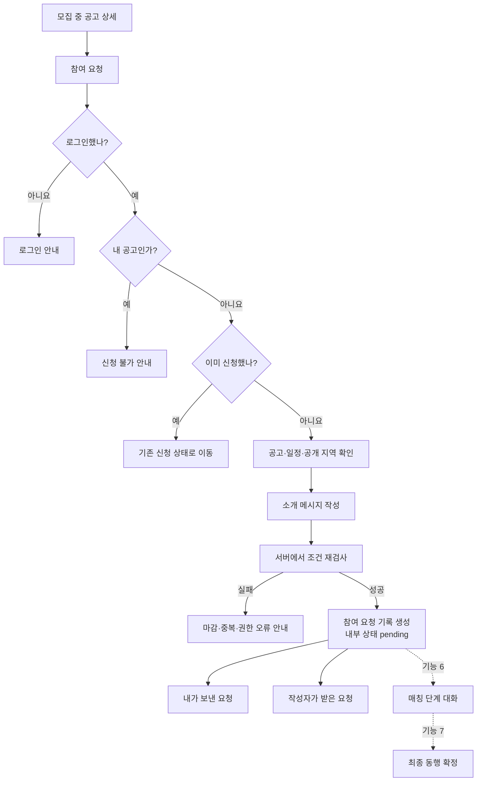
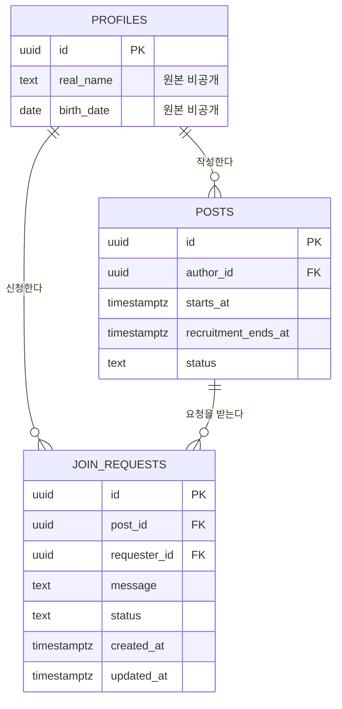
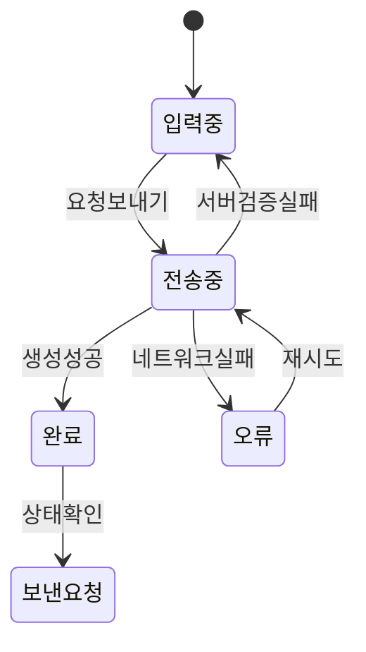

# 기능 5. 동행 참여 요청 구현 계획

상태: `PLAN_ONLY`  
구현: `NOT_RUN`  
현재 순서: 기능 1은 구현·개선 중이며 기능 2·3·4는 구현 시작 전이다. 기능 5 구현은 기능 1~4가 끝난 뒤 시작한다.

## 목표

로그인한 사용자가 모집 중인 다른 사람의 공고에 소개 메시지와 함께 한 번만 참여 요청을 보내고, 요청자와 공고 작성자가 각각 보낸 요청·받은 요청을 확인한다.

요청이 만들어지면 상태는 `pending`이 된다. `pending` 요청으로 대화하는 기능은 6번, 대화 후 최종 동행 확정은 7번에서 구현한다.

## 사용자 흐름



프론트엔드에서 버튼을 눌렀을 때 조건을 확인하더라도, 실제 생성 직전에 서버가 같은 조건을 다시 검사한다.

## 데이터 관계



## `join_requests` 키 계획

| 키 | 형식 | 필수 | 설명과 이유 |
|---|---|---:|---|
| `id` | `uuid` | O | 참여 요청 식별자. 이후 채팅·최종 확정 연결에 사용 |
| `post_id` | `uuid` | O | 어떤 공고에 신청했는지 연결하는 `posts.id` FK |
| `requester_id` | `uuid` | O | 신청자. 로그인 세션의 `auth.uid()`로만 결정 |
| `message` | `text` | O | 공고 작성자에게 보내는 10~300자의 소개 메시지 |
| `status` | `text` | O | 현재 상태. 기능 5에서는 `pending`, `withdrawn`, `declined` |
| `created_at` | `timestamptz` | O | 요청을 보낸 시각과 목록 정렬 기준 |
| `updated_at` | `timestamptz` | O | 취소·거절 등 마지막 상태 변경 시각 |

기능 5의 기본값은 `status = 'pending'`이다. 기능 7의 최종 확정 상태는 기능 7 계약을 정할 때 추가한다.

## 중복해서 저장하지 않을 정보

- `host_id`: `posts.author_id`로 알 수 있음
- `post_title`: `posts`에서 조회 가능
- 신청자 실명·마스킹 이름·나이·사진: `profiles`에서 안전하게 조회 가능
- `current_members`: 확정 결과로 계산할 정보
- 정확한 만남 장소: 공고 작성 시 `post_private_details`에 이미 저장되지만 참여 요청 응답에는 반환하지 않음
- 당도·후기: 기능 9 전에는 실제 데이터가 없음

이 값을 요청 행에 복사하면 프로필이나 공고가 바뀌었을 때 오래된 값이 남으므로 저장하지 않는다.

여기서 원본 정보를 “사용하지 않는다”는 뜻은 아니다. 서버는 `real_name`을 `변*현`처럼 마스킹하고 `birth_date`를 `25살` 같은 만 나이로 계산할 때만 원본을 사용한다. 계산이 끝나면 원본 실명과 생년월일은 응답에서 빼고, 휴대폰 번호는 요청 목록을 만드는 데 아예 사용하지 않는다.

## 상태 변화

```mermaid
stateDiagram-v2
    [*] --> pending: 참여 요청 성공
    pending --> withdrawn: 신청자가 취소
    pending --> declined: 공고 작성자가 거절
    pending -. 기능 6에서 대화 가능 .-> pending
    pending -. 기능 7 .-> matched: 최종 확정
```

- `pending`: 요청이 유효하고 기능 6 대화 대상이 되는 상태
- `withdrawn`: 신청자가 최종 확정 전에 요청을 취소한 상태
- `declined`: 공고 작성자가 요청을 거절한 상태
- 행은 삭제하지 않는다. 최소한의 요청 결과를 남겨 중복 신청과 상태 혼동을 막는다.
- 최소 기능에서는 같은 공고에 취소·거절 후 다시 신청할 수 없다.
- 재신청 제한 시간, 경고, 당도 차감, 이용 정지는 검증되지 않은 별도 정책이므로 기능 5에 넣지 않는다.

DB 상태명은 화면에 그대로 노출하지 않고 다음처럼 한국어로 표시한다.

| DB 상태 | 화면 표시 | 의미 |
|---|---|---|
| `pending` | `매칭 대화 중` | 참여 요청이 유효하며 아직 최종 동행 확정 전 |
| `withdrawn` | `신청 취소` | 신청자가 요청을 취소함 |
| `declined` | `신청 거절` | 공고 작성자가 요청을 거절함 |

## 참여 요청 생성 조건

서버는 한 트랜잭션 안에서 다음을 검사하고 요청을 만든다.

1. 로그인 세션이 유효하다.
2. 신청자의 `profiles` 행이 존재한다.
3. 공고가 존재하고 `status = 'recruiting'`이다.
4. `recruitment_ends_at > 현재 서울 시각`이다.
5. `starts_at > 현재 서울 시각`이다.
6. 신청자가 공고 작성자가 아니다.
7. 같은 `(post_id, requester_id)` 요청이 없다.
8. 메시지를 다듬은 결과가 10~300자다.

버튼 연속 클릭이나 두 탭의 동시 요청도 한 건만 생성되도록 `(post_id, requester_id)`에 `UNIQUE` 제약을 둔다.

## 서버 명령 계획

### `create_join_request(post_id, message)`

- `requester_id`를 입력값으로 받지 않고 `auth.uid()`를 사용
- 대상 공고 행을 잠그고 모집 상태·마감·작성자를 다시 검사
- 메시지의 앞뒤 공백을 제거하고 길이 검사
- 요청을 `pending`으로 한 번만 생성
- 성공 시 생성된 요청의 공개 가능한 키만 반환

### `withdraw_join_request(request_id)`

- 현재 로그인 사용자가 해당 요청의 신청자인지 확인
- `pending` 상태일 때만 `withdrawn`으로 변경
- 행을 물리적으로 삭제하지 않음

### `decline_join_request(request_id)`

- 현재 로그인 사용자가 해당 공고의 작성자인지 확인
- `pending` 상태일 때만 `declined`로 변경
- 신청자의 다른 요청이나 프로필은 변경하지 않음

모든 상태 변경은 클라이언트의 직접 `UPDATE` 대신 제한된 서버 명령으로 수행한다.

## 조회와 RLS 계획

| 역할 | 볼 수 있는 요청 | 할 수 있는 변경 |
|---|---|---|
| `anon` | 없음 | 없음 |
| 신청자 | 자신이 보낸 요청 | 자기 `pending` 요청 취소 |
| 공고 작성자 | 자기 공고에 들어온 요청 | `pending` 요청 거절 |
| 그 외 로그인 사용자 | 없음 | 없음 |

- 테이블 직접 `INSERT`, `UPDATE`, `DELETE` 권한은 열지 않는다.
- 요청 생성·취소·거절은 전용 RPC로만 수행한다.
- 서버는 신청자의 `real_name`을 기능 4와 같은 규칙으로 마스킹한 `masked_name`만 반환한다.
- 서버는 `birth_date`로 만 나이를 계산한 `age`만 반환한다.
- 원본 `real_name`과 `birth_date`는 브라우저 네트워크 응답·화면 상태·로그에 포함하지 않는다.
- 휴대폰 번호와 인증 메타데이터는 요청 목록 조회에 사용하거나 반환하지 않는다.

## 요청 목록 화면

### 내가 보낸 요청

- 공고 제목
- 동행 일정과 시·구·동 공개 지역
- 작성자의 마스킹된 실명
- 내가 보낸 소개 메시지
- 요청 시각과 현재 상태
- `pending`일 때 요청 취소

### 내가 받은 요청

- 신청자의 마스킹된 실명·만 나이·사진
- 소개 메시지
- 요청 시각과 현재 상태
- 안전한 상대 프로필 보기
- `pending`일 때 요청 거절
- 기능 6에서 연결할 대화 진입점

여러 사람이 한 공고에 `pending` 요청을 보낼 수 있다. 기능 7에서 한 사람을 최종 확정할 때 나머지 요청을 어떻게 종료할지 한 트랜잭션으로 처리한다.

## 화면 상태



- 전송 중 버튼을 비활성화하지만 중복 방지는 DB 제약으로 최종 보장한다.
- 실패하면 작성 중인 메시지를 유지한다.
- 이미 신청한 공고라면 새 모달 대신 기존 신청 상태로 이동한다.
- 늦은 응답이 로그아웃이나 계정 전환 뒤 화면을 덮지 않게 한다.

## 구현 순서

기능 5 구현을 시작하는 별도 세션은 다음 순서를 따른다.

1. 기능 1~4의 실제 완료 상태와 최신 스키마를 다시 확인한다.
2. `join_requests` 테이블, FK, CHECK, UNIQUE, 인덱스, RLS 마이그레이션을 작성한다.
3. 생성·취소·거절 RPC와 권한을 작성한다.
4. 테스트 사용자 A의 공고와 사용자 B의 프로필을 연결한다.
5. 참여 요청 모달을 실제 서버 명령에 연결한다.
6. 보낸 요청·받은 요청 목록과 상태 화면을 실제 데이터에 연결한다.
7. 기능 4 마스킹 규칙으로 요청 목록의 이름과 나이를 안전하게 반환한다.
8. 두 브라우저에서 동시 요청·권한·상태 변경을 검증한다.
9. 검증 후에만 Notion에 실제 결과를 기록한다.

## 테스트 사용자 시나리오

사용자 A는 공고 작성자, 사용자 B는 신청자로 사용한다.

1. B가 A의 모집 중 공고를 연다.
2. B가 소개 메시지를 작성해 요청을 보낸다.
3. B의 보낸 요청과 A의 받은 요청에 같은 `pending` 요청이 보인다.
4. A는 B의 마스킹된 실명과 공개 프로필만 본다.
5. B가 같은 공고에 다시 신청하면 기존 요청으로 이동한다.
6. B가 요청을 취소하면 양쪽 화면에 `withdrawn`이 보인다.
7. 별도 요청에서 A가 거절하면 양쪽 화면에 `declined`가 보인다.

## 완료 기준

아래를 실제로 확인해야 기능 5를 완료로 표시한다.

1. 로그인 사용자 B가 A의 모집 중 공고에 참여 요청을 한 번 생성한다.
2. 요청자는 서버가 현재 세션에서 결정하며 클라이언트가 다른 ID로 바꿀 수 없다.
3. 같은 공고에 버튼을 연속 클릭하거나 두 탭에서 보내도 한 건만 생성된다.
4. 자기 공고, 마감 공고, 모집 종료 공고에는 요청을 만들 수 없다.
5. 익명 사용자는 요청을 조회하거나 만들 수 없다.
6. B는 자신의 보낸 요청만 보고 A는 자기 공고의 받은 요청만 본다.
7. 관계없는 사용자 C는 요청을 조회·변경할 수 없다.
8. B는 자기 `pending` 요청만 취소할 수 있다.
9. A는 자기 공고의 `pending` 요청만 거절할 수 있다.
10. 요청 목록과 네트워크 응답에 원본 실명·생년월일·전화번호가 없다.
11. 메시지 길이·공백·오류·재시도 화면이 동작한다.
12. `npm test`, `npm run lint`, `npm run build`, `git diff --check`가 통과한다.

두 브라우저와 원격 Supabase에서 확인하지 않은 항목은 `NOT_RUN`으로 남긴다.

## 이번 기능에서 하지 않는 것

- 채팅 메시지 저장·실시간 수신
- 최종 동행 확정과 공고 마감
- 다른 신청자의 일괄 종료
- 확정된 약속과 비공개 장소 조회
- 알림 푸시·문자·이메일 발송
- 재신청 허용과 반복 취소 제재
- 당도 차감·이용 정지·신고·차단

## 기능 6으로 넘길 정보

- 채팅방의 근거가 되는 `join_request_id`
- 참가자는 `posts.author_id`와 `join_requests.requester_id` 두 명
- `pending` 요청일 때만 매칭 단계 채팅 가능
- `withdrawn`·`declined`가 되면 새 메시지를 보낼 수 없음
- `post_private_details.exact_location`은 기능 7 최종 확정 전까지 신청자에게 반환하지 않음

## Notion 기록 예정

실제 구현과 원격 검증이 끝난 뒤 지정된 Notion 페이지의 `기능 5. 동행 참여 요청`에 각 `join_requests` 키의 형식·PK/FK·공개 범위·RLS·생성/변경 주체·필요 이유를 기록한다. 중복 방지, 자기 공고 신청 차단, 실명 마스킹, 상태 전이, RPC 권한과 실제 PASS/NOT_RUN도 함께 남긴다.
