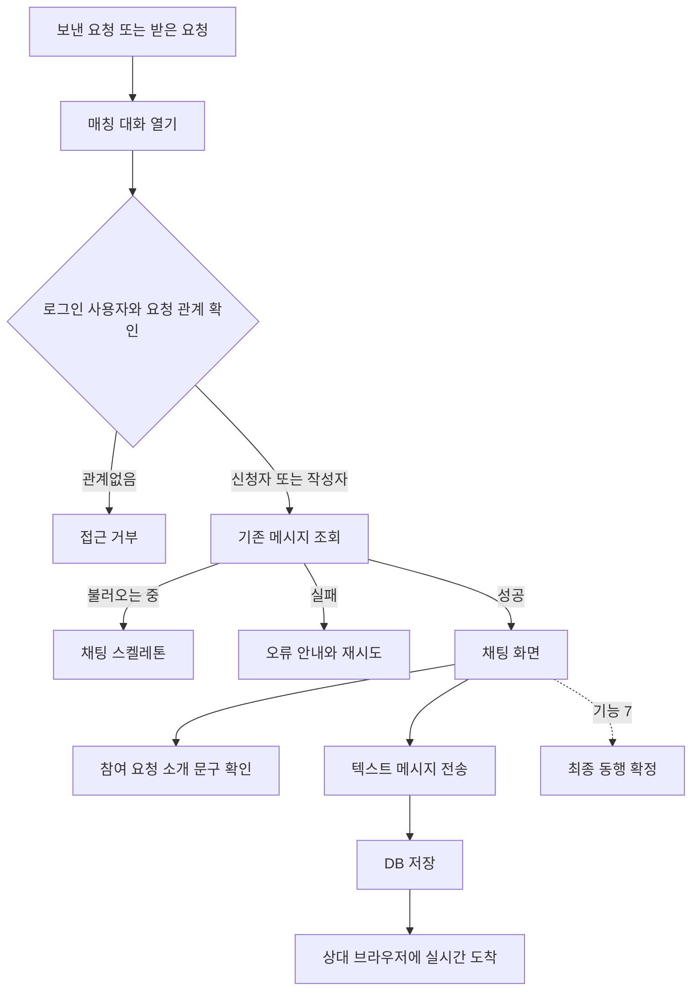
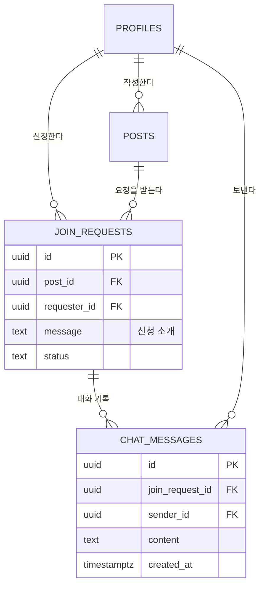
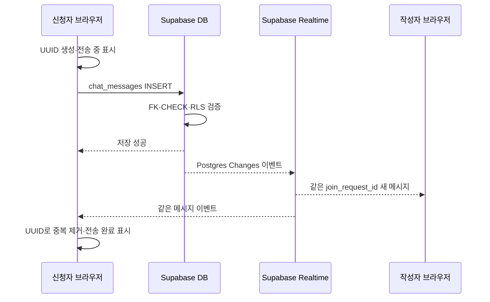
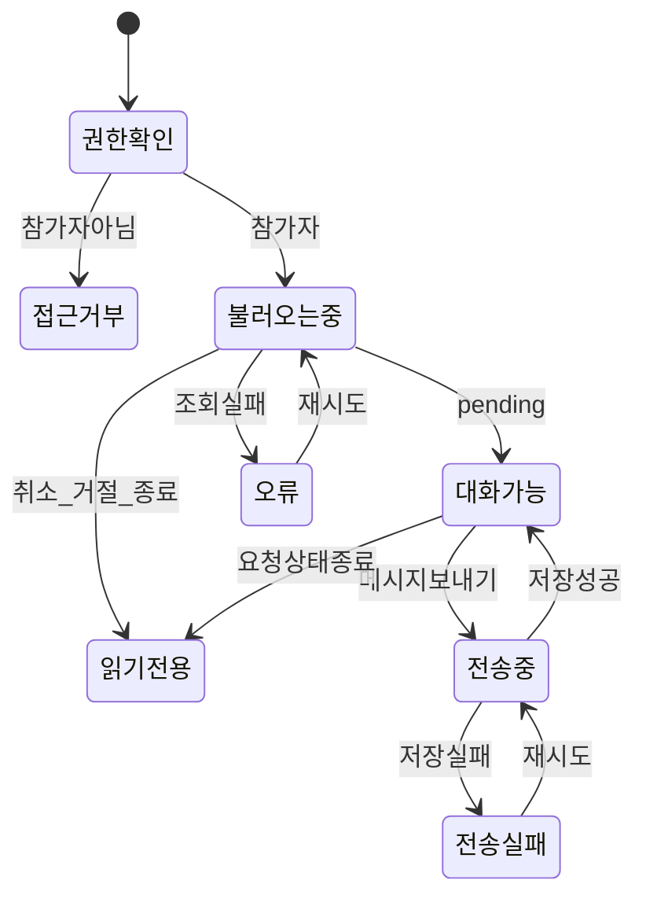

# 기능 6. 매칭 단계 채팅 구현 계획

상태: `PLAN_ONLY`  
구현: `NOT_RUN`  
현재 순서: 기능 1은 구현·개선 중이며 기능 2~5는 구현 시작 전이다. 기능 6 구현은 기능 1~5가 끝난 뒤 시작한다.

계획 파일: `06-matching-chat.md`  
향후 구현 기록 파일: `06-matching-chat-HANDOFF.md`  

## 목표

유효한 참여 요청의 신청자와 공고 작성자 두 명이 최종 동행 확정 전에 실시간으로 대화한다. 새로고침해도 대화 기록이 남고, 상대방이 보낸 메시지가 새로고침 없이 도착해야 한다.

기능 6은 텍스트 대화와 접근 권한만 구현한다. 공고 작성 시 비공개 저장된 정확한 만남 장소의 공개와 최종 동행 확정은 기능 7에서 다룬다.

## 사용자 흐름

## 데이터 관계

## 별도 `chat_rooms` 테이블을 만들지 않는 이유

최소 기능에서는 참여 요청 하나에 신청자와 공고 작성자 두 명만 존재한다. 따라서 `join_request_id` 자체가 대화방 식별자 역할을 할 수 있다.

- 채팅방과 참여 요청의 참가자 정보가 서로 달라지는 문제를 피함
- 불필요한 방 생성·동기화 로직을 줄임
- 기능 7에서도 같은 `join_request_id` 대화를 이어서 사용할 수 있음

그룹 채팅이나 참여 요청과 무관한 1:1 대화가 필요해질 때 별도 `chat_rooms` 도입을 다시 판단한다.

## `chat_messages` 키 계획

| 키 | 형식 | 필수 | 설명과 이유 |
|---|---|---:|---|
| `id` | `uuid` | O | 메시지 식별자. 재시도·실시간 수신 중복 제거에 사용 |
| `join_request_id` | `uuid` | O | 어떤 참여 요청의 대화인지 연결하는 FK |
| `sender_id` | `uuid` | O | 메시지를 보낸 사용자. `auth.uid()`와 같아야 함 |
| `content` | `text` | O | 앞뒤 공백 제거 후 1~1,000자의 텍스트 |
| `created_at` | `timestamptz` | O | DB가 기록하는 전송 시각과 메시지 정렬 기준 |

`updated_at`, `deleted_at`, 읽음 시각, 첨부파일 키는 이번 최소 기능에 넣지 않는다. 기능 6의 메시지는 수정·삭제하지 않는 기록으로 취급한다.

## 중복해서 저장하지 않을 정보

- 채팅 참가자 목록: `join_requests.requester_id`와 `posts.author_id`로 계산
- 상대 실명·나이·사진: 기능 4의 안전한 공개 프로필 응답 사용
- 공고 제목·일정·공개 지역: `posts`에서 조회
- 참여 요청 소개 문구: `join_requests.message`를 대화 상단에 표시
- 정확한 만남 장소: 공고 작성 시 `post_private_details`에 저장되며 기능 7 확정 전에는 조회하지 않음

신청 소개 문구를 첫 번째 `chat_messages` 행으로 다시 복사하지 않는다. 같은 내용이 두 곳에서 달라지는 문제를 막기 위해 신청서 카드로만 보여준다.

## 대화 권한

대화 참가자는 다음 두 명으로 서버에서 계산한다.

1. 신청자: `join_requests.requester_id`
2. 공고 작성자: 해당 요청의 `posts.author_id`

| 사용자·상태 | 이전 메시지 조회 | 새 메시지 전송 |
|---|---:|---:|
| 유효한 `pending` 요청의 신청자 | O | O |
| 유효한 `pending` 요청의 공고 작성자 | O | O |
| `withdrawn` 또는 `declined` 요청의 두 참가자 | O | X |
| 관계없는 로그인 사용자 | X | X |
| 비회원 | X | X |

- 모집 마감 시각이 지났더라도 이미 만들어진 `pending` 요청의 대화는 동행 시작 전까지 유지한다.
- 동행 시작 시각이 지났거나 공고가 삭제되면 기능 6 채팅은 읽기 전용으로 바꾼다.
- 기능 7에서 요청이 최종 확정되면 확정 상태에서도 대화를 계속할 수 있도록 권한을 확장한다.
- 다른 사용자가 `join_request_id`를 추측해도 RLS가 메시지를 반환하지 않아야 한다.

## RLS 계획

### `SELECT`

현재 로그인 사용자가 해당 요청의 신청자이거나 공고 작성자일 때만 허용한다. 종료된 요청도 두 참가자는 이전 기록을 볼 수 있다.

### `INSERT`

다음을 모두 만족할 때만 허용한다.

- `sender_id = auth.uid()`
- 사용자가 해당 요청의 신청자 또는 공고 작성자
- 요청 상태가 `pending`
- 공고가 삭제되지 않음
- 동행 시작 시각 전
- `content`가 공백 제거 후 1~1,000자

### `UPDATE`와 `DELETE`

기능 6에서는 허용하지 않는다. 사용자 메시지 수정·삭제 정책은 별도 기능으로 검토한다.

## 실시간 전송 구조

- 클라이언트가 메시지별 UUID를 한 번 만들고 재시도에도 같은 ID를 사용한다.
- 재시도에서 같은 UUID의 PK 충돌이 나면 새 ID를 만들지 않는다. 같은 참가자·대화·본문의 기존 행을 다시 조회해 저장 완료로 처리한다.
- 전송 버튼은 해당 메시지 전송만 잠그고, 앱 전체 작업을 막는 전역 잠금을 사용하지 않는다.
- 저장 성공 뒤 전체 메시지를 다시 내려받지 않고 새 행만 합친다.
- 실시간 이벤트와 INSERT 응답이 모두 와도 `id` 기준으로 한 번만 표시한다.
- 대화방을 바꾸거나 로그아웃하면 기존 Realtime 구독을 해제한다.
- 구독은 현재 `join_request_id`로 필터링한다.
- `chat_messages`를 Supabase Realtime publication에 등록한다.

실시간 전달 실패에 대비해 새로고침하거나 재진입하면 DB에서 기록을 다시 불러온다. Realtime은 빠른 전달 경로이며 DB 저장이 최종 기록이다.

## 메시지 조회 계약

- 처음 열 때 최신 50개를 조회
- 정렬: `created_at ASC, id ASC`
- 위로 스크롤하면 더 오래된 메시지 50개 조회
- 다음 페이지 기준: 가장 오래된 메시지의 `created_at`, `id`
- 같은 시각의 메시지도 `id` 보조 정렬로 순서를 안정화
- DB의 `created_at`을 화면 시간 기준으로 사용하고 클라이언트 시각은 신뢰하지 않음

## 화면 구성

- 공고 제목과 `매칭 대화 중` 상태
- 상대의 마스킹된 실명과 프로필 사진
- 공고 일정과 시·구·동 공개 지역
- 참여 요청 소개 문구 카드
- 이전 메시지 목록
- 텍스트 입력창과 보내기 버튼
- 전송 중·전송 실패·재시도 상태
- 종료된 요청의 읽기 전용 안내
- 기능 7에서 연결할 최종 동행 확정 진입점

메시지 본문은 HTML로 해석하지 않고 일반 텍스트로 렌더링한다.

## 개인정보 안내의 한계

DB와 API는 정확한 만남 장소·전화번호·원본 실명을 자동으로 채팅에 넣지 않는다. 그러나 사용자가 메시지에 직접 주소나 연락처를 입력하는 것까지 이번 최소 기능에서 완전히 탐지하거나 차단할 수는 없다.

화면에는 `최종 확정 전에는 상세 주소와 연락처 공유를 피해주세요.`라는 안내를 표시한다. 자동 개인정보 탐지·필터링은 이번 범위가 아니다.

## 화면 상태

## 구현 순서

기능 6 구현을 시작하는 별도 세션은 다음 순서를 따른다.

1. 기능 1~5의 실제 완료 상태와 최신 스키마를 다시 확인한다.
2. `chat_messages` 테이블, FK, CHECK, 인덱스, RLS 마이그레이션을 작성한다.
3. Supabase Realtime publication과 참가자 전용 구독을 설정한다.
4. 참여 요청을 대화방으로 변환하는 목록 조회 계약을 연결한다.
5. 이전 메시지 조회와 50개 단위 페이지 연결을 구현한다.
6. 메시지별 전송·실패·재시도와 UUID 중복 제거를 구현한다.
7. 요청 상태 변경 시 읽기 전용 전환을 연결한다.
8. 두 브라우저에서 새로고침 없는 양방향 전달과 권한을 검증한다.
9. 구현 결과와 실제 검증을 별도 `06-matching-chat-HANDOFF.md`에 기록한다.
10. 검증 후에만 Notion에 실제 결과를 기록한다.

## 테스트 사용자 시나리오

사용자 A는 공고 작성자, 사용자 B는 신청자다. 두 사용자의 요청 상태는 `pending`이다.

1. A와 B가 서로 다른 브라우저에서 같은 매칭 대화를 연다.
2. B가 메시지를 보내고 A 화면에 새로고침 없이 도착한다.
3. A가 답장을 보내고 B 화면에 새로고침 없이 도착한다.
4. 두 브라우저를 새로고침해도 같은 순서로 기록이 복구된다.
5. 같은 메시지를 재시도해도 한 행만 존재한다.
6. 관계없는 사용자 C는 URL이나 요청 ID를 알아도 대화를 보지 못한다.
7. B가 요청을 취소하거나 A가 거절하면 두 화면의 입력창이 읽기 전용으로 바뀐다.

## 완료 기준

아래 항목을 실제로 확인해야 기능 6을 완료로 표시한다.

1. `pending` 요청의 신청자와 작성자만 대화 기록을 조회한다.
2. 두 브라우저에서 양방향 메시지가 새로고침 없이 도착한다.
3. 저장 성공한 메시지는 새로고침 후에도 남는다.
4. 연속 클릭·응답·Realtime 이벤트가 겹쳐도 같은 메시지가 중복 표시·저장되지 않는다.
5. 관계없는 사용자와 비회원은 조회·전송 모두 실패한다.
6. `sender_id`를 다른 사용자 ID로 바꾼 INSERT가 거부된다.
7. `withdrawn`·`declined` 요청은 이전 기록만 보고 새 메시지는 보내지 못한다.
8. 동행 시작 시각이 지난 기능 6 대화는 읽기 전용이다.
9. 50개 단위 이전 메시지 조회에서 중복·누락이 없다.
10. 메시지 전송 실패 후 내용이 유지되고 같은 ID로 재시도할 수 있다.
11. 방 전환·로그아웃 뒤 이전 Realtime 구독이 작동하지 않는다.
12. 네트워크 응답과 화면 상태에 원본 실명·생년월일·전화번호가 없다.
13. 브라우저 콘솔 오류 없이 `npm test`, `npm run lint`, `npm run build`, `git diff --check`가 통과한다.

두 브라우저와 원격 Supabase에서 확인하지 않은 항목은 `NOT_RUN`으로 남긴다.

## 이번 기능에서 하지 않는 것

- 최종 동행 확정
- `post_private_details`의 정확한 만남 장소 조회·공개
- 이미지·파일·음성 메시지
- 메시지 수정·삭제
- 읽음 표시·입력 중 표시
- 푸시·문자·이메일 알림
- 자동 개인정보·욕설 탐지
- 차단·신고·운영자 모니터링
- 일정·장소 변경 제안

## 기능 7로 넘길 정보

- 확정 대상 `join_request_id`
- 대화 참가자인 `posts.author_id`와 `join_requests.requester_id`
- 최종 확정 뒤에도 이어서 사용할 `chat_messages`
- 한 사람 확정과 동시에 처리해야 할 공고 마감·다른 요청 종료
- 공고 작성 시 `post_private_details`에 저장됐고 확정된 두 사람에게만 공개할 정확한 만남 장소

## Notion 기록 예정

실제 구현과 원격 검증이 끝난 뒤 지정된 Notion 페이지의 `기능 6. 매칭 단계 채팅`에 각 `chat_messages` 키의 형식·FK·공개 범위·RLS·생성 주체·필요 이유를 기록한다. Realtime 구독, UUID 중복 제거, 읽기 전용 전환, 개인정보 응답 범위, 실제 양방향 전달 시간과 PASS/NOT_RUN을 함께 남긴다.
