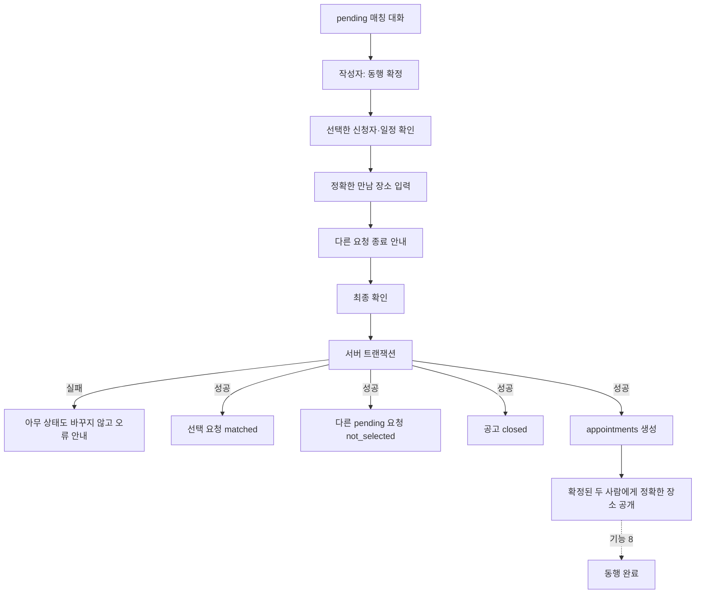
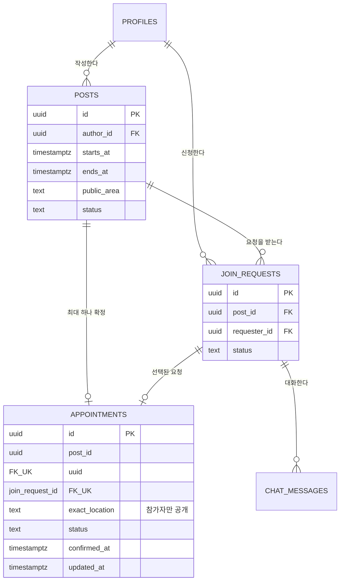
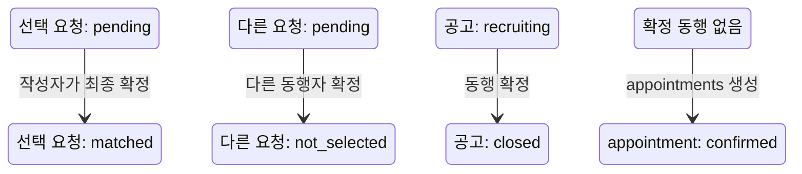
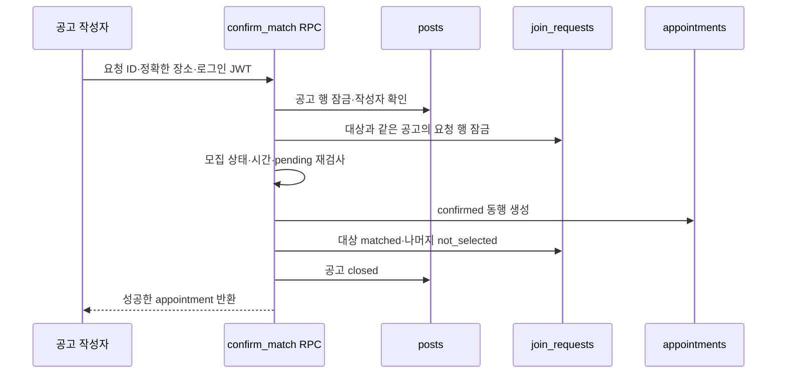
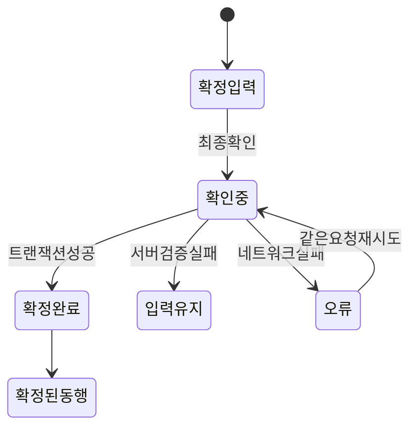

# 기능 7. 최종 동행 확정 구현 계획

상태: `PLAN_ONLY`  
구현: `NOT_RUN`  
현재 순서: 기능 1은 구현·개선 중이며 기능 2~6은 구현 시작 전이다. 기능 7 구현은 기능 1~6이 끝난 뒤 시작한다.

계획 파일: `07-final-match.md`  
향후 구현 기록 파일: `07-final-match-HANDOFF.md`  

## 목표

매칭 대화를 거친 뒤 공고 작성자가 한 명의 신청자를 선택해 최종 동행을 확정한다. 확정된 두 사람만 정확한 만남 장소를 볼 수 있고, 같은 공고의 다른 참여 요청은 종료된다.

최소 기능에서는 신청자가 참여 요청을 보내고 확정 전까지 취소할 수 있는 것을 신청자의 동의로 본다. 신청자가 취소하지 않은 `pending` 요청을 공고 작성자가 확정하면 최종 매칭이 완료된다.

## 사용자 흐름

## 데이터 관계

## `appointments` 키 계획

| 키 | 형식 | 필수 | 설명과 이유 |
|---|---|---:|---|
| `id` | `uuid` | O | 확정된 동행 식별자. 완료·평가 연결에 사용 |
| `post_id` | `uuid` | O | 확정된 공고. 한 공고당 하나만 허용하는 UNIQUE FK |
| `join_request_id` | `uuid` | O | 선택된 참여 요청. 한 요청당 하나만 허용하며 `post_id`와 묶어 관계 검증 |
| `exact_location` | `text` | O | 확정된 두 사람만 보는 정확한 만남 장소 |
| `status` | `text` | O | 기능 7에서는 `confirmed`. 기능 8에서 완료 상태 확장 |
| `confirmed_at` | `timestamptz` | O | 최종 확정이 성공한 서버 시각 |
| `updated_at` | `timestamptz` | O | 이후 완료·취소 같은 상태 변경 시각 |

## 중복해서 저장하지 않을 정보

- 작성자 ID: `posts.author_id`로 계산
- 동행자 ID: 선택된 `join_requests.requester_id`로 계산
- 제목·일정·공개 지역: `posts`에서 조회
- 상대 이름·나이·사진: 기능 4의 안전한 공개 프로필 응답 사용
- 채팅 내용: 기존 `chat_messages`를 그대로 사용

참가자 ID를 여러 테이블에 복사하지 않아 불일치 가능성을 줄인다. `posts`와 `join_requests`는 확정 뒤에도 삭제하지 않고 관계 기록으로 유지한다.

`(join_request_id, post_id)`는 `join_requests(id, post_id)`를 함께 참조하게 해, 선택한 요청과 appointment의 공고가 서로 다르면 DB가 저장을 거부하도록 한다.

## 상태 변화

화면 표시:

| DB 상태 | 화면 표시 |
|---|---|
| 요청 `matched` | `동행 확정` |
| 요청 `not_selected` | `다른 동행자와 확정` |
| 공고 `closed` + appointment 존재 | `모집 완료` |
| appointment `confirmed` | `확정된 동행` |

## 최종 확정 주체

- 신청자는 참여 요청을 보내면서 동행 의사를 표시한다.
- 신청자는 작성자가 확정하기 전까지 요청을 취소할 수 있다.
- 공고 작성자만 `동행 확정`을 실행할 수 있다.
- 최종 확정 뒤 신청자에게 두 번째 확인 버튼을 요구하지 않는다.

이 방식은 최소 사이클을 단순하게 유지한다. 나중에 양쪽의 별도 최종 동의가 필요하다는 사용자 검증 결과가 나오면 `confirmation_pending` 단계를 추가한다.

## 정확한 만남 장소

- 공개 공고의 `public_area`에는 시·구·동만 유지한다.
- 작성자는 최종 확정 화면에서 `exact_location`을 2~200자로 입력한다.
- 예: `성수역 3번 출구 앞`
- `exact_location`은 `posts`나 공개 프로필 응답에 복사하지 않는다.
- 확정된 작성자와 동행자만 `appointments` RLS를 통해 조회한다.
- 다른 신청자·관계없는 회원·비회원은 조회할 수 없다.
- 정확한 장소를 분석 로그나 오류 메시지에 남기지 않는다.

기능 7에서는 장소 변경 기능을 만들지 않는다. 변경 합의와 이력 보존은 별도 기능으로 검토한다.

## 원자적 최종 확정 명령

권장 서버 명령은 `confirm_match(join_request_id, exact_location)` 형태의 단일 RPC다.

다음 변경은 한 트랜잭션에서 모두 성공하거나 모두 취소되어야 한다.

1. `appointments` 한 행 생성
2. 선택 요청을 `matched`로 변경
3. 같은 공고의 다른 `pending` 요청을 `not_selected`로 변경
4. 공고를 `closed`로 변경

일부만 성공하면 공고는 열려 있는데 동행은 존재하거나, 두 사람이 동시에 확정되는 문제가 생긴다.

## 서버 검증 조건

1. 로그인 세션이 유효하다.
2. 실행자는 해당 공고의 `posts.author_id`다.
3. 대상 요청이 해당 공고에 속한다.
4. 대상 요청 상태가 `pending`이다.
5. 공고 상태가 `recruiting`이다.
6. 동행 시작 시각이 지나지 않았다.
7. 같은 `post_id`의 appointment가 없다.
8. 같은 `join_request_id`의 appointment가 없다.
9. `exact_location`을 다듬은 결과가 2~200자다.

공고 행과 관련 요청 행을 잠가 두 탭이나 두 요청을 동시에 확정해도 한 건만 성공하게 한다. `appointments.post_id`와 `appointments.join_request_id`의 UNIQUE 제약, `(join_request_id, post_id)` 복합 FK가 마지막 방어선이다.

같은 요청의 재시도로 이미 같은 appointment가 만들어졌다면 기존 성공 결과를 반환한다. 다른 요청이 이미 확정됐다면 새 확정을 거부한다.

## RLS와 권한 계획

| 역할 | appointment 조회 | 최종 확정 |
|---|---:|---:|
| 비회원 | X | X |
| 관계없는 회원 | X | X |
| 선택되지 않은 신청자 | X | X |
| 확정된 신청자 | O | X |
| 공고 작성자 | O | O |

- `appointments` 직접 `INSERT`, `UPDATE`, `DELETE` 권한은 열지 않는다.
- 생성과 관련 상태 변경은 `confirm_match` RPC에서만 수행한다.
- `SELECT`는 해당 appointment의 작성자와 선택된 신청자에게만 허용한다.
- 클라이언트가 작성자 ID·동행자 ID·공고 ID를 임의로 정하지 못하게 서버 관계에서 계산한다.
- RPC 반환에도 원본 실명·생년월일·전화번호를 포함하지 않는다.

## 확정 뒤 채팅 처리

- 선택된 `matched` 요청의 기존 채팅은 계속 조회·전송 가능
- 다른 `not_selected` 요청의 채팅은 이전 기록만 조회 가능
- 최종 확정 결과는 별도 시스템 메시지 행을 복사하기보다 요청·appointment 상태 배너로 표시
- 두 브라우저에서 요청·공고 상태 변경을 구독하거나 안전하게 다시 조회해 즉시 화면 반영

## 화면 구성

### 작성자 확정 화면

- 선택한 신청자의 마스킹된 실명·만 나이·사진
- 공고 제목·일정·시·구·동 공개 지역
- 정확한 만남 장소 입력
- `확정하면 다른 신청은 종료됩니다.` 안내
- 최종 확인 버튼과 처리 중 상태

### 확정된 두 사람의 화면

- `동행 확정` 상태
- 상대의 마스킹된 실명과 프로필
- 일정과 공개 지역
- 정확한 만남 장소
- 이어지는 기존 채팅
- 기능 8에서 연결할 동행 완료 진입점

### 선택되지 않은 신청자의 화면

- `다른 동행자와 확정되었어요.` 안내
- 이전 대화 읽기 전용
- 정확한 만남 장소 비공개

## 화면 상태

실패하면 정확한 장소 입력과 선택한 신청자를 유지한다. 성공 응답을 받기 전에는 화면만 먼저 확정 상태로 바꾸지 않는다.

## 구현 순서

기능 7 구현을 시작하는 별도 세션은 다음 순서를 따른다.

1. 기능 1~6의 실제 완료 상태와 최신 스키마를 다시 확인한다.
2. `appointments` 테이블, FK, UNIQUE, CHECK, 인덱스, RLS 마이그레이션을 작성한다.
3. `join_requests`에 `matched`, `not_selected` 상태를 추가한다.
4. 행 잠금과 네 가지 변경을 포함하는 `confirm_match` 트랜잭션 RPC를 작성한다.
5. 작성자 전용 최종 확정 화면과 정확한 장소 입력을 연결한다.
6. 확정된 두 사람 전용 appointment 조회와 장소 공개를 연결한다.
7. 선택된 채팅은 유지하고 다른 채팅은 읽기 전용으로 전환한다.
8. 두 탭 동시 확정, 다른 신청자, 비회원 권한을 실제로 검증한다.
9. 구현 결과와 실제 검증을 별도 `07-final-match-HANDOFF.md`에 기록한다.
10. 검증 후에만 Notion에 실제 결과를 기록한다.

## 테스트 사용자 시나리오

사용자 A는 공고 작성자, 사용자 B와 C는 `pending` 신청자다.

1. A가 B와 C의 매칭 대화를 확인한다.
2. A가 B를 선택하고 정확한 만남 장소를 입력한다.
3. B 요청은 `matched`, C 요청은 `not_selected`가 된다.
4. 공고는 `closed`, appointment는 `confirmed`가 된다.
5. A와 B만 정확한 장소를 본다.
6. B의 기존 채팅은 계속 가능하고 C의 채팅은 읽기 전용이다.
7. A가 두 탭에서 B와 C를 동시에 확정해도 appointment는 하나만 생긴다.

## 완료 기준

아래 항목을 실제로 확인해야 기능 7을 완료로 표시한다.

1. 공고 작성자만 `pending` 요청을 최종 확정할 수 있다.
2. 신청자·관계없는 사용자가 RPC를 호출해도 거부된다.
3. 확정 성공 시 appointment 생성, 선택 요청 변경, 다른 요청 종료, 공고 마감이 모두 반영된다.
4. 위 네 변경 중 하나라도 실패하면 아무 변경도 남지 않는다.
5. 두 요청을 동시에 확정해도 한 appointment만 생성된다.
6. 같은 성공 요청을 재시도해도 중복 appointment가 생기지 않는다.
7. 확정된 두 사람만 `exact_location`을 조회한다.
8. 다른 신청자·비회원·관계없는 회원은 정확한 장소를 조회하지 못한다.
9. 공개 공고·프로필·요청 응답에는 정확한 장소가 없다.
10. 선택된 채팅은 계속 가능하고 다른 요청의 채팅은 읽기 전용이다.
11. 두 브라우저에서 확정 상태가 새로고침 없이 반영되거나 안전한 재조회로 즉시 동기화된다.
12. 네트워크 응답과 화면 상태에 원본 실명·생년월일·전화번호가 없다.
13. 브라우저 콘솔 오류 없이 `npm test`, `npm run lint`, `npm run build`, `git diff --check`가 통과한다.

두 브라우저와 원격 Supabase에서 확인하지 않은 항목은 `NOT_RUN`으로 남긴다.

## 이번 기능에서 하지 않는 것

- 신청자의 두 번째 최종 확인 버튼
- 확정 뒤 일정·장소 변경
- 최종 동행 취소와 취소 제재
- 동행 완료 처리
- 평가·당도 계산
- 푸시·문자·이메일 알림
- 결제·환불·에스크로

## 기능 8로 넘길 정보

- 완료 대상 `appointment_id`
- 동행 일정의 `posts.starts_at`, `posts.ends_at`
- 두 참가자를 확인하는 `post_id`, `join_request_id`
- 현재 appointment 상태 `confirmed`
- 완료 처리 뒤 기능 9 평가 자격을 열어야 한다는 조건

## Notion 기록 예정

실제 구현과 원격 검증이 끝난 뒤 지정된 Notion 페이지의 `기능 7. 최종 동행 확정`에 각 `appointments` 키의 형식·PK/FK·공개 범위·RLS·생성/변경 주체·필요 이유를 기록한다. 원자적 트랜잭션, 중복 확정 방지, 다른 요청 종료, 정확한 장소 접근 범위와 실제 PASS/NOT_RUN도 함께 남긴다.
