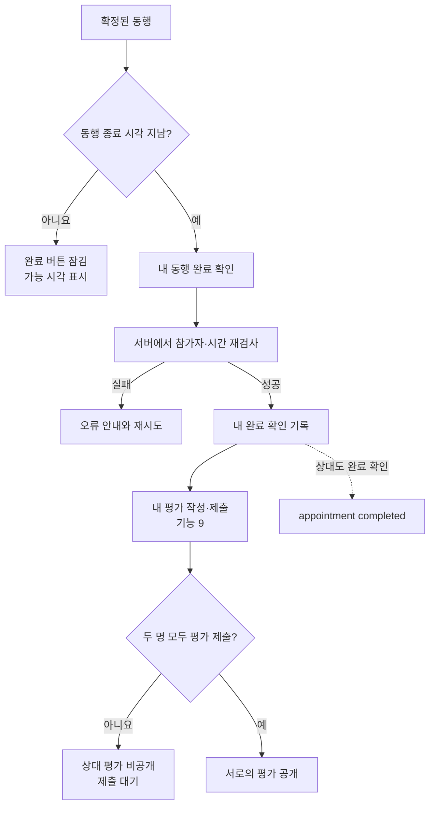
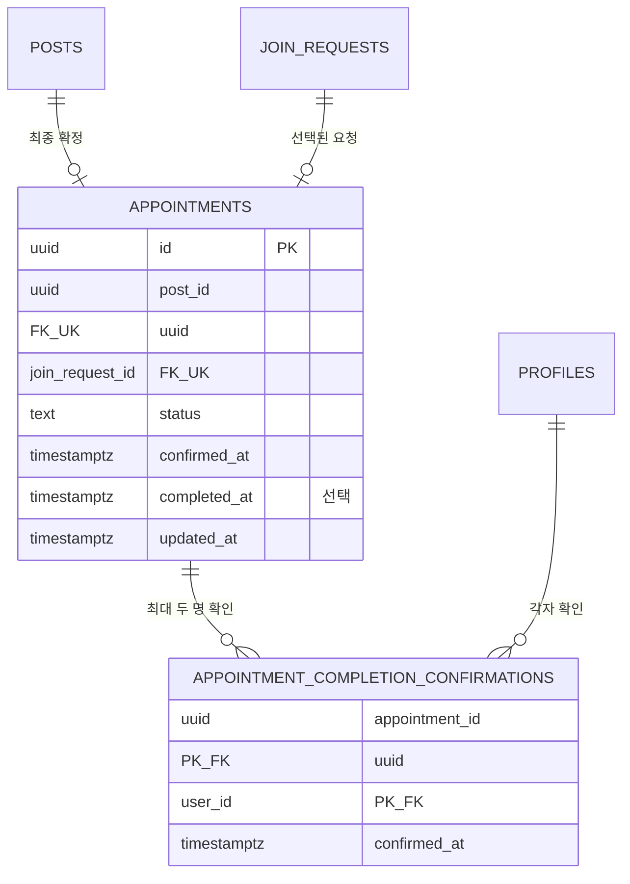
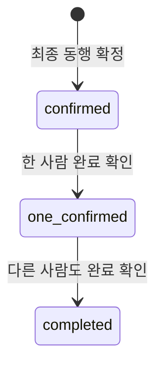
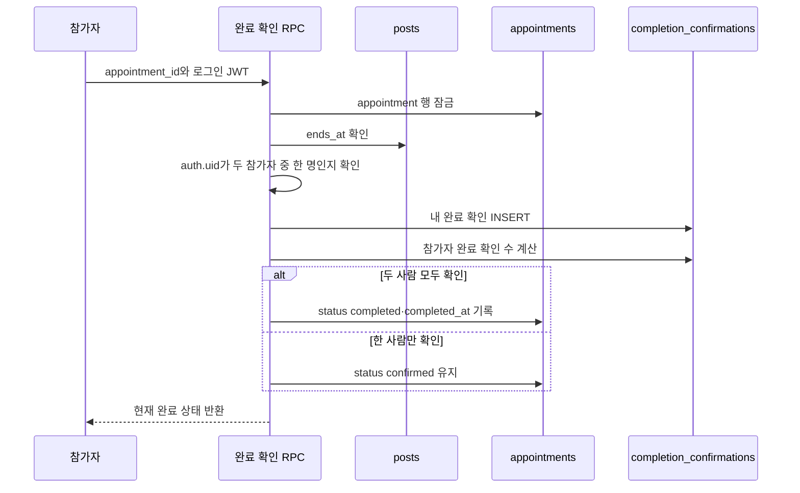
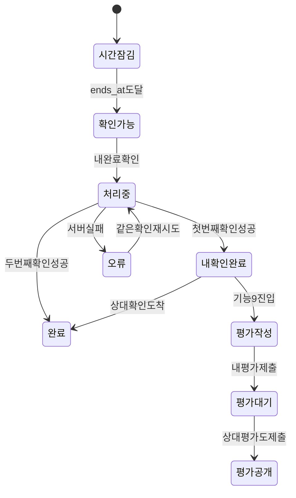

# 기능 8. 확정된 동행 완료 구현 계획

상태: `PLAN_ONLY`
구현: `NOT_RUN`
현재 순서: 기능 1은 구현·개선 중이며 기능 2~7은 구현 시작 전이다. 기능 8 구현은 기능 1~7이 끝난 뒤 시작한다.

계획 파일: `08-complete-appointment.md`
향후 구현 기록 파일: `08-complete-appointment-HANDOFF.md`

## 목표

확정된 동행의 종료 시각이 지난 뒤 작성자와 동행자가 각자 실제 동행 완료를 확인한다. 각 참가자는 **자기 완료 확인 직후** 기능 9의 평가를 작성할 수 있다. 두 사람의 완료 확인이 모두 저장되면 확정 동행을 `completed`로 전환한다.

먼저 평가를 제출해도 상대가 제출한 평가를 볼 수 없다. 두 참가자의 평가가 모두 제출된 뒤에만 서로의 평가를 공개한다.

시간이 지났다는 이유만으로 자동 완료하지 않는다. 실제로 만나지 않았거나 문제가 생긴 동행까지 완료로 처리되는 것을 막기 위해 두 참가자의 명시적인 완료 확인을 사용한다.

## 사용자 흐름

## 데이터 관계

## `appointment_completion_confirmations` 키 계획

| 키 | 형식 | 필수 | 설명과 이유 |
|---|---|---:|---|
| `appointment_id` | `uuid` | O | 어떤 확정 동행을 완료했다고 확인했는지 연결하는 PK/FK |
| `user_id` | `uuid` | O | 완료를 확인한 참가자. `appointment_id`와 묶은 복합 PK |
| `confirmed_at` | `timestamptz` | O | 해당 사용자가 완료를 확인한 서버 시각 |

복합 PK `(appointment_id, user_id)`로 한 사람이 같은 동행을 여러 번 완료 처리하지 못하게 한다.

## `appointments`에 추가할 키

| 키 | 형식 | 필수 | 설명과 이유 |
|---|---|---:|---|
| `completed_at` | `timestamptz` | 완료 시 O | 두 사람의 완료 확인이 모두 모여 동행이 완료된 서버 시각 |

첫 번째 사람만 확인한 동안에는 `appointments.status = 'confirmed'`, `completed_at = null`을 유지한다. 두 번째 확인이 성공한 트랜잭션에서 `status = 'completed'`와 `completed_at`을 함께 기록한다.

## 상태 변화

`one_confirmed`는 화면에서 이해하기 위한 상태다. `appointments.status`에 별도로 저장하지 않고 완료 확인 행의 개수로 계산한다.

화면 표시:

| 저장 상태 | 화면 표시 |
|---|---|
| 확인 0명 | `동행 완료 확인 전` |
| 내 확인만 있음 | `내 완료 확인됨 · 상대 확인 대기` |
| 상대 확인만 있음 | `상대 완료 확인됨 · 내 확인 필요` |
| 확인 2명 + appointment `completed` | `동행 완료` |

## 완료 가능 조건

서버는 다음을 모두 만족할 때만 완료 확인을 허용한다.

1. 로그인 세션이 유효하다.
2. 대상 appointment가 존재한다.
3. 사용자가 해당 appointment의 작성자 또는 선택된 동행자다.
4. appointment 상태가 `confirmed` 또는 이미 `completed`다.
5. 연결된 공고의 `ends_at`이 유효하다.
6. 현재 서버 시각이 `posts.ends_at` 이상이다.
7. 해당 사용자의 완료 확인 행이 아직 없거나 이미 같은 확인으로 존재한다.

모집 마감 시각이나 동행 시작 시각은 완료 가능 기준이 아니다. 공고 작성 시 정한 동행 종료 시각만 사용한다.

## 완료 확인 서버 명령

권장 서버 명령은 `confirm_appointment_completion(appointment_id)` 형태의 단일 RPC다.

- `user_id`를 클라이언트 입력으로 받지 않고 `auth.uid()`로 결정한다.
- appointment 행을 잠가 두 사람이 동시에 눌러도 최종 상태를 정확히 계산한다.
- 같은 사용자의 재시도는 새 행을 만들지 않고 기존 완료 결과를 반환한다.
- 완료 확인 행과 두 번째 확인 시 appointment 변경은 같은 트랜잭션에서 처리한다.
- 완료 확인은 삭제하거나 취소하지 않는 기록으로 취급한다.

## RLS와 권한 계획

| 역할 | 완료 상태 조회 | 완료 확인 생성 | 다른 사람 확인 생성 |
|---|---:|---:|---:|
| 비회원 | X | X | X |
| 관계없는 회원 | X | X | X |
| appointment 참가자 | O | 자기 것만 O | X |

- `appointment_completion_confirmations` 직접 `INSERT`, `UPDATE`, `DELETE` 권한은 열지 않는다.
- 완료 확인은 전용 RPC에서만 생성한다.
- 두 참가자는 서로의 완료 여부와 확인 시각을 조회할 수 있다.
- 원본 실명·생년월일·전화번호는 완료 응답에 포함하지 않는다.
- `appointments`의 `completed` 변경 권한도 RPC에만 둔다.

## 평가 자격과의 경계

기능 8은 평가 내용을 저장하지 않는다.

- 두 참가자의 완료 확인이 모두 있어야 appointment가 `completed`가 됨
- 각 참가자는 **자기 완료 확인 행이 있으면** 상대의 완료 확인 여부와 관계없이 평가를 작성할 수 있음
- 자기 완료 확인 전에는 평가를 작성할 수 없음
- 평가를 한 명만 제출했다면 상대 평가의 점수와 내용은 양쪽 모두에게 공개하지 않음
- 두 참가자의 평가가 모두 제출되면 서로의 평가를 동시에 공개
- 제출한 사람은 공개 전에도 자기 평가 내용과 `제출 완료` 상태를 확인할 수 있음
- 먼저 제출한 평가를 상대 평가에 맞춰 바꾸지 못하도록 평가 제출 후 수정은 허용하지 않는 방향으로 기능 9에서 설계

따라서 평가 작성 자격과 평가 공개 자격은 서로 다르다.

| 조건 | 내 평가 작성 | 상대 평가 열람 |
|---|---:|---:|
| 내 완료 확인 전 | X | X |
| 내 완료 확인 후, 평가 미제출 | O | X |
| 내 평가만 제출 | 제출 완료 | X |
| 두 사람 모두 평가 제출 | 제출 완료 | O |

한쪽이 완료를 확인하지 않거나 평가를 제출하지 않으면 먼저 제출된 평가는 계속 비공개다. 자동 완료·평가 공개 기한·분쟁 처리는 이번 최소 기능에 포함하지 않는다.

## 화면 구성

### 종료 시각 전

- 확정된 동행 일정과 정확한 장소
- `2026년 10월 3일 18:00부터 완료할 수 있어요.` 안내
- 비활성화된 완료 버튼

### 종료 시각 후

- `내 동행 완료 확인` 버튼
- 되돌릴 수 없다는 확인 안내
- 내 완료·상대 완료 상태 표시
- 내 완료 확인 직후 기능 9의 `평가 작성` 진입점 표시
- 상대 완료 확인 전에도 내 평가는 작성 가능
- 두 번째 완료 확인 뒤 appointment에 `동행 완료` 표시
- 내 평가만 제출된 동안 `평가 제출 완료 · 상대 평가 대기` 표시
- 두 평가가 모두 제출되면 `서로의 평가 보기` 표시

## 화면 상태

다른 브라우저에서 상대가 완료를 확인하면 Realtime 상태 구독이나 안전한 재조회로 현재 화면을 갱신한다.

## 구현 순서

기능 8 구현을 시작하는 별도 세션은 다음 순서를 따른다.

1. 기능 1~7의 실제 완료 상태와 최신 스키마를 다시 확인한다.
2. `appointment_completion_confirmations` 테이블, 복합 PK, FK, 인덱스, RLS 마이그레이션을 작성한다.
3. `appointments`에 `completed_at`과 `completed` 상태 제약을 추가한다.
4. 참가자·종료 시각·중복을 검사하는 완료 확인 RPC를 작성한다.
5. 확정 동행 화면에 완료 가능 시각과 두 사람의 확인 상태를 연결한다.
6. 자기 완료 확인 직후 기능 9가 사용할 평가 작성 자격을 제공한다.
7. 첫 번째 완료 확인과 두 번째 완료 확인의 appointment 상태 전환을 연결한다.
8. 두 브라우저 동시 확인, 시간 조작, 관계없는 사용자 권한을 검증한다.
9. 구현 결과와 실제 검증을 별도 `08-complete-appointment-HANDOFF.md`에 기록한다.
10. 검증 후에만 Notion에 실제 결과를 기록한다.

## 테스트 사용자 시나리오

사용자 A와 B는 같은 `confirmed` appointment의 두 참가자다.

1. 동행 종료 시각 전에는 A와 B 모두 완료할 수 없다.
2. 종료 시각 후 A가 자기 완료를 확인한다.
3. A 화면은 `내 완료 확인됨`, B 화면은 `상대 완료 확인됨`을 표시한다.
4. appointment는 아직 `confirmed`지만 A는 기능 9 평가를 작성할 수 있다.
5. A가 평가를 먼저 제출해도 B는 A의 평가와 점수를 볼 수 없고, A 역시 상대 평가를 볼 수 없다.
6. B가 자기 완료를 확인한다.
7. appointment가 `completed`로 바뀌고 `completed_at`이 기록되며 B도 평가를 작성할 수 있다.
8. B 역시 A의 평가를 보지 못한 상태에서 자기 평가를 제출한다.
9. 두 평가가 모두 제출된 뒤 A와 B에게 서로의 평가가 동시에 공개된다.

## 완료 기준

아래 항목을 실제로 확인해야 기능 8을 완료로 표시한다.

1. 동행 종료 시각 전에는 두 참가자 모두 완료 확인이 거부된다.
2. 브라우저 시간을 바꿔도 서버 시각 기준 종료 전 확인은 거부된다.
3. 작성자와 선택된 동행자만 자기 완료를 확인할 수 있다.
4. 관계없는 사용자·비회원은 완료 상태 조회와 생성이 모두 거부된다.
5. 사용자는 상대방 명의의 완료 확인을 만들 수 없다.
6. 같은 사용자의 연속 클릭·재시도에도 확인 행은 한 개다.
7. 첫 번째 확인만으로 appointment가 `completed`가 되지 않는다.
8. 두 번째 확인과 appointment 완료 변경이 한 트랜잭션에서 처리된다.
9. 두 브라우저에서 동시에 확인해도 두 행과 하나의 완료 상태만 남는다.
10. `completed_at`은 두 번째 확인이 성공한 서버 시각이다.
11. 완료 응답에 원본 실명·생년월일·전화번호가 없다.
12. 두 참가자의 화면에 완료 상태가 새로고침 없이 반영되거나 안전한 재조회로 즉시 동기화된다.
13. 자기 완료 확인 직후에는 상대 완료 여부와 관계없이 자기 평가 작성 자격이 생긴다.
14. 자기 완료 확인 전에는 평가 작성 자격이 생기지 않는다.
15. 브라우저 콘솔 오류 없이 `npm test`, `npm run lint`, `npm run build`, `git diff --check`가 통과한다.

두 브라우저와 원격 Supabase에서 확인하지 않은 항목은 `NOT_RUN`으로 남긴다.

### 기능 9에서 검증할 연계 기준

1. 평가가 한 건만 제출된 동안 먼저 제출된 평가의 점수와 내용은 상대 화면과 API에 노출되지 않는다.
2. 먼저 평가한 사람도 상대가 평가를 제출하기 전에는 상대 평가를 볼 수 없다.
3. 두 참가자의 평가가 모두 제출된 뒤에만 서로의 평가가 동시에 공개된다.
4. 평가 제출 전후에 완료 확인 행과 appointment 완료 상태가 변조되지 않는다.

## 이번 기능에서 하지 않는 것

- 종료 시각만으로 자동 완료
- 한 사람의 확인만으로 전체 동행 완료
- 완료 확인 취소·삭제
- 노쇼·분쟁·신고 처리
- 확정 동행 취소와 제재
- 별점·후기 저장과 공개
- 당도 계산
- 푸시·문자·이메일 알림

## 기능 9로 넘길 정보

- 평가 대상 `appointment_id`
- 두 참가자의 완료 확인 행
- 평가자와 상대를 계산하는 `post_id`, `join_request_id`
- 평가 작성 자격: 평가자 본인의 완료 확인 행 존재 여부
- 한 참가자가 한 번만 평가해야 한다는 조건
- 평가 제출 후 수정 금지
- 평가 공개 자격: 두 참가자의 평가 행이 모두 존재하는지 여부
- 한쪽만 평가를 제출하면 상대 평가를 계속 비공개로 유지

## Notion 기록 예정

실제 구현과 원격 검증이 끝난 뒤 지정된 Notion 페이지의 `기능 8. 확정된 동행 완료`에 `appointment_completion_confirmations`와 `appointments.completed_at` 키의 형식·PK/FK·공개 범위·RLS·생성/변경 주체·필요 이유를 기록한다. 서버 시간 기준, 복합 PK 중복 방지, 두 번째 확인 트랜잭션, 자기 완료 확인 직후 생기는 평가 작성 자격과 실제 PASS/NOT_RUN도 함께 남긴다. 평가의 양쪽 제출 여부와 공개 조건은 기능 9 항목에 기록한다.
