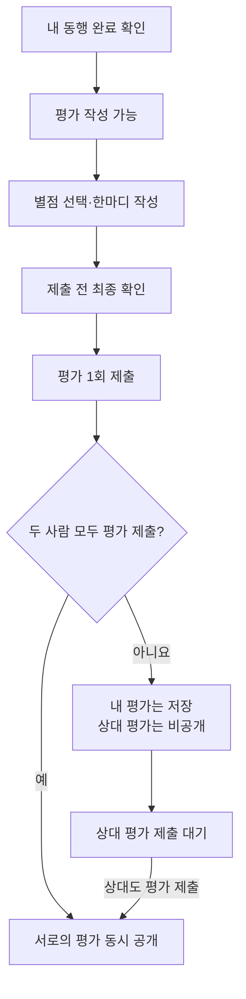
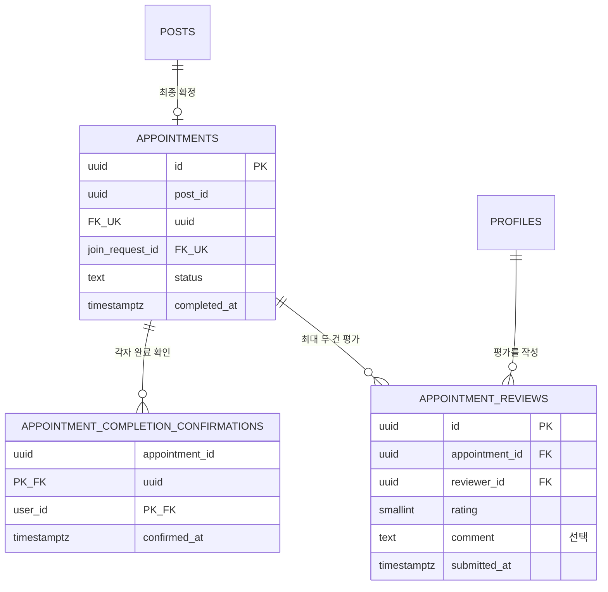
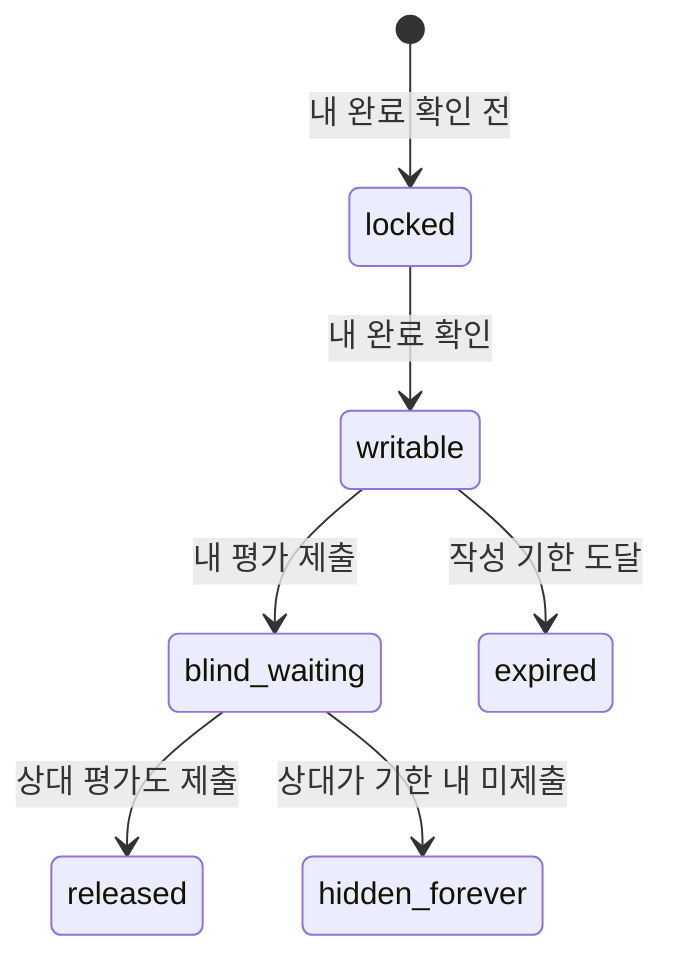
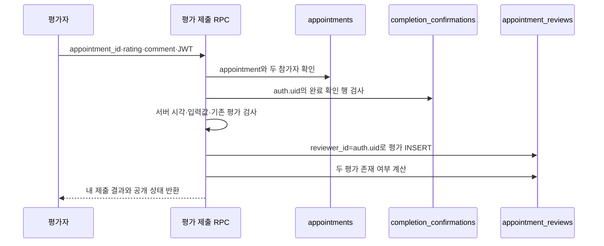
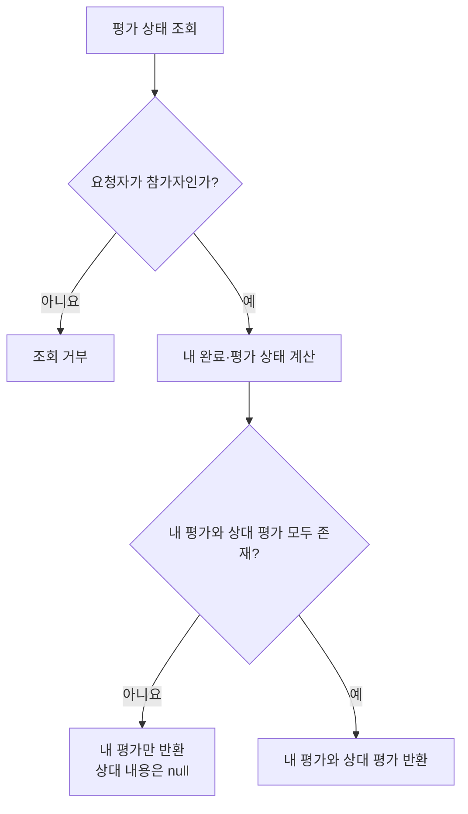

# 기능 9. 상호 평가 구현 계획

> 2026-09-17 정책 변경으로 이 계획의 “양쪽 제출 때만 공개” 계약은 폐기됐다. 현재 계약과 검증 결과는 `docs/backend-implementation/POLICY-IMPLEMENTATION-2026-09-17.md`를 따른다.

상태: `PLAN_ONLY`
구현: `NOT_RUN`
현재 순서: 기능 1은 구현·개선 중이며 기능 2~8은 구현 시작 전이다. 기능 9 구현은 기능 1~8이 끝난 뒤 시작한다.

계획 파일: `09-mutual-review.md`
향후 구현 기록 파일: `09-mutual-review-HANDOFF.md`

## 목표

동행 참가자는 자기 동행 완료를 확인한 뒤 상대를 한 번 평가한다. 먼저 제출한 평가 내용은 숨기고, 두 참가자의 평가가 모두 제출됐을 때만 서로의 평가를 동시에 공개한다.

최소 평가 항목은 다음 두 가지다.

- 별점: `1~5점`, 필수
- 한마디: `300자 이하`, 선택

평가 작성 자격과 평가 열람 자격은 분리한다. 상대가 아직 완료를 확인하지 않았더라도 나는 내 완료를 확인했다면 평가할 수 있다. 그러나 상대 평가의 별점과 한마디는 두 평가가 모두 제출되기 전까지 볼 수 없다.

## 사용자 흐름

`두 사람 모두 확인`이라는 표현은 완료 확인과 혼동될 수 있으므로 화면과 서버 계약에서는 `두 사람 모두 평가 제출`로 구분한다.

## 데이터 관계

## `appointment_reviews` 키 계획

| 키 | 형식 | 필수 | 설명과 이유 |
|---|---|---:|---|
| `id` | `uuid` | O | 평가 행 식별자. 서버에서 생성 |
| `appointment_id` | `uuid` | O | 어떤 확정 동행에 대한 평가인지 연결하는 FK |
| `reviewer_id` | `uuid` | O | 평가 작성자. 로그인한 `auth.uid()`로만 결정 |
| `rating` | `smallint` | O | 필수 별점. DB `CHECK`로 정수 `1~5`만 허용 |
| `comment` | `text` | X | 선택 한마디. 앞뒤 공백 제거 후 빈 문자열은 `null`, 최대 300자 |
| `submitted_at` | `timestamptz` | O | 평가가 최종 제출된 서버 시각 |

UNIQUE `(appointment_id, reviewer_id)`로 한 사람이 같은 동행에 한 번만 평가하도록 한다.

### 저장하지 않는 키

- `reviewee_id`: 현재 확정 동행은 두 명뿐이므로 appointment 관계에서 상대를 계산한다. 클라이언트가 임의의 사용자를 평가 대상으로 지정하지 못하게 한다.
- `updated_at`: 제출 후 수정하지 않으므로 필요 없다.
- `released_at`: 두 평가의 `submitted_at` 중 늦은 시각으로 공개 시점을 계산할 수 있어 중복 저장하지 않는다.
- `post_id`: `appointment_id → appointments.post_id`로 조회한다.

동행 인원이 두 명을 초과하는 정책으로 바뀌면 `reviewee_id`가 필요하다. 현재의 `작성자 1명 + 선택된 신청자 1명` 구조에서는 제외한다.

## 평가 상태

| 상태 | 화면 표시 | 상대 평가 내용 |
|---|---|---|
| `locked` | `동행 완료 확인 후 평가할 수 있어요` | 비공개 |
| `writable` | `평가 작성` | 비공개 |
| `blind_waiting` | `내 평가 제출 완료 · 상대 평가 대기` | 비공개 |
| `released` | `서로의 평가가 공개됐어요` | 공개 |
| `expired` | `평가 작성 기간이 종료됐어요` | 비공개 |
| `hidden_forever` | `상대가 평가하지 않아 비공개로 종료됐어요` | 비공개 |

`locked`, `writable`, `blind_waiting`, `released`는 별도 상태 열로 저장하지 않고 완료 확인 행, 평가 행, 서버 시각으로 계산한다.

## 평가 작성 기한

계획 기본값은 동행 종료 시각부터 7일이다.

- 시작: 평가자 본인의 완료 확인 직후
- 종료: `posts.ends_at + 7일`
- 서버 현재 시각이 종료 시각+7일 **미만**이면 제출 가능
- 정확히 종료 시각+7일에 도달하면 제출 마감
- 기한은 브라우저가 아닌 서버 시각으로 검사
- 한쪽만 평가한 채 기한이 끝나도 평가를 자동 공개하지 않음

종료 시각을 기준으로 하면 두 참가자에게 같은 마감 시각이 적용된다. 늦게 완료를 확인한 사용자에게 남은 시간이 짧아질 수 있다는 한계가 있으며, 실제 사용자 검증에서 문제가 확인되면 완료 확인 시점 기준 기한이나 알림 정책을 다시 검토한다.

## 평가 제출 서버 명령

권장 서버 명령은 `submit_appointment_review(appointment_id, rating, comment)` 형태의 단일 RPC다.

서버 검증 조건:

1. 로그인 세션이 유효하다.
2. appointment가 존재한다.
3. 사용자가 공고 작성자 또는 선택된 동행자다.
4. appointment 상태가 `confirmed` 또는 `completed`다.
5. 사용자의 완료 확인 행이 존재한다.
6. 현재 서버 시각이 `posts.ends_at + 7일` 미만이다.
7. 별점이 정수 `1~5`다.
8. 한마디가 300자 이하다.
9. `(appointment_id, auth.uid())` 평가가 아직 없다.

`reviewer_id`와 평가 대상은 클라이언트 입력으로 받지 않는다. 중복 클릭이나 네트워크 재시도에서 같은 평가가 이미 저장됐다면 기존 제출 결과를 반환하고 두 번째 행을 만들지 않는다. 다른 값으로 다시 제출하려 하면 `이미 제출된 평가`로 거부한다.

## 블라인드 평가 조회

권장 조회 계약은 `get_appointment_review_state(appointment_id)` 형태의 읽기 전용 RPC다. 클라이언트에 `appointment_reviews` 원본 테이블 직접 조회 권한을 주지 않는다.

안전한 응답 예시:

| 조건 | `own_review` | `peer_submitted` | `peer_review` |
|---|---|---:|---|
| 내가 미제출 | `null` | 존재 여부만 반환 | `null` |
| 나만 제출 | 내 평가 | `false` | `null` |
| 상대만 제출 | `null` | `true` | `null` |
| 둘 다 제출 | 내 평가 | `true` | 상대 평가 |

`peer_submitted`는 제출 여부만 알려주며 별점·한마디를 포함하지 않는다. 공개 조건을 충족하기 전에는 프로필, 알림, 로그, Realtime 이벤트에서도 상대 평가 내용을 노출하지 않는다.

## RLS와 권한 계획

| 역할 | 평가 제출 | 내 평가 내용 | 상대 평가 내용 |
|---|---:|---:|---:|
| 비회원 | X | X | X |
| 관계없는 회원 | X | X | X |
| 완료 확인 전 참가자 | X | X | X |
| 완료 확인 후 미제출 참가자 | O | 해당 없음 | X |
| 자기 평가 제출 참가자 | 재제출 X | O | 양쪽 제출 후 O |

- `appointment_reviews`의 직접 `INSERT`, `UPDATE`, `DELETE`를 허용하지 않는다.
- 원본 행의 직접 `SELECT`도 열지 않고 안전한 조회 RPC만 사용한다.
- 제출 RPC는 `reviewer_id = auth.uid()`를 강제한다.
- 조회 RPC는 appointment 참가자 관계를 서버에서 확인한다.
- 보안 실행 함수는 고정 `search_path`, 명시적 반환 열, 최소 실행 권한을 사용한다.
- 제출된 평가는 수정·삭제하지 않는다.
- 원본 실명·생년월일·전화번호는 평가 응답에 포함하지 않는다.

상대가 제출하면 대기 화면은 안전한 조회 RPC를 다시 호출해 공개 여부를 갱신한다. 원본 평가 행을 Realtime으로 직접 구독하지 않는다. 최소 기능에서는 화면 재진입·창 포커스·짧은 주기 재조회 중 하나로 동기화하고, 구현 시 네트워크 비용을 확인한다.

## 화면 구성

### 평가 작성 전

- 공고 제목과 동행 일시
- 상대의 마스킹된 실명
- 상호 블라인드 평가 안내
- 작성 마감 시각
- 별점 `1~5` 선택
- 선택 한마디 `300자 이하`
- 제출 후 수정할 수 없다는 안내
- 제출 전 최종 확인

### 내 평가만 제출

- 내 별점과 한마디 확인
- `내 평가 제출 완료`
- `상대 평가 대기`
- 상대 평가 내용은 숨김

### 두 평가 모두 제출

- `서로의 평가가 공개됐어요`
- 내가 작성한 평가
- 상대가 나에게 작성한 별점과 한마디
- 상대의 마스킹된 실명

평가 화면과 응답에는 정확한 장소를 다시 포함하지 않는다. 평가 조회에 장소 정보가 필요하지 않기 때문이다.

## 공개 범위

최소 기능에서는 공개된 평가도 해당 appointment의 두 참가자만 본다. 다른 회원의 공개 프로필에 별점·후기를 노출하거나 평균 점수·당도를 계산하지 않는다.

프로필 공개 후기나 신뢰 점수가 필요해지면 다음을 별도 결정해야 한다.

- 어떤 평가를 공개 프로필에 포함할지
- 한마디 전체를 공개할지
- 신고·숨김·운영 검토를 어떻게 처리할지
- 평균 별점과 당도를 어떻게 계산할지

## 구현 순서

기능 9 구현을 시작하는 별도 세션은 다음 순서를 따른다.

1. 기능 1~8의 실제 완료 상태와 최신 스키마를 다시 확인한다.
2. `appointment_reviews` 테이블, UNIQUE, FK, CHECK, 인덱스와 RLS를 작성한다.
3. 완료 확인·참가자·기한·입력값을 검사하는 제출 RPC를 작성한다.
4. 블라인드 공개 조건을 적용하는 읽기 전용 상태 조회 RPC를 작성한다.
5. 기존 샘플 평가 UI를 실제 응답 타입에 맞게 단순화한다.
6. 잠김·작성·제출 중·비공개 대기·공개·기한 종료·오류 화면을 연결한다.
7. 두 브라우저에서 제출 순서와 우회 조회 차단을 검증한다.
8. 구현 결과와 실제 검증을 `09-mutual-review-HANDOFF.md`에 기록한다.
9. 검증 후에만 Notion에 실제 키와 결과를 기록한다.

## 테스트 사용자 시나리오

사용자 A와 B는 같은 appointment의 두 참가자다.

1. A와 B 모두 완료 확인 전에는 평가할 수 없다.
2. A가 자기 완료를 확인하면 A만 평가할 수 있다.
3. A가 별점과 한마디를 제출한다.
4. B는 A의 평가 제출 여부는 알 수 있지만 별점과 한마디는 볼 수 없다.
5. A는 자기 평가를 확인하며 상대 평가 대기 상태를 본다.
6. B가 자기 완료를 확인한 뒤 A의 평가를 보지 못한 채 평가한다.
7. B의 제출이 성공하면 A와 B에게 서로의 평가가 동시에 공개된다.
8. 관계없는 사용자 C는 평가 존재 여부와 내용 모두 볼 수 없다.

## 완료 기준

아래 항목을 실제로 확인해야 기능 9를 완료로 표시한다.

1. 자기 완료 확인 전에는 평가 제출이 거부된다.
2. 상대가 완료를 확인하지 않아도 자기 완료 확인 뒤에는 평가할 수 있다.
3. 별점의 정수 `1~5` 범위와 한마디 300자 제한을 서버가 검사한다.
4. `reviewer_id`와 상대는 로그인 사용자와 appointment 관계로 계산된다.
5. 같은 동행에서 한 사용자의 평가는 한 건만 저장된다.
6. 연속 클릭·새로고침·네트워크 재시도에도 중복 평가가 생기지 않는다.
7. 제출 후 평가를 수정하거나 삭제할 수 없다.
8. 첫 평가만 존재할 때 상대 별점과 한마디가 화면·RPC·원본 테이블·프로필·알림에서 노출되지 않는다.
9. 상대가 먼저 제출했더라도 나는 그 내용을 보지 않고 평가한다.
10. 두 평가가 모두 제출된 뒤에만 두 참가자에게 서로의 평가가 공개된다.
11. 두 평가가 거의 동시에 제출돼도 최종 공개 상태가 일치한다.
12. 비회원·관계없는 회원은 평가 존재 여부와 내용을 조회하지 못한다.
13. 평가 작성 기한 직전에는 제출되고 정확한 마감 시각부터는 거부된다.
14. 한쪽만 제출한 채 기한이 끝나도 평가가 자동 공개되지 않는다.
15. 평가 응답에 원본 실명·생년월일·전화번호·정확한 장소가 없다.
16. 평가 제출이 완료 확인 행이나 appointment 상태를 변경하지 않는다.
17. 두 브라우저에서 상대 제출 뒤 공개 상태가 안전한 재조회로 반영된다.
18. 브라우저 콘솔 오류 없이 `npm test`, `npm run lint`, `npm run build`, `git diff --check`가 통과한다.

두 브라우저와 원격 Supabase에서 확인하지 않은 항목은 `NOT_RUN`으로 남긴다.

## 이번 기능에서 하지 않는 것

- 평가 제출 후 수정·삭제
- 7일 뒤 평가 자동 공개
- 공개 프로필의 후기 목록·평균 별점
- 당도 점수 계산과 자동 변경
- 긍정·부정 태그 평가
- 평가 신고·숨김·운영자 검토
- 푸시·문자·이메일 알림
- 여러 명이 참여하는 그룹 동행 평가

## 구현 뒤 남길 파일

기능 9 구현 세션은 계획 문서를 완료 기록으로 덮어쓰지 않는다. 다음 파일을 별도로 만든다.

- `09-mutual-review-HANDOFF.md`
- 실제 추가·수정한 파일 목록
- 적용한 Supabase 마이그레이션 이름과 원격 적용 여부
- 두 테스트 사용자의 블라인드 평가 검증 결과
- 각 완료 기준의 `PASS`, `FAIL`, `NOT_RUN`
- 남은 문제와 다음 작업

## Notion 기록 예정

실제 구현과 원격 검증이 끝난 뒤 지정된 Notion 페이지의 `기능 9. 상호 평가`에 `appointment_reviews`의 모든 키를 각각 설명한다. 형식·필수 여부·PK/FK/UNIQUE/CHECK·공개 범위·RLS·생성 주체·필요 이유와 함께 다음 규칙을 기록한다.

- 자기 완료 확인 뒤 평가 가능
- `(appointment_id, reviewer_id)` 중복 방지
- 별점 `1~5`, 한마디 `300자 이하`
- 제출 후 수정 불가
- 두 평가가 모두 제출되기 전 상대 내용 비공개
- 기한이 지나도 자동 공개하지 않음
- 원격 검증의 실제 `PASS`, `FAIL`, `NOT_RUN`
