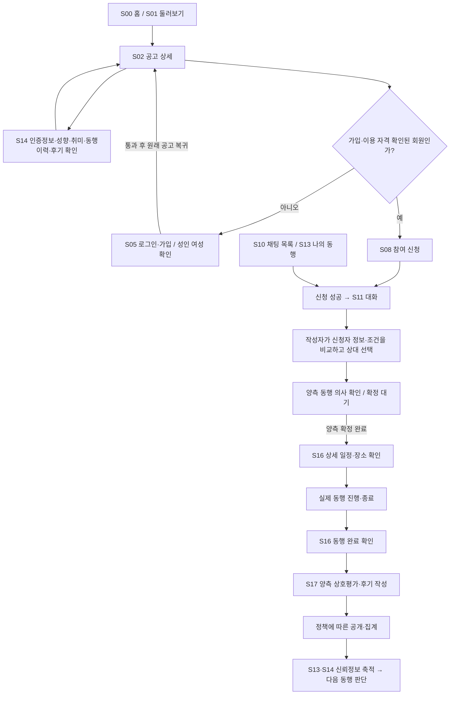
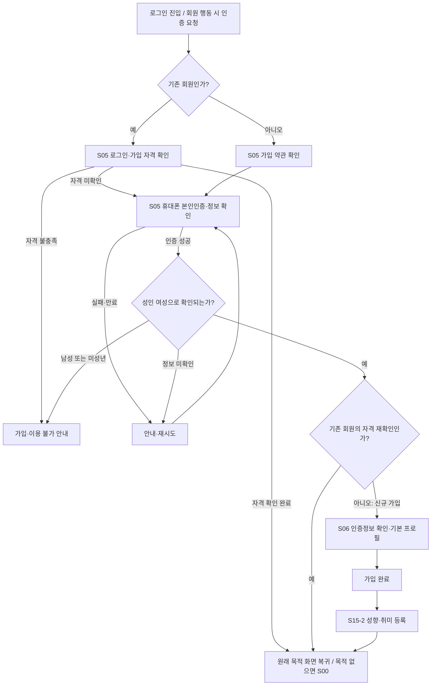
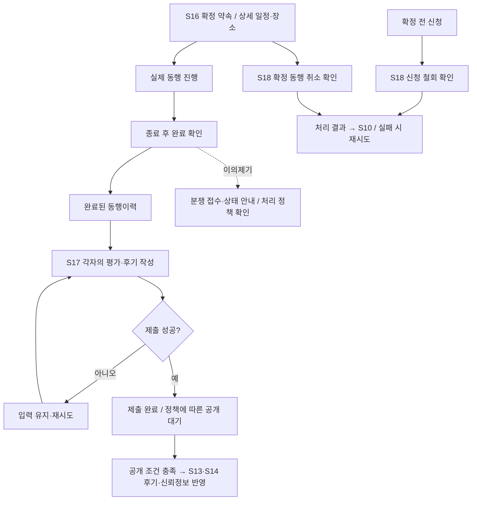

# 유미당 유저플로우 — PRD 반영 · 여성 전용

기준: [최신 PRD](../requirements/PRD.md), [PRD 반영 IA](IA.md), 사용자의 **여성만 가입·이용하며 남성 사용자는 두지 않는다**는 결정.

현재 기준은 위 로컬 PRD·IA다. 이전 Notion 분석의 출처와 화면 구조 기록은 [과거 IA·유저플로우 보관 안내](../../archive/design-selection/README.md)에서만 참고한다. 아래는 앞으로 제공할 서비스의 목표 흐름이다.

## 1. 표기와 공통 기준

- **목표 흐름:** 최신 PRD와 사용자 결정에 따라 제공할 사용자 행동·화면·결과. 실제 구현 완료를 뜻하지 않는다.
- **기존 분석:** Notion에 기록된 와이어프레임 상태. 이번 작업에서 HTML·API·DB 동작을 재검증한 결과가 아니다.
- **정책 확인:** 최신 PRD가 정하지 않은 세부 사항. 원문에 있던 정책 수치를 새 결정으로 간주하지 않는다.
- 흐름의 화살표는 목표 이동 순서다. 원문의 ‘실선은 구현 연결’이라는 의미와 다르다.
- 홈 S00·둘러보기 S01·채팅 S10·나 S13의 기본 탭과 기존 화면 ID를 유지한다. **S07은 폐기된 남성 가입 분기의 참조 ID**이며 서비스 경로에 포함하지 않는다. 새 번호로 재사용하지 않는다.
- 일반 회원은 성인 여성으로 한정한다. 공고 작성자와 신청자는 같은 여성 회원이 상황에 따라 맡는 역할이다. 운영 관리자는 별도 역할이며 성별 정책을 일반 회원 기준에서 임의로 확장하지 않는다.
- 회원 활동은 휴대폰 본인인증과 성인 여성 자격 확인 후 가능하다. 남성·미성년은 가입 불가이며 추천 코드·기관 이메일로 우회 가입할 수 없다. 인증 결과 미확인은 실패·재확인 상태로 처리한다.
- 비회원은 허용된 공개 범위에서 탐색하고, 공고 작성·참여 신청·채팅·확정·평가는 회원 인증을 거친다. 비회원에게 공개할 상세 정보는 기존 공개 정책과 대조한다.
- 초기 범위는 무료 1:1 동행이다. 전문 동행·유료 오퍼는 후속 확장으로 구분한다.

## 2. 핵심 흐름 — 탐색 → 신청 → 대화 → 양측 확정 → 동행 → 평가



1. 신청자는 공고 내용·조건과 작성자의 인증·취향·동행이력·후기를 확인한다. 이력이 없는 회원은 없음 상태로 표시한다.
2. 신청을 제출하고 성공 결과를 확인한 뒤 대화를 시작한다. 실패는 입력 유지·재시도로 이어지며 성공한 것처럼 이동하지 않는다.
3. 작성자는 신청자의 성향·취미와 공고 조건을 비교해 상대를 선택한다. 신청이나 채팅방 생성은 확정이 아니다.
4. 양측의 동행 의사가 확인되면 약속을 확정한다. 작성자의 상대 선택과 최종 확정은 구분한다. 신청 시 동의의 효력과 추가 확인 버튼 방식은 정책 확인 항목이다.
5. 확정 당사자는 상세 일정·장소를 확인하고 실제 동행을 진행한다. 실제 동행 이후 완료를 확인하고 서로 평가한다.
6. 공개 가능한 후기와 완료 이력·당도는 이후 다른 여성 회원의 상대 판단 정보로 연결한다.

## 3. 둘러보기·검색·필터

| 시작·행동 | 목표 흐름 | 기존 분석에서 바꿀 점 |
|---|---|---|
| S01 검색 입력 | 검색어 입력 → 해당 공고 조회 → 목록/0건/오류 | 입력값만 유지되는 모형과 실제 조회를 구분 |
| 필터 열기 | 카테고리·지역·날짜·작성자 나이 선택 | **작성자 성별 필터 제거**. 여성만 이용하므로 성별 선택 없음 |
| 적용 | 선택 조건으로 목록 조회·결과 요약 갱신 | 예시 1건을 무조건 보여주는 흐름 제거 |
| 닫기·취소 | 적용 전 선택을 취소하고 기존 목록·조건 유지 | 시트 닫기가 이전 서비스 화면으로 나가지 않도록 연결 |
| 초기화 | 필터를 기본값으로 되돌리고 결과 갱신 | 시트와 목록의 초기화 의미를 일치시킴. 검색어 지우기는 별도 행동 |
| 정렬·모집중만 보기 | 정렬 기준·모집 상태를 실제 목록에 반영 | 표시만 바뀌는 모형과 구분 |
| 카드 본문 / 작성자 화살표 | 해당 공고 S02 / 해당 작성자 S14 | 선택한 공고·작성자 정보를 이어서 전달 |
| 결과 없음·조회 실패 | 조건 수정 / 재시도·복귀 | 사용자 행동·응답 결과에 맞는 상태 제공 |

비로그인 필터 제한 여부는 성별 제한과 별개다. 어떤 버튼으로 필터를 열어도 같은 공개 정책을 적용하며, 화면 이동만으로 로그인 상태가 바뀌지 않는다.

## 4. 공고 상세의 역할·상태 분기

| 사용자·공고 상태 | 확인할 정보와 행동 | 다음 흐름 |
|---|---|---|
| 비회원 | 공개 공고·공개 지역·허용된 작성자 정보 | 신청 → S05 → 자격 확인·인증 완료 후 해당 공고 복귀 |
| 신청 가능한 여성 회원 | 동행 내용·일정·조건·작성자 신뢰정보 | S14 확인 또는 S08 신청 |
| 조건 불일치 | 해당 공고의 연령·일정 등 실제 불일치 안내 | 조건 확인·다른 공고 탐색. 남성 참여 예외 경로 없음 |
| 이미 신청·대화 중 | 내 신청 상태·연결된 채팅 | 기존 S11로 이동 |
| 공고 작성자 | 본인 공고·신청자·상세 장소·관리 기능 | 수정 S03 / 모집 마감 / 신청자 확인·선택 / 삭제 확인 |
| 양측 확정 당사자 | 약속·상세 장소·상대 정보 | S16 / S11. 신청자에게 작성자 편집·삭제 권한을 부여하지 않음 |
| 확정 공고를 보는 제3자 | 확정 상태·신청 불가 안내 | 공개 범위 열람·복귀. 당사자 상세 정보는 제외 |
| 마감·삭제된 공고 | 신청 불가 사유 | 목록 복귀 또는 권한이 있는 기존 대화 확인 |

작성자 관리 흐름은 다음처럼 구분한다.

```text
S02 작성자 화면
├─ 수정 → S03 기존 내용 불러오기 → S04 확인 → 저장 → 해당 S02
├─ 모집 마감 → 새 신청 종료 안내 [상대 선택·확정과 별개]
├─ 신청자 확인 → S14 프로필 / S11 대화 → 상대 선택 → 양측 확정
│  └─ 확정 완료 → S16
└─ 삭제 → 삭제 확인 → 성공 안내·이전 목록 / 실패 시 재시도
```

원문에서 ‘마감’과 ‘확정’이 같은 신청자 선택 화면으로 연결되던 부분을 분리한다. 미선정 신청 처리·동시 확정·조건 변경 재동의·삭제 후 보존 기간은 세부 정책과 서버 구현에서 맞춘다.

## 5. 참여 신청과 채팅의 예외

| 상황 | 목표 흐름 |
|---|---|
| 일반 신청 | S08 신청 내용 확인·작성 → 제출 중 → 성공 또는 실패 → 성공한 신청의 S11 |
| 본인 공고·마감·중복 신청 | 신청 가능 여부 확인 → 해당 사유 안내. 새 신청을 성공으로 표시하지 않음 |
| 일정 중복 | 충돌 확인 → 정책에 따른 경고·진행 제한. 실제 일정으로 판정하고 원문의 예시 상태와 구분 |
| 인사 문구 | 문구 선택 → 입력창에 채움 → 사용자가 명시적으로 전송 |
| 메시지 전송 | 해당 방에 전송 → 성공/실패 표시 → 실패 메시지 재시도 |
| 작성자 상대 선택 | 신청자 프로필·조건 비교 → 선택 → 양측 확정 의사 확인. 선택만으로 확정 약속을 표시하지 않음 |
| 확정 대기 | 각 당사자의 확인 상태 표시 → 양측 확정 또는 대기 유지. 철회·만료 처리 규칙은 별도 정책 |
| 일정 변경 | 기존 제안 시안 유지. 제안·응답·변경 결과는 정책 확정 후 연결하며 일방 변경으로 처리하지 않음 |
| 종료된 신청·채팅 | 실제 종료 사유와 기존 대화를 표시하고 상태에 맞게 입력 제한 |
| 신고·차단 | 메뉴 → 대상·처리 내용 확인 → 접수/처리 결과. 기능 범위·기존 약속 영향은 안전 정책 확인 |

인증·가입 자격·참가자 권한은 화면의 역할 선택 도구가 아니라 실제 사용자 상태에 따라 판단해야 한다. 양측 모두 여성 회원이어도 상대 선택·확정·메시지 열람 권한은 각각 확인한다.

## 6. 로그인·가입·프로필 설정



- 휴대폰 번호 소유 확인만으로 실명·성별·나이까지 확인됐다고 표시하지 않는다. 해당 정보를 확인할 수 있는 본인인증 절차가 필요하며 공급자·연동 방법은 별도 결정한다.
- S06의 성별·생년월일은 인증 결과 확인 정보다. 사용자가 성별을 여성으로 선택하거나 생년월일을 수정해 가입 자격을 통과하는 경로를 두지 않는다. 오류 정정은 재확인 절차로 처리한다.
- **남성 가입·이용 경로, S07 추천 코드·기관 이메일 예외 가입을 없앤다.** 기존 남성 계정도 여성 전용 서비스의 이용 가능한 회원으로 취급하지 않는다. 계정·기존 기록의 보관·전환 방식은 별도 운영 과제다.
- 인증 실패·미확인과 자격 불충족은 구분한다. 단순 통신 실패를 남성·미성년 판정으로 표시하지 않는다.
- 성인 기준의 정확한 연령·판정 기준일, 사진 필수 여부, 취향 입력의 필수·건너뛰기는 세부 정책에 따른다. 성인 여성 확인 전에는 가입 완료·회원 활동으로 진행하지 않는다.
- S13에서 S15-2를 열어 수정한 경우 저장 후 S13으로 복귀한다. 가입 후의 복귀는 인증 전에 수행하려던 목적을 따른다.

## 7. 공고 작성·수정

```text
모집 + / 카테고리 모집 / 행사로 동행 만들기 / 내 공고 작성
→ 여성 회원의 로그인·가입 자격 확인
→ S03 활동 내용·카테고리·일정·공개 장소·상세 장소 작성
→ S04 상대 연령·성향·바라는 점과 전체 내용 확인
→ 등록 중 → 성공 / 실패
→ 성공: 생성된 S02 작성자 화면
→ 이후 내가 쓴 공고로 이동 선택 시 S13 내 공고 탭
```

- **S04의 상대 성별 선택을 제거한다.** ‘여성/남성/상관없음’ 선택 없이 여성 회원 간 1:1 모집으로 고정한다.
- 카테고리·행사에서 진입하면 선택 맥락을 작성 화면에 전달한다. 행사 연결값이 있다는 사실만으로 잘못된 일정·장소를 자동 확정하지 않는다.
- 수정은 새 빈 폼이 아니라 해당 공고 내용을 불러온다. 작성자 권한과 수정 가능한 상태를 확인한다.
- 필수 정보 누락·잘못된 일정은 해당 단계에서 안내한다. 저장 실패 시 입력을 유지하고 재시도하게 한다.
- 작성 중 이탈의 뒤로·닫기 동작을 일치시킨다. 공고 등록·수정이 실제로 성공한 경우에만 완료 화면으로 이동한다.
- 등록한 공고 보기에는 해당 공고 ID와 작성자 상태를, 내 공고로 이동에는 S13의 내 공고 탭을 전달한다.

## 8. 카테고리·행사 탐색

| 경로 | 목표 결과 |
|---|---|
| S00 카테고리 → S09 | 선택 카테고리 목록·0건·오류 표시 |
| S09 카드 → S02 / S14 | 해당 공고·작성자 정보로 이동 |
| S09 모집하기 → S03 | 선택 카테고리를 작성 기본값으로 전달 |
| S00 행사 전체보기 → S09-2 | 기간·분류 조건에 맞는 행사 조회 |
| S09-2 행사 → S09-3 | 선택한 행사·기간·상태·출처 확인 |
| S09-3 관련 공고 → S02 / S14 | 연결된 공고·작성자로 이동 |
| 이 행사로 동행 만들기 → S03 | 여성 회원 확인 후 해당 행사 연결정보 전달 |
| 공식 정보·출처 | 제공된 실제 출처 확인. 없는 링크를 작동 가능한 것처럼 표시하지 않음 |

기존 12개 공고 카테고리와 팝업·전시·축제·공연 행사 분류를 유지한다. 종료 행사 모집 허용 여부·행사 공급처·순위 기준은 별도 정책/연동 항목이며 이번 PRD로 새로 확정하지 않는다.

## 9. 나·사진·공개 프로필

| 시작 | 목표 행동·결과 |
|---|---|
| S13 프로필 헤더 | 사진 S15 / 성향·취미 편집 S15-2 / 본인 상태의 S14 미리보기 |
| 보낸 신청 | 해당 대화 S11 / 확정 전 신청 철회 S18 |
| 받은 신청 | 신청 여성 회원의 S14 확인 → S11 대화·상대 선택 → 양측 확정 |
| 확정 대기·확정 동행 | 실제 확정 상태 확인 → S11 또는 S16 |
| 완료된 동행 | 해당 동행이력 S16 / 작성 가능한 평가 S17 |
| 내 공고 | 해당 S02 작성자 화면 / 새 모집 S03 |
| 프로필·후기 | 인증정보·성향·취미·완료 이력·받은 후기·당도 확인 |
| 안전·계정 | 안전 수칙 S19 / 사진 관리 S15 / 로그아웃 후 비회원 상태 |
| S15 사진 교체 | 선택·미리보기 → 저장 중 → 성공 후 반영 / 실패 시 기존 사진 유지 |
| S14 상대 프로필 | 이름·성별·나이, 인증정보, 성향·취미, 완료 이력·공개 후기 확인 → 이전 화면 |

남성 가입용 추천 코드 발급·입력·초대 안내는 현재 프로필·가입 흐름에서 제거한다. 다른 목적의 추천인 프로그램은 이번 PRD 범위에 새로 추가하지 않는다.

초기 회원은 인증정보로 판단을 돕고, 동행 이후에는 이력·평가가 누적된다. 후기가 없으면 없다고 표시한다. 이름 마스킹·비회원 공개 범위·당도 산식은 상세 정책과 맞추며 생년월일 원본·인증 식별정보를 공개 프로필에 추가하지 않는다.

## 10. 약속 완료·평가·취소



- 종료 전·취소된 동행을 완료된 동행처럼 평가하지 않는다. 완료 확인과 실제 동행의 일치 여부, 분쟁 처리는 별도 정책으로 검증한다.
- 작성 가능한 당사자만 해당 동행의 상대를 평가한다. 제출 완료와 상대 평가 제출·후기 공개는 서로 다른 상태다.
- 완료 후 받은 후기는 신뢰정보가 되며, 사용자별 공개 가능 범위와 보복성 리뷰 방지 정책을 적용한다.
- S18은 확정 전 신청 철회와 확정 후 동행 취소를 정확히 구분해 진입한다. 사유·결과·권한을 해당 대상에 맞추고 실패를 성공 화면으로 연결하지 않는다.
- S19 수칙 읽기와 신고·차단·법적 동의 저장은 별개의 행동이다.

원문에는 종료 후 24시간 자동완료, 완료 알림 확인 가능 시점부터 24시간 공개·집계 보류, 완료부터 7일 평가기간, 분쟁 중 정지·재개 규칙이 기재돼 있다. 이 수치는 **기존 화면·정책 참고값**으로 남긴다. 최신 PRD에 수치가 없으므로 [정책 담당 인수인계](../../collaboration/work-allocation/01_POLICY_HANDOFF.md)와 대조해 적용 기준을 확정한다. 이번 문서가 기존 규칙을 삭제하거나 새 수치로 대체하는 것은 아니다.

## 11. 알림

기본 경로는 각 탭의 알림 → S12 → 해당 신청·채팅·약속·평가 화면 → 이전 화면 복귀다.

| 알림 종류 | 목표 도착점 |
|---|---|
| 새 신청 | 해당 공고의 받은 신청·신청자 정보 / 연결된 S11 |
| 새 메시지 | 해당 S11과 읽지 않은 메시지 |
| 상대 선택·확정 대기 | 해당 S11의 양측 확정 상태 |
| 동행 확정 | 해당 S16의 확정 약속 |
| 완료·평가 안내 | 해당 S16 / 작성 가능한 S17 |
| 삭제·종료·권한 없음 | 대상 없음·접근 불가 안내 → 목록 복귀 |

현재 사용자의 알림만 보여주고, 대상 ID·사용자 역할·진행 상태를 유지한다. 알림 읽음·분류 변경은 결과에 반영한다. 알림 클릭 자체가 상대 동의·동행 확정·완료 처리를 대신하지 않는다.

## 12. 자연어 검색과 후속 확장

- **S20 자연어 검색:** 기존 제안 화면으로 유지한다. 진입 위치·초기 포함 여부·조회 방식이 확정되면 입력 → 조건 확인 → 실제 공고 → S02/S14, 실패 시 S01 필터로 이어진다. 남성 검색·매칭이나 성별 예외 조건은 제공하지 않는다.
- **전문 동행·유료 오퍼:** 여성 요청자와 여성 제공자 사이의 조건 제안·매칭으로 확장한다. 초기 무료 동행 플로우에 결제 단계를 삽입하지 않는다. 자격·거래·분쟁·정산은 별도 설계한다.
- **운영 관리자:** 인증 오류·신고·분쟁 등을 다룰 운영 범위는 별도 IA로 정의한다. 이번 문서에서 관리자 화면이 구현됐다고 기록하지 않는다.

## 13. 기존 분석 대비 변경·연결 보완

기존 Notion의 WF-01~12 식별자는 추적용으로 유지한다. 아래 항목은 후속 구현 확인 목록이며 이번 문서 작성으로 해결된 버그 목록이 아니다.

| 항목 | 수정된 목표 |
|---|---|
| WF-01 로그인·대상·역할·상태 전달 | 실제 여성 회원·선택한 공고·채팅·약속의 상태로 이동. 검토 도구의 역할 선택에 의존하지 않음 |
| WF-02 인증 후 목적 복귀 | 여성·성인 확인을 통과한 뒤 원래 공고·신청·작성 흐름으로 복귀 |
| WF-03 필터 일관성 | 성별 필터 제거, 적용·취소·초기화·정렬·모집중 조회를 실제 결과에 반영 |
| WF-04 비회원 제한 | 진입 버튼에 관계없이 동일한 공개·인증 정책 유지 |
| WF-05 작성자와 확정 상대 분리 | 여성 회원 사이에서도 소유자 관리 권한과 참가자 열람 권한을 분리 |
| WF-06 마감과 확정 | 모집 마감·상대 선택·양측 최종 확정을 서로 다른 상태로 처리 |
| WF-07 채팅 보조 동작 | 더보기·거절·일정 제안·신고·차단의 진입과 실제 결과 확인 |
| WF-08 취소 대상 구분 | 확정 전에는 신청 철회, 확정 후에는 동행 취소로 진입 |
| WF-09 폼·카테고리·행사 전달 | 실제 대상·입력·오류 전달. S04 성별 조건 제거, 수정 시 기존 내용 유지 |
| WF-10 완료·평가·사진 결과 | 처리 중·실패·완료·공개·분쟁 상태를 실제 결과와 연결 |
| WF-11 자연어 검색 | 채택 시 진입 위치를 정하고 합성 예시를 실제 결과로 표현하지 않음 |
| WF-12 오래된 문서 | 남성 가입·성별 분기·단독 수락 확정 설명을 최신 PRD·IA와 대조 |
| 추가: 가입 자격 | 성인 여성만 통과. 남성·미성년·정보 미확인을 구분하고 수동 성별 변경·추천 코드로 우회하지 않음 |
| 추가: 신뢰정보 순환 | 동행 완료 → 상호평가 → 공개 가능한 후기·이력·당도 → 다음 동행 판단 연결 |

S07의 추천 코드·기관 이메일 가입 상태와 완료 화면, S06의 남성 선택, S04의 상대 성별 조건, S01의 성별 필터를 목표 서비스에서 제외한다. S13의 남성 가입용 추천 코드도 제외한다. S06에는 인증정보 확인·자격 불충족·정보 미확인 상태가 필요하고, S11에는 상대 선택·양측 확정 상태가 필요하다. 기존 상태 키의 실제 변경은 후속 구현 작업이다.

## 14. 근거·검증 기준·남은 결정

### 근거와 확인 범위

- 사용자가 제공한 Notion 페이지의 ‘유저플로우’ 본문을 로그인된 브라우저에서 읽고, 최신 로컬 PRD·IA 및 여성 전용 서비스 지시를 반영했다.
- 원문은 2026-09-21의 HTML 스냅샷 24개 화면·119개 상태 분석을 근거로 한다. 이 수치를 새 여성 전용 서비스의 화면·상태 수나 이번 구현 검증 결과로 재사용하지 않는다.
- 이번 산출물은 문서다. Notion 원문·와이어프레임·인증 서버·DB·계정 데이터를 변경하지 않았다.

### 후속 구현의 확인 시나리오

- 성인 여성은 인증 후 가입·원래 목적 복귀가 가능하고, 남성·미성년은 가입·회원 활동으로 넘어가지 않는다. 미확인 인증은 재확인으로 이어진다.
- S07·추천 코드·기관 이메일·수동 성별 변경을 통해 가입 자격을 우회할 수 없다. 기존 계정도 동일한 이용 자격을 적용한다.
- 여성 작성자와 여성 신청자가 프로필 확인 → 신청 → 대화 → 상대 선택 → 양측 확정 → 약속 확인을 각자의 계정에서 수행한다.
- 상세 장소는 확정 당사자에게 제공하고, 제3자와 신청자에게 작성자 관리 권한을 주지 않는다.
- 완료 전 평가, 전송 실패 후 가짜 성공, 잘못된 대상의 알림·취소·수정으로 진행되지 않는다.
- 완료·후기 없는 회원과 실제 이력이 있는 회원의 신뢰정보를 구분하고, 공개·집계 조건이 충족됐을 때만 반영한다.

### 남은 결정

여성 전용 가입·이용 여부는 확정이다. 본인인증 공급자와 성인 판정 세부 기준, 인증 오류 정정·기존 계정 전환 절차, 양측 확정 UI·신청 시 동의 효력, 채팅 생략 가능 여부, 사진·취향 필수 항목, 공개 범위·완료·평가·당도·취소·분쟁 세부 정책은 담당자와 맞춘다. 이 미결 사항이 남성 예외 가입을 허용한다는 뜻은 아니다.
